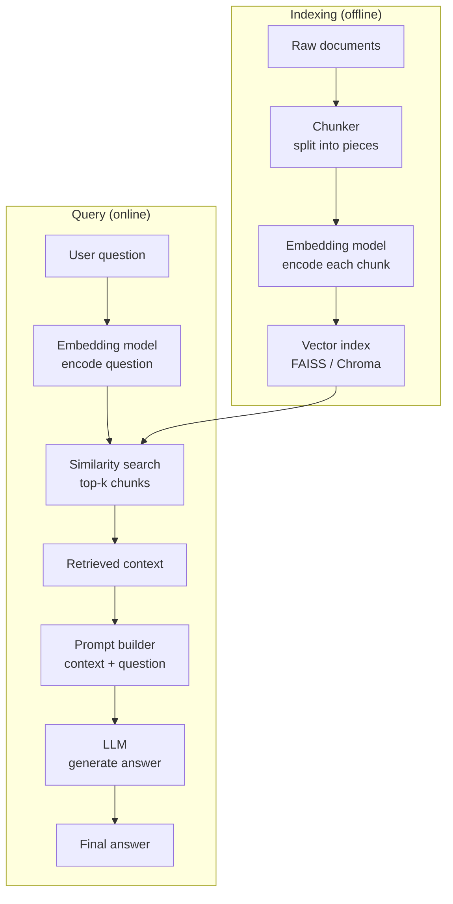

# Simple RAG

## The Simple Idea (Feynman Explanation)

Imagine you are a student taking an open-book exam. You have a stack of textbooks. When a question appears, you:

1. Flip through the books to find the most relevant pages.
2. Read those pages.
3. Write your answer based on what you just read — not from memory.

That is Simple RAG. The "books" are your documents. The "flipping through" is the retriever. The "writing the answer" is the LLM. The key rule: **answer only from what you retrieved, not from what you already know**.

Without RAG, the LLM answers from memory — which may be outdated, wrong, or simply not contain your private data. With RAG, the LLM is grounded in your documents.

---

## The Pipeline

### Step 1 — Prepare the knowledge base (done once)

```
Raw documents
    ↓ split into chunks (e.g., 200-500 tokens each)
Chunks
    ↓ embed each chunk → dense vector
Embeddings
    ↓ store in a vector index (FAISS, Chroma, Pinecone, etc.)
Vector index  ← ready for search
```

### Step 2 — Answer a question (done per query)

```
User question
    ↓ embed the question → query vector
Query vector
    ↓ similarity search against the index → top-k chunks
Retrieved context (top-k chunks)
    ↓ build a prompt: "Answer using only this context: {context}\n\nQuestion: {question}"
LLM
    ↓ generate answer grounded in context
Final answer
```

---

## Mermaid Diagram



---

## Worked Example

**Documents:**
```
Doc A: "The Eiffel Tower is located in Paris, France. It was built in 1889."
Doc B: "The Colosseum is in Rome, Italy. It was completed in 80 AD."
Doc C: "The Great Wall of China stretches over 13,000 miles."
```

**Question:** `"Where is the Eiffel Tower?"`

**Step 1 — Embed and index** all three docs.

**Step 2 — Embed the question** → query vector.

**Step 3 — Similarity search** → Doc A scores highest (cosine similarity ≈ 0.91), Doc B and C score low.

**Step 4 — Build prompt:**
```
Answer using only the context below. If the answer is not in the context, say "I don't know."

Context:
The Eiffel Tower is located in Paris, France. It was built in 1889.

Question: Where is the Eiffel Tower?
```

**Step 5 — LLM answer:** `"The Eiffel Tower is located in Paris, France."`

The LLM did not need to know this from training — it read it from the retrieved context.

---

## Failure Modes

| Problem | What happens | Fix |
|---|---|---|
| Bad chunking | Answer is split across two chunks; neither is retrieved alone | Use recursive or semantic chunking |
| Weak retrieval | The right chunk is not in the top-k | Increase k, improve embeddings, or use hybrid search |
| No grounding instruction | LLM answers from training memory instead of context | Add "answer only from context" to the prompt |
| No evaluation | You cannot tell if failures come from retrieval or generation | Measure retrieval precision and answer faithfulness separately |

---

## Key Findings

- The grounding instruction in the prompt is critical. Without it, the LLM will blend retrieved context with its own training knowledge, making it impossible to trace where the answer came from.
- Simple RAG fails on multi-hop questions (e.g., "Who built the tower in the city where the Louvre is?") because the answer requires combining information from multiple chunks that may not be retrieved together.
- The quality of the embedding model matters more than the vector index. A better embedding model improves retrieval; a faster index only improves latency.
- `k=3` to `k=5` is a common starting point. Too small and you miss the right chunk; too large and you dilute the context with irrelevant text.

---

## Pros, Cons & When to Use

| | |
|---|---|
| ✅ **Simple to implement** | Four components: chunker, embedder, index, LLM. Each is independently replaceable. |
| ✅ **Works on private data** | No fine-tuning needed — just index your documents. |
| ✅ **Grounded answers** | The LLM cites retrieved context, reducing hallucination. |
| ❌ **Single-hop only** | Cannot combine information from multiple chunks to answer complex questions. |
| ❌ **No reliability checks** | Retrieves and generates without verifying whether the context is actually relevant. |
| ❌ **Sensitive to chunk quality** | A bad split can make the right answer unretrievable. |

**Suitable for:**
- Direct factual Q&A over a single knowledge base.
- Customer support bots, internal documentation search, FAQ systems.
- The baseline before adding any advanced technique.

**Not suitable for:**
- Multi-hop reasoning (use graph RAG or iterative retrieval).
- High-stakes domains where wrong answers are costly (use Reliable RAG with validation).
- Real-time data (the index must be rebuilt or updated when documents change).
