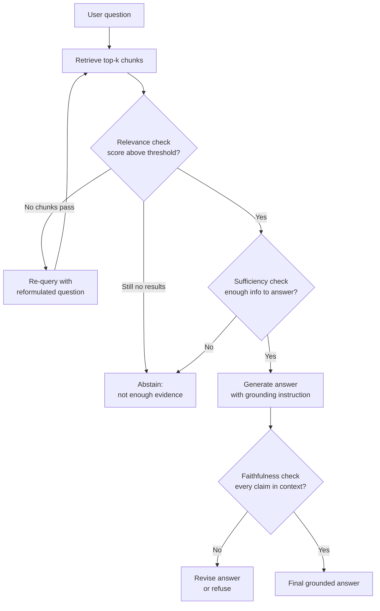

# Reliable RAG

## The Simple Idea (Feynman Explanation)

Simple RAG retrieves context and generates an answer — but it never checks whether the retrieval was actually useful or whether the answer is actually grounded in what was retrieved.

Imagine a student who looks up the wrong chapter in the textbook, reads it, and then confidently writes an answer based on it. The answer sounds plausible but is wrong. Simple RAG does exactly this.

Reliable RAG adds **checkpoints** at two places:

1. **After retrieval:** Is the retrieved context actually relevant to the question? If not, try again or say "I don't know."
2. **After generation:** Does the answer actually come from the retrieved context? If the LLM added facts from its training memory, flag or reject the answer.

Think of it like a fact-checker sitting between the retriever and the LLM, and another one sitting between the LLM and the user.

```
Question
  ↓
Retrieve context
  ↓
[CHECK 1] Is this context relevant? → No → Re-query or abstain
  ↓ Yes
Generate answer
  ↓
[CHECK 2] Is the answer grounded in the context? → No → Revise or refuse
  ↓ Yes
Final answer
```

---

## The Four Reliability Checks

### Check 1 — Retrieval Relevance

Before passing context to the LLM, verify that the retrieved chunks actually address the question. This can be done with:

- A **relevance score threshold**: only use chunks above a minimum cosine similarity score.
- A **cross-encoder reranker**: a second model that scores each (query, chunk) pair more accurately than the embedding similarity alone.
- An **LLM judge**: ask a small LLM "Does this context help answer this question? Yes/No."

```
Query: "What is the refund policy?"
Retrieved chunk: "Our company was founded in 2010 in San Francisco."
Relevance score: 0.12  ← below threshold → discard, do not pass to LLM
```

### Check 2 — Context Sufficiency

Even if each chunk is individually relevant, the combined context may not contain enough information to answer the question. Check before generating:

```
Query: "What is the penalty for late payment after 90 days?"
Context: "Late payments incur a 2% monthly fee."
Sufficiency check: The context mentions fees but not the 90-day threshold → flag as incomplete
```

### Check 3 — Faithfulness

After generation, verify that every claim in the answer is supported by the retrieved context. Claims that cannot be traced to a specific chunk are hallucinations.

```
Answer: "The refund window is 30 days and applies to all products including digital downloads."
Context: "Refunds are accepted within 30 days of purchase."

Claim 1: "30 days" → found in context ✅
Claim 2: "applies to digital downloads" → NOT in context ❌ → hallucination
```

### Check 4 — Citation Alignment

If the answer cites specific chunks, verify that the cited chunks actually support the cited claims. This prevents the LLM from citing the wrong source.

---

## Mermaid Diagram



---

## Worked Example

**Documents:** A company policy PDF.

**Question:** `"Can I get a refund after 60 days?"`

**Retrieved chunks:**
```
Chunk A (score=0.82): "Refunds are accepted within 30 days of purchase for physical products."
Chunk B (score=0.71): "Digital downloads are non-refundable."
Chunk C (score=0.34): "Our customer service team is available 24/7."
```

**Check 1 — Relevance:** Chunk C (score=0.34) is below threshold → discard.

**Check 2 — Sufficiency:** Chunks A and B together address the question (30-day window, digital exclusion). Sufficient.

**Generated answer:** `"No, refunds are only accepted within 30 days of purchase for physical products. Digital downloads are non-refundable."`

**Check 3 — Faithfulness:**
- "30 days" → Chunk A ✅
- "physical products" → Chunk A ✅
- "digital downloads non-refundable" → Chunk B ✅
- No unsupported claims → answer passes.

**Final answer delivered.**

---

## Key Findings

- **The grounding instruction is the cheapest reliability improvement.** Adding "Answer only from the context below. If the answer is not in the context, say 'I don't know.'" to the prompt costs nothing and significantly reduces hallucination.
- **Relevance thresholds prevent confident wrong answers.** A retriever that returns low-scoring chunks is worse than one that returns nothing — the LLM will try to answer from irrelevant context.
- **Faithfulness checking requires a second LLM call.** This adds latency and cost. For high-stakes applications it is worth it; for low-stakes applications, a strong grounding instruction is often sufficient.
- **"I don't know" is a feature, not a failure.** A system that can abstain when evidence is missing is more trustworthy than one that always produces an answer.
- **Retrieval and generation failures look identical to the user.** Both produce wrong answers. Measuring them separately (retrieval precision, answer faithfulness) is the only way to know which stage to fix.

---

## Pros, Cons & When to Use

| | |
|---|---|
| ✅ **Reduces hallucination** | Faithfulness checks catch claims the LLM added from training memory. |
| ✅ **Graceful degradation** | The system can say "not enough evidence" instead of confidently answering incorrectly. |
| ✅ **Separates failure modes** | Retrieval failures and generation failures are measured and fixed independently. |
| ❌ **Higher latency** | Each check adds at least one extra model call. |
| ❌ **Higher cost** | LLM-based checks (relevance judge, faithfulness checker) cost tokens per query. |
| ❌ **Threshold tuning required** | Relevance score thresholds need calibration per domain and embedding model. |

**Suitable for:**
- Medical, legal, financial, or compliance applications where wrong answers have real consequences.
- Customer-facing systems where hallucinations damage trust.
- Any production RAG system — reliability checks should be the default, not an afterthought.

**Not suitable for:**
- Rapid prototyping where latency and cost matter more than correctness.
- Internal tools where a wrong answer is easy to spot and correct manually.
- Domains where "I don't know" is unacceptable and the system must always produce an answer (use confidence scores instead of hard abstention).
