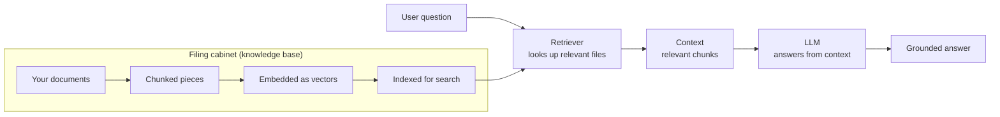
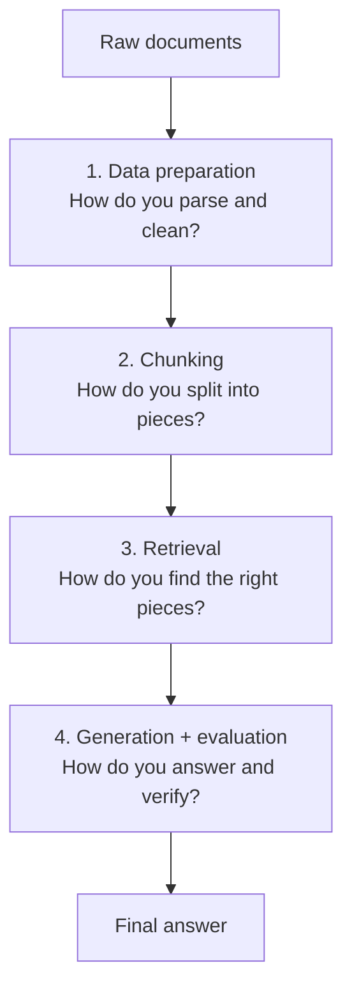

# RAG Fundamentals

## What Is RAG?

Imagine you hired a brilliant assistant who has read every book ever written — but their knowledge is frozen at the day they were trained. They cannot tell you what happened last week, what is in your company's internal documents, or what your customer database says right now.

RAG (Retrieval-Augmented Generation) gives that assistant a filing cabinet. Before answering, they look up the relevant files, read them, and then answer based on what they just read — not just what they memorised years ago.

The answer is only as good as three things: how the documents were prepared, how well the retriever found the right pieces, and whether the LLM stayed faithful to what it read.

---

## What This Module Covers

This module builds the foundation before the specialised techniques in later modules. Each note introduces one new concern:

| # | Technique | New concern introduced |
|---|---|---|
| 1 | [Simple RAG](1_simple_rag/README.md) | The basic pipeline end-to-end |
| 2 | [Reliable RAG](2_reliable_rag/README.md) | Validation and trust checks |

---

## The Four Decisions in Every RAG System

Every advanced technique in this repository is an improvement to one of these four decisions. Understanding the baseline first makes every improvement easier to reason about.

---

## Key Takeaways

- RAG is not just "add a vector database" — it is a pipeline of decisions, each of which can fail independently.
- The input format matters. A PDF paragraph, CSV row, JSON object, and code file should not be indexed the same way.
- A system that cannot say "I don't know" is not reliable — it will hallucinate when context is missing.
- Measure retrieval and generation separately. A bad answer could come from either stage.
