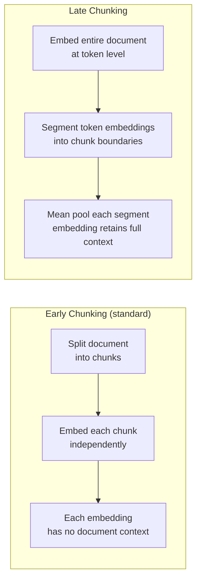

# Late Chunking

**Paper:** Günther et al. (2024) — *Late Chunking: Contextual Chunk Embeddings Using Long-Context Embedding Models* ([arXiv:2409.04701](https://arxiv.org/abs/2409.04701))
**Studied in:** Merola & Singh (2025) — *Reconstructing Context: Evaluating Advanced Chunking Strategies for Retrieval-Augmented Generation* ([arXiv:2504.19754](https://arxiv.org/abs/2504.19754))

> ⚠️ **Not yet implemented.** This folder documents the technique. A Python implementation is a welcome contribution — see [CONTRIBUTING.md](../../CONTRIBUTING.md).

---

## Feynman Explanation

Imagine you are reading a detective novel. In the middle of chapter 5, you encounter the sentence: *"He finally found it."* On its own that sentence means nothing — you don't know who "he" is or what "it" refers to. But if you read the whole chapter before trying to understand that sentence, the meaning is obvious.

Standard (early) chunking is like cutting the book into strips *before* reading it — each strip is then read by itself, losing all surrounding context. Late chunking reads the entire document first, lets the meaning of every word be shaped by the full context, and *then* splits the embeddings into chunks. The chunks are still separate, but each one remembers the full story it came from.

---

## Algorithm

1. **Feed the whole document** to a long-context embedding model (e.g., Jina-V3). The model produces one embedding vector per token across the entire document.
2. **Determine chunk boundaries** using any standard method (fixed-size, recursive, semantic) — but *do not embed the chunks separately*.
3. **Segment the token embeddings** at the pre-determined boundaries.
4. **Mean pool** all token vectors within each segment to produce one chunk-level embedding.
5. Store the pooled embeddings in a vector index as usual.

At query time, retrieval is identical to standard dense retrieval — the difference is only in how the chunk embeddings were produced.

---

## Worked Example

Document: *"Marie Curie discovered polonium in 1898. She later won two Nobel Prizes — one in Physics, one in Chemistry. She was the first woman to win a Nobel Prize."*

**Early chunking:** The chunk *"She later won two Nobel Prizes"* is embedded with no knowledge of who "she" is. The embedding drifts toward generic pronoun space.

**Late chunking:**
1. The full document is fed to the model. Token embeddings for "She" in chunk 2 are contextualised by "Marie Curie" from chunk 1.
2. Chunk boundaries are applied at the sentence level.
3. Token embeddings within each sentence are mean-pooled.
4. The embedding for chunk 2 is now semantically closer to "Marie Curie Nobel Prize" than a context-free embedding would be.

---

## Mermaid Diagram

---

## Key Findings

- **Marginal improvement with Jina-V3:** Late chunking shows small gains over early chunking on NFCorpus (NDCG@5: 0.380 vs 0.374).
- **Model-dependent — can hurt badly:** With BGE-M3, early chunking (NDCG@5: 0.246) **significantly outperforms** late chunking (NDCG@5: 0.070). Late chunking is not universally better.
- **Fails on MSMarco with Stella-V5:** Early chunking (NDCG@5: 0.630) decisively beats late chunking (NDCG@5: 0.503). Dataset and embedding model combination determines whether it helps or hurts.
- **No LLM cost:** Unlike contextual retrieval, late chunking requires no LLM call per chunk — only a long-context embedding model pass, which is much cheaper.
- **Requires a long-context embedding model:** Models with short context windows cannot ingest a full document; the technique only applies to models like Jina-V3, E5-Mistral, or similar.

---

## Pros, Cons & When to Use

| | |
|---|---|
| ✅ Context-aware chunk embeddings without splitting context | |
| ✅ No additional LLM calls — cheaper than contextual retrieval | |
| ✅ Compatible with any long-context embedding model | |
| ❌ Performance is model-dependent — can degrade significantly | |
| ❌ Requires a model that can fit the entire document in context | |
| ❌ Marginal gains do not justify adoption without benchmarking | |

**Suitable for:**
- Medium-length documents where cross-sentence coreference matters (e.g., biographies, reports)
- Pipelines already using a long-context embedding model (Jina-V3)
- Cost-sensitive setups that cannot afford an LLM call per chunk

**Not suitable for:**
- Very long documents that exceed even long-context model limits
- Pipelines using BGE-M3, Stella-V5, or similar models (empirically degrades)
- Production use without first benchmarking on your specific corpus + embedding model

---

## Performance Data (from Merola & Singh 2025)

### NFCorpus — Jina-V3

| Method | NDCG@5 | MAP@5 | F1@5 |
|---|---|---|---|
| Early — Fixed-size | 0.374 | 0.107 | 0.186 |
| Late — Fixed-size | **0.380** | 0.103 | 0.185 |
| Early — Semantic | 0.377 | 0.111 | **0.192** |
| Late — Simple-Qwen | 0.384 | 0.105 | 0.185 |
| Late — Topic-Qwen | 0.383 | 0.102 | 0.179 |

### MSMarco — Stella-V5

| Method | NDCG@5 | MAP@5 |
|---|---|---|
| Early — Fixed-size | **0.630** | **0.501** |
| Late — Fixed-size | 0.503 | 0.340 |

---

## References

- Günther et al. (2024) — *Late Chunking: Contextual Chunk Embeddings Using Long-Context Embedding Models* — [arXiv:2409.04701](https://arxiv.org/abs/2409.04701)
- Merola & Singh (2025) — *Reconstructing Context: Evaluating Advanced Chunking Strategies for RAG* — [arXiv:2504.19754](https://arxiv.org/abs/2504.19754)
