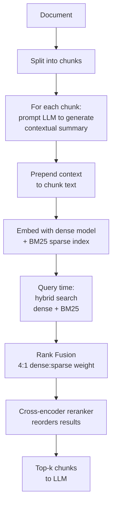

# Contextual Retrieval (ContextualRankFusion)

**Introduced by:** Anthropic (September 2024)
**Studied in:** Merola & Singh (2025) — *Reconstructing Context: Evaluating Advanced Chunking Strategies for Retrieval-Augmented Generation* ([arXiv:2504.19754](https://arxiv.org/abs/2504.19754))

> ⚠️ **Not yet implemented.** This folder documents the technique. A Python implementation is a welcome contribution — see [CONTRIBUTING.md](../../CONTRIBUTING.md).

---

## Feynman Explanation

Picture a library where every book has been torn into loose pages and shuffled into a pile. You pick up a page and read: *"The company's revenue grew by 3% over the previous quarter."* Useful? Not really — you don't know which company, which quarter, or even which industry this is from.

Contextual retrieval solves this by writing a sticky note for every page before filing it. The sticky note says something like: *"This page is from the Q3 2024 earnings report for Acme Corp, which manufactures industrial widgets."* Now when you search the pile for "Acme revenue", you find the right page even if the word "Acme" doesn't appear on the page itself.

On top of that, contextual retrieval searches the pile in two ways simultaneously: by meaning (dense embeddings) and by exact words (BM25), then lets a judge (reranker) decide the final ranking. The combination is consistently the most accurate retrieval method in recent benchmarks.

---

## Algorithm

**Indexing (offline):**

1. **Split** the document into chunks using any standard method (fixed-size or semantic).
2. **Contextualize each chunk:** For every chunk, prompt an LLM with the full document and the chunk text, asking it to generate a short summary situating the chunk within the document. Prepend this generated context to the chunk.
3. **Dual indexing:** Index each contextualized chunk with:
   - A dense embedding model (e.g., Jina-V3)
   - A BM25 sparse index

**Retrieval (online):**

4. **Hybrid search:** Run the query against both the dense index and the BM25 index.
5. **Rank fusion:** Merge the two result lists using a 4:1 weight ratio (dense:sparse).
6. **Rerank:** Pass the top-N candidates through a cross-encoder reranker (e.g., Jina Reranker V2) for precise query-chunk relevance scoring.
7. Return the top-k reranked chunks to the LLM.

---

## Worked Example

**Document excerpt:** *"Q3 2024 Earnings Report — Acme Corp. Revenue grew by 3% to $1.2B, driven by strong demand in the Asia-Pacific region."*

**Chunk (after standard split):** *"Revenue grew by 3% to $1.2B, driven by strong demand in the Asia-Pacific region."*

**LLM-generated context:** *"This passage is from Acme Corp's Q3 2024 earnings report and describes the company's quarterly revenue performance."*

**Contextualized chunk (what gets embedded and indexed):**
> "This passage is from Acme Corp's Q3 2024 earnings report and describes the company's quarterly revenue performance. Revenue grew by 3% to $1.2B, driven by strong demand in the Asia-Pacific region."

Query: *"Acme revenue last quarter"*
- Dense search: high cosine similarity due to semantic match on "Acme Corp earnings revenue"
- BM25 search: exact match on "revenue", "Acme" (now present in the contextualized text)
- After rank fusion and reranking: this chunk rises to top-1

---

## Mermaid Diagram

---

## Key Findings

- **Best overall retrieval quality** of the three emerging techniques (late chunking, contextual retrieval, vision-guided).
- **Consistently outperforms late chunking:** ContextualRankFusion NDCG@5: 0.317 vs late chunking 0.309 on NFCorpus with Jina-V3.
- **Chunking method barely matters here:** Fixed-size and semantic chunking yield nearly identical results (NDCG@5: 0.317 for both) when the retrieval pipeline includes RankFusion + reranking. Invest in the retrieval pipeline, not the chunking.
- **Expensive at indexing time:** One LLM call per chunk. For a 1,000-chunk document, that's 1,000 LLM calls.
- **Memory-intensive:** Contextualizing long documents can require 20 GB+ VRAM depending on the LLM used.
- **Reranking is the single highest-leverage addition** to any RAG pipeline regardless of chunking method — even without contextualization, adding a reranker improves results.

---

## Pros, Cons & When to Use

| | |
|---|---|
| ✅ Best retrieval quality of all chunking/retrieval techniques benchmarked | |
| ✅ Works with any chunking method — gains are from retrieval, not chunking | |
| ✅ Hybrid search captures both semantic and lexical matches | |
| ❌ One LLM call per chunk — very expensive for large corpora | |
| ❌ Memory-intensive during indexing | |
| ❌ Reindexing is required if the document set changes | |
| ❌ Adds latency at query time (reranker is a second model pass) | |

**Suitable for:**
- High-stakes retrieval where quality matters more than cost (legal, medical, financial)
- Static or slowly changing corpora where indexing cost is paid once
- Pipelines already using a reranker (the contextualization adds marginal cost on top)

**Not suitable for:**
- Real-time or frequently updated document collections (reindexing is expensive)
- Cost-sensitive production deployments with large document counts
- Low-latency requirements where the reranker adds unacceptable latency

---

## Performance Data (from Merola & Singh 2025)

### Contextual RankFusion vs Late Chunking (NFCorpus, Jina-V3, Fixed-Window)

| Method | NDCG@5 | MAP@5 | F1@5 | NDCG@10 | MAP@10 | F1@10 |
|---|---|---|---|---|---|---|
| Late Chunking | 0.309 | 0.143 | 0.202 | 0.294 | 0.160 | 0.192 |
| Contextual RankFusion | **0.317** | **0.146** | **0.206** | **0.308** | **0.166** | **0.202** |

### Fixed-size vs Semantic (Contextual setup, Jina-V3)

| Chunking | Retrieval | NDCG@5 | MAP@5 | F1@5 |
|---|---|---|---|---|
| Fixed-Window Uncontextualized | Traditional | 0.303 | 0.137 | 0.193 |
| Semantic Uncontextualized | Traditional | 0.307 | 0.143 | 0.197 |
| Fixed-Window Contextualized | RankFusion | **0.317** | **0.146** | **0.206** |
| Semantic Contextualized | RankFusion | **0.317** | **0.146** | **0.209** |

**Takeaway:** The jump from 0.303 → 0.317 comes from the retrieval pipeline (RankFusion + reranking), not from switching between fixed-size and semantic chunking.

---

## References

- Merola & Singh (2025) — *Reconstructing Context: Evaluating Advanced Chunking Strategies for RAG* — [arXiv:2504.19754](https://arxiv.org/abs/2504.19754)
- Anthropic (2024) — *Introducing Contextual Retrieval* — [anthropic.com](https://www.anthropic.com/news/contextual-retrieval)
