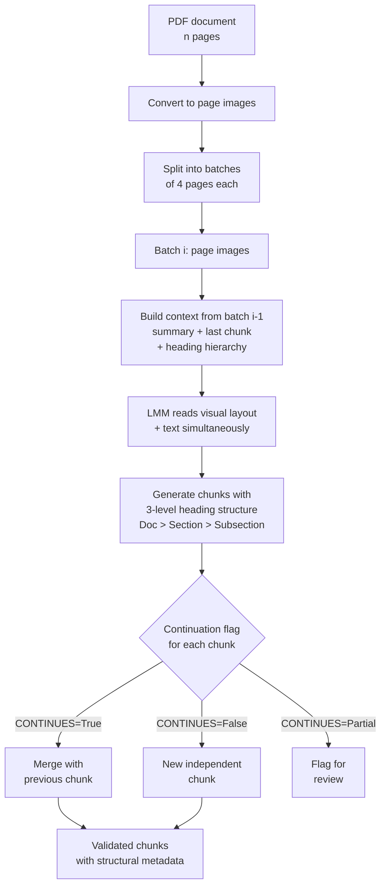

# Vision-Guided (Multimodal) Chunking

**Paper:** Tripathi et al. (2025) — *Vision-Guided Chunking Is All You Need: Enhancing RAG with Multimodal Document Understanding* ([arXiv:2506.16035](https://arxiv.org/abs/2506.16035))

> ⚠️ **Not yet implemented.** This folder documents the technique. A Python implementation is a welcome contribution — see [CONTRIBUTING.md](../../CONTRIBUTING.md).

---

## Feynman Explanation

All standard chunking methods are essentially blind. They receive the document as plain text — a string of characters — and split it by character count, token count, or sentence boundaries. They cannot see the page.

But a PDF is not just text. It has columns, tables that span multiple pages, figures with captions, headers, footnotes, and visual structure that carries meaning. When you extract text from a multi-column PDF, the extractor often reads left-column and right-column text interleaved, producing gibberish. A table that spans three pages becomes three disconnected fragments.

Vision-guided chunking gives the document to a Large Multimodal Model (like Gemini-2.5-Pro) as **images** — exactly like scanning pages and handing them to a very smart reader. The model sees the layout, understands which text belongs to which table cell, recognizes that the diagram on page 4 belongs to the section that started on page 3, and produces clean, semantically coherent chunks with a proper heading hierarchy.

---

## Algorithm

1. **Convert PDF pages to images** (one image per page).
2. **Batch pages** into groups of 4.
3. For each batch, **construct a context object** from the previous batch:
   - Summary of the previous batch
   - Last chunk produced (for continuation detection)
   - Current heading hierarchy (Doc Title → Section → Subsection)
4. **Send the batch images + context** to a multimodal LMM (e.g., Gemini-2.5-Pro) with a structured prompt requesting:
   - Semantically coherent chunks
   - 3-level heading path per chunk (`Doc > Section > Subsection`)
   - A `CONTINUES` flag for each chunk: `True` (merges with previous), `False` (new chunk), or `Partial` (flag for review)
5. **Apply continuation flags:**
   - `CONTINUES=True` → merge with the last chunk from the previous batch
   - `CONTINUES=False` → start a new chunk
   - `CONTINUES=Partial` → flag for manual review
6. **Collect validated chunks** with full structural metadata.

---

## Worked Example

**Input:** A 12-page technical manual with a 3-page table of component specifications (pages 4–6) and a flowchart on page 7.

**Text-extraction chunking result:** The table is fragmented across 3 chunks. Row data from the bottom of page 4 is split from the column headers on page 4. The flowchart text is mixed with surrounding paragraphs.

**Vision-guided chunking result:**
- Pages 4–6 produce a single chunk: *"Table: Component Specifications — columns: Part No., Voltage, Tolerance, Temp Range — 48 rows"* with heading path `"Manual > Chapter 2 > Component Specs Table"`.
- Page 7 produces: *"Flowchart: Assembly sequence — steps 1–7 with decision nodes"* with heading path `"Manual > Chapter 2 > Assembly Flowchart"`.
- Each chunk carries its `Doc > Section > Subsection` path as metadata, enabling precise metadata-filtered retrieval.

---

## Mermaid Diagram

---

## Key Findings

- **+14% accuracy** over vanilla RAG on a diverse benchmark of complex PDFs (technical manuals, financial reports, research papers).
- **~5× more chunks** than vanilla text extraction — finer, more precise granularity reduces retrieval noise.
- **Each chunk carries a full heading path** (`Doc > Section > Subsection`) enabling metadata-filtered retrieval — you can restrict search to a specific section.
- **Continuation flags** allow automated merging of procedural content (numbered steps, table rows) that spans page boundaries.
- **Highest cost** of all chunking techniques — requires a multimodal API call (Gemini, GPT-4V) for every 4-page batch.
- **Solves the multi-column and multi-page table problem** that all text-extraction methods fail on.

---

## Pros, Cons & When to Use

| | |
|---|---|
| ✅ Best performance on complex PDFs with visual structure | |
| ✅ Handles multi-page tables, flowcharts, figures, multi-column layouts | |
| ✅ Produces hierarchical metadata enabling precise filtered retrieval | |
| ✅ +14% accuracy over vanilla RAG on diverse PDF benchmark | |
| ❌ Highest cost — multimodal LMM API call per 4-page batch | |
| ❌ Requires a multimodal model with vision capability | |
| ❌ Overkill for plain-text documents with no visual structure | |
| ❌ Slower indexing than any text-based method | |

**Suitable for:**
- Complex PDFs: technical manuals, financial reports, research papers, legal contracts with tables
- Documents where visual layout carries meaning (multi-column, figures with captions, flowcharts)
- High-value retrieval tasks where +14% accuracy is worth the API cost

**Not suitable for:**
- Plain-text documents (Markdown, HTML, JSON) — use Structured Chunking instead
- Cost-sensitive deployments with many documents
- Documents already available as clean, structured text

---

## Performance Data (from Tripathi et al. 2025)

*Dataset: Internal benchmark of diverse PDF documents (technical manuals, financial reports, research papers)*

| Chunking Method | RAG Accuracy |
|---|---|
| Vanilla RAG (fixed-size chunking) | 0.78 |
| Vision-Guided RAG (multimodal LMM) | **0.89** |

**+14% accuracy improvement.** Attributed to:
- Preservation of multi-page table structures
- Intact procedural step sequences
- Hierarchical heading metadata enabling precise retrieval
- ~5× more granular chunks reducing retrieval noise

---

## References

- Tripathi et al. (2025) — *Vision-Guided Chunking Is All You Need: Enhancing RAG with Multimodal Document Understanding* — [arXiv:2506.16035](https://arxiv.org/abs/2506.16035)
