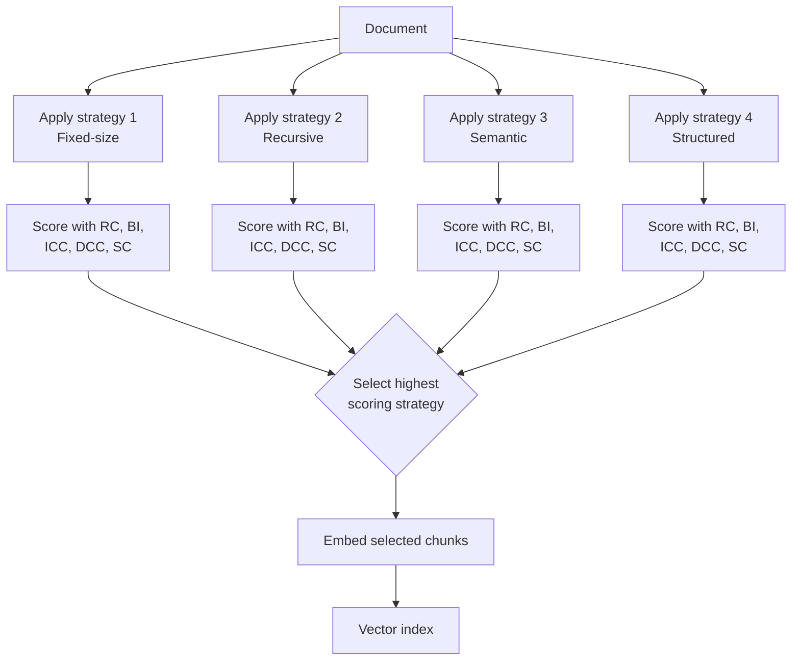

# Adaptive Chunking

**Paper:** de Moura Júnior, Lelong & Blangero (2026) — *Adaptive Chunking: Optimizing Chunking-Method Selection for RAG* ([arXiv:2603.25333](https://arxiv.org/abs/2603.25333)) · Accepted at LREC 2026
**Code:** [github.com/ekimetrics/adaptive-chunking](https://github.com/ekimetrics/adaptive-chunking)

> ⚠️ **Not yet implemented.** This folder documents the technique. A Python implementation is a welcome contribution — see [CONTRIBUTING.md](../../CONTRIBUTING.md).

---

## Feynman Explanation

Imagine you are a baker who makes different kinds of bread — sourdough, baguette, brioche. Each dough behaves differently: sourdough needs slow fermentation, baguette needs high heat, brioche needs lots of butter folding. If you treated every dough exactly the same way, most loaves would come out wrong.

Chunking documents is the same problem. A legal contract, a technical manual, and a social science paper each have their own structure and rhythm. Applying the same chunking strategy to all of them — the way every standard RAG pipeline does — guarantees you are doing the wrong thing for most of your documents.

Adaptive Chunking asks: *before you commit to a chunking method, try several of them, score the results, and pick the best one for this specific document.* The scoring uses five metrics that measure chunk quality without needing to run any retrieval or generation — so it is cheap, fast, and model-independent.

---

## Algorithm

```
For each document:
  1. Apply N chunking strategies (fixed-size, recursive, semantic, structured, ...)
  2. For each set of chunks produced, compute five intrinsic metrics:
       RC  — References Completeness
       BI  — Block Integrity
       ICC — Intrachunk Cohesion
       DCC — Document Contextual Coherence
       SC  — Size Compliance
  3. Aggregate the five scores into a single quality score per strategy
  4. Select the strategy with the highest score
  5. Embed and index only those chunks

At query time: standard dense retrieval — no change needed.
```

The five metrics are computed entirely from the chunks themselves (text analysis + embeddings of the chunks). No LLM generation, no retrieval, no ground-truth labels required.

---

## The Five Intrinsic Metrics

| Metric | Abbr | What it checks | How it is computed |
|---|---|---|---|
| References Completeness | RC | Cross-references (citations, footnotes, section links) are not split across chunk boundaries | Regex detection of reference patterns; penalty when a reference start and end fall in different chunks |
| Block Integrity | BI | Logical blocks (paragraphs, code blocks, list items, tables) are not cut in the middle | Parse structural delimiters; count blocks that span a boundary as violations |
| Intrachunk Cohesion | ICC | Sentences within a chunk are semantically similar to each other | Mean pairwise cosine similarity of sentence embeddings within each chunk, averaged over all chunks |
| Document Contextual Coherence | DCC | Adjacent chunks in document order are semantically related | Mean cosine similarity between consecutive chunk embeddings; low DCC means chunks break unrelated text together |
| Size Compliance | SC | Chunk sizes fall within the target token range [min, max] | Fraction of chunks whose token count is within bounds |

RC and BI are structural — they catch hard formatting breaks. ICC and DCC are semantic — they catch meaning fragmentation. SC is operational — it ensures the chunks are actually usable by the downstream model.

---

## Worked Example

Document: a legal contract with numbered clauses, cross-references ("see clause 4.2"), and multi-sentence paragraphs.

**Fixed-size chunking (512 chars):**
- Splits mid-clause: "...the party shall be liable for damages not exceeding — [CHUNK BREAK] — the amount specified in clause 4.2..."
- RC = 0.4 (many cross-references broken)
- BI = 0.5 (paragraphs cut mid-sentence)
- ICC = 0.6 (sentences within chunks are still on the same topic)
- DCC = 0.7 (adjacent chunks are somewhat coherent)
- SC = 0.9 (most chunks near target size)
- **Aggregate score: 0.62**

**Structured chunking (split at clause headers):**
- Each clause becomes one chunk; cross-references stay intact
- RC = 0.95
- BI = 0.90
- ICC = 0.85
- DCC = 0.80
- SC = 0.70 (some clauses are long, a few exceed the size limit)
- **Aggregate score: 0.84**

→ Adaptive Chunking selects structured chunking for this document.

---

## Mermaid Diagram



---

## New Chunkers Introduced

The paper also contributes two new splitting strategies:

**LLM-regex splitter**
Uses an LLM to identify semantically meaningful split points (e.g., topic shifts, argument boundaries), then executes the splits with a regex pattern. More accurate than pure regex, cheaper than full proposition chunking — the LLM is only used to locate boundaries, not to rewrite content.

**Split-then-merge recursive splitter**
1. Over-split the document aggressively into very small chunks
2. Merge adjacent chunks greedily until the ICC and SC targets are both satisfied
3. Stop merging when the next merge would violate a size or cohesion constraint

This outperforms naive recursive splitting on documents with highly variable paragraph lengths, because it starts from atoms and builds up rather than starting from large units and cutting down.

---

## Key Findings

- **No single strategy wins across document types.** Legal documents favour structural chunking. Technical documents respond better to semantic or recursive splitting. Social science prose benefits from cohesion-optimised splits.
- **+8–10 percentage points correctness improvement without changing anything else.** Answer correctness went from 62–64% to 72% on the same models, same prompts, same retriever.
- **+33% more questions answered.** 65 vs. 49 successfully answered questions — the adaptive method covers more of the question space by producing better-matched chunks.
- **Metrics are intrinsic and model-independent.** RC, BI, and SC use only text analysis. ICC and DCC use chunk embeddings (already computed for indexing). No LLM call needed for the selection step.
- **Selection overhead is negligible.** Scoring N strategies' chunks takes milliseconds compared to the embedding and indexing time.
- **The split-then-merge splitter handles variable-length documents better than top-down recursive splitting.**

---

## Pros, Cons & When to Use

| | |
|---|---|
| ✅ Adapts to each document — no single strategy imposed on diverse corpora | |
| ✅ Five intrinsic metrics are cheap and model-independent | |
| ✅ Significant downstream improvement without changing the retriever or LLM | |
| ✅ Compatible with any existing chunking strategies as candidates | |
| ❌ Runs N chunking strategies per document — N× preprocessing cost | |
| ❌ Requires tuning the aggregation weights for the five metrics | |
| ❌ The metric suite does not yet cover all document types (e.g., multimodal PDFs) | |

**Suitable for:**
- Corpora with mixed document types (legal + technical + prose in the same pipeline)
- Offline preprocessing pipelines where indexing cost is acceptable
- Teams who have already tried standard chunking and hit a quality ceiling

**Not suitable for:**
- Real-time chunking pipelines where latency per document is critical
- Homogeneous corpora where a single known-good strategy already performs well
- Multimodal documents (tables, figures) — use Vision-Guided Chunking instead

---

## Performance Results (from de Moura Júnior et al. 2026)

_Corpus: legal, technical, and social science documents. Same embedding model, retriever, and LLM prompt across all conditions._

| Chunking Setup | Answer Correctness | Questions Answered Successfully |
|---|---|---|
| Best single fixed strategy (baseline) | 62–64% | 49 |
| Adaptive Chunking (metric-guided) | **72%** | **65 (+33%)** |

---

## References

- de Moura Júnior, Lelong & Blangero (2026) — *Adaptive Chunking: Optimizing Chunking-Method Selection for RAG* — [arXiv:2603.25333](https://arxiv.org/abs/2603.25333)
