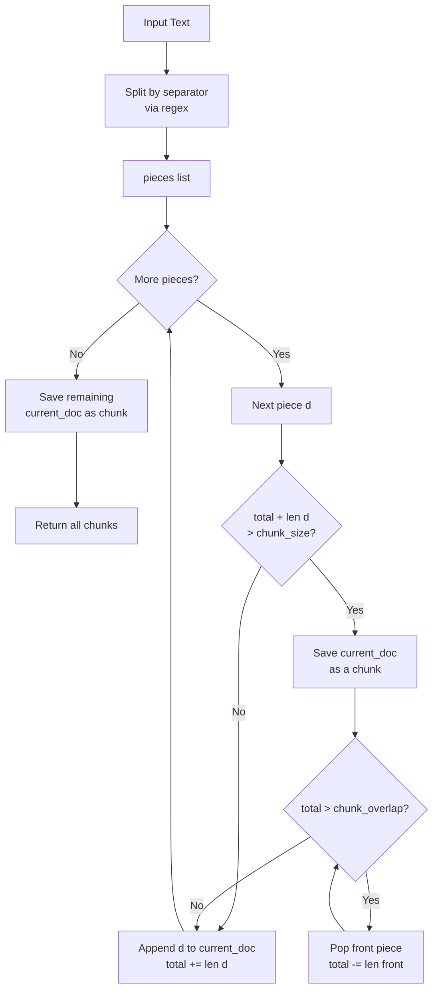
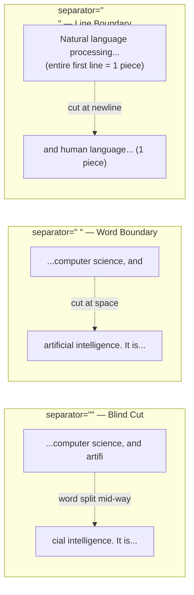

# Fixed-Size Chunking by Character

## The Simple Idea (Feynman Explanation)

Imagine you have a long essay and you need to cut it into pieces of exactly 100 characters each. You have two tools:

- **Scissors with no ruler** (`separator=""`): You count exactly 100 characters and cut — even if you're in the middle of the word `artifi|cial`. The pieces are uniform in size but words get chopped.
- **Scissors that only cut at spaces** (`separator=" "`): You cut at the nearest space before 100 characters. Words stay whole, but pieces vary slightly in size.
- **Scissors that only cut at newlines** (`separator="\n"`): You cut only where someone pressed Enter. Paragraphs stay intact, but a long paragraph becomes one giant piece.

The **overlap** is like a sticky note: after cutting, you copy the last 15 characters of the current piece onto the front of the next piece. This way, context at the boundary isn't lost.

---

## Algorithm

Uses `langchain_text_splitters.CharacterTextSplitter`. The core merging logic lives in `_merge_splits()` in `base.py`.

### Step 1 — Split the text by separator

The text is divided using the specified `separator` via regex. The result is a list of pieces.

```
Input:  "Hello world. This is a test."

separator=""   →  ["H","e","l","l","o"," ","w","o","r","l","d","."," ","T","h","i","s"," ","i","s"," ","a"," ","t","e","s","t","."]
separator=" "  →  ["Hello", "world.", "This", "is", "a", "test."]
separator="\n" →  ["Hello world. This is a test."]   (no newlines → one piece)
```

### Step 2 — Merge pieces into chunks targeting `chunk_size`

Walk through the pieces, accumulating them into `current_doc`. When adding the next piece would exceed `chunk_size`, finalize the current chunk first.

```
current_doc = [], total = 0

for each piece d:
    if (total + len(d) + separator_cost) > chunk_size:
        → save current_doc as a chunk
        → trim overlap: pop from front while total > chunk_overlap
    append d to current_doc
    total += len(d) + separator_cost

save remaining current_doc as final chunk
```

### Step 3 — Apply overlap (the trim loop)

After saving a chunk, the while loop pops pieces from the **front** of `current_doc` until `total ≤ chunk_overlap`. The surviving tail becomes the start of the next chunk — that's the overlap.

```
chunk_overlap = 15

After saving chunk 1 (total = 99):
  pop "N" → total = 98
  pop "a" → total = 97
  ...
  pop until total = 15
  → current_doc now holds the last 15 characters
  → these 15 chars become the start of chunk 2
```

---

## Worked Example

**Code:**
```python
splitter = CharacterTextSplitter(
    chunk_size=100,
    chunk_overlap=15,
    separator=""        # Default is "\n\n"
)
```

**Input text** (~167 characters after the leading newline):
```
\nNatural language processing (NLP) is a subfield of linguistics, computer science, and artificial
intelligence. It is concerned with the interactions between computers\nand human language, in
particular how to program computers to process and analyze\nlarge amounts of natural language data.\n
```

**Trace** (`separator=""`, so every character is its own piece):

```
Pieces 1–99:   accumulate → total = 99
Piece 100:     adding 1 char would make total = 100, which equals chunk_size.
               LangChain's condition is (total + len_) > chunk_size, so 100 > 100 is False.
               → append piece 100, total = 100

Piece 101:     101 > 100 → boundary hit!
               → save chunk 1 (chars 1–100, but first char is \n so visible = 99 chars)
               → trim: pop chars from front until total ≤ 15
               → current_doc = last 15 chars of chunk 1
               → append piece 101, total = 16

... continues until all characters consumed
```

**Output:**
```
Chunk 1 [99 chars]:  Natural language processing (NLP) is a subfield of linguistics, computer science, and artificial in
Chunk 2 [100 chars]: d artificial intelligence. It is concerned with the interactions between computers and human langua
Chunk 3 [100 chars]: nd human language, in particular how to program computers to process and analyze large amounts of n
Chunk 4 [36 chars]:  ge amounts of natural language data.
```

Notice `artificial in` at the end of chunk 1 and `d artificial` at the start of chunk 2 — the word `artificial` was split mid-word. That's blind cutting.

---

## Mermaid Diagram



---

## Separator Behavior Comparison



---

## Key Findings

- **Blind cutting** (`separator=""`) splits words arbitrarily — `artificial in` / `d artificial` — fragmenting tokens and degrading retrieval quality.
- **Word cutting** (`separator=" "`) keeps words whole. Overlap works well because each word is a small piece that can be selectively retained.
- **Line cutting** (`separator="\n"`) preserves whole lines but overlap often has no effect: a single 167-char line is one atomic piece — you can't partially carry it forward.
- The `chunk_overlap` mechanism only produces visible overlap when a chunk is built from **multiple small pieces**. A single large atomic piece cannot be partially carried over.
- The default separator is `"\n\n"` (double newline / paragraph break), not `""`.
