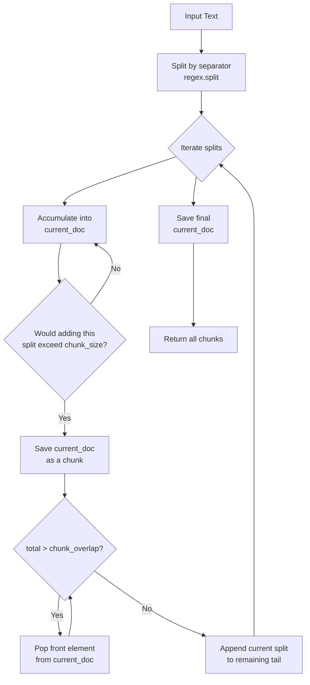

# Fixed-Size Chunking by Character

## Algorithm

Uses `langchain_text_splitters.CharacterTextSplitter` to split text into chunks of a fixed number of characters. The core logic lives in `_merge_splits` in `base.py`.

### Step-by-Step Logic

**Step 1 — Split the text by separator**

The text is divided using the specified `separator` via regex. With `separator=""`, every character is an individual split point. With `separator="\n"`, the text splits on newline boundaries.

```
Input:  "Hello world. This is a test."
        separator=""   →  ["H","e","l","l","o"," ","w","o","r","l","d","."," ","T","h","i","s"," ","i","s"," ","a"," ","t","e","s","t","."]
        separator=" "  →  ["Hello", "world.", "This", "is", "a", "test."]
```

**Step 2 — Merge splits into chunks targeting `chunk_size`**

Iterate through the split pieces, accumulating them into a `current_doc`. Track the running `total` character count. The separator length is added when joining multiple pieces.

```
current_doc = [], total = 0
for each split piece d:
    len_ = len(d)
    if (total + len_ + separator_cost) > chunk_size:
        # chunk boundary reached — finalize current_doc
        save current_doc as a chunk
        # overlap: pop front elements while total > chunk_overlap
        while total > chunk_overlap:
            total -= len(current_doc[0]) + separator_cost
            current_doc = current_doc[1:]   // drop from front
    current_doc.append(d)
    total += len_ + separator_cost
```

**Step 3 — Apply overlap (the while loop)**

When a chunk is finalized, the while loop pops elements from the **front** of `current_doc`. The remaining tail elements (totaling ≤ `chunk_overlap`) carry forward as the start of the next chunk.

**Trace with `separator=""`, `chunk_size=100`, `chunk_overlap=15`:**

```
Text: "\nNatural language processing ... large amounts of natural language data.\n"
Splits (separator=""): Each character is its own element (~167 chars total)

  Piece 1-99:  accumulate → total=99
  Piece 100:   adding would exceed 100, so:
               → save chunk 1 (chars 1-99)
               → while total(99) > 15: pop front char, total=98 ... pop front char, total=15
               → current_doc now holds the last 15 characters
  Piece 100:   append, total = 15+1 = 16
  Piece 101:   append, total = 17
  ...
  (continues until all characters consumed)
```

### Mermaid Diagram



### Separator Behavior Comparison

```mermaid
flowchart LR
    subgraph "separator=\"\" (Blind)"
        T1["Natural language processin|g (NLP) is a sub..."]
    end
    subgraph "separator=\"\\n\" (Newline)"
        T2["Line 1 (167 chars) -> Chunk 1\nLine 2 (81 chars)  -> Chunk 2\nLine 3 (39 chars)  -> Chunk 3"]
    end
    subgraph "separator=\" \" (Word)"
        T3["Words are atomic units\nNo mid-word cuts"]
    end
```

## Output

```
Chunk 1 [99 chars]: Natural language processing (NLP) is a subfield of linguistics, computer science, and artificial in
Chunk 2 [100 chars]: d artificial intelligence. It is concerned with the interactions between computers and human langua
Chunk 3 [100 chars]: nd human language, in particular how to program computers to process and analyze large amounts of n
Chunk 4 [36 chars]: ge amounts of natural language data.
```

## Key Findings

- **Blind cutting** (`separator=""`) splits words arbitrarily (e.g., `artificial in` / `d artificial`), fragmenting tokens and degrading retrieval quality.
- **Smart cutting** (`separator="\n"`) preserves whole lines but can produce oversized chunks if a line exceeds `chunk_size`. Overlap may not apply because each line is a single atomic piece — popping the only element leaves nothing to carry forward.
- The `chunk_overlap` mechanism only produces visible overlap when a chunk accumulates **multiple small splits**. A single large atomic piece cannot be partially carried over.
- For visible overlap, use a separator that generates many small pieces: `separator=" "` (words) or `separator=""` (characters).
