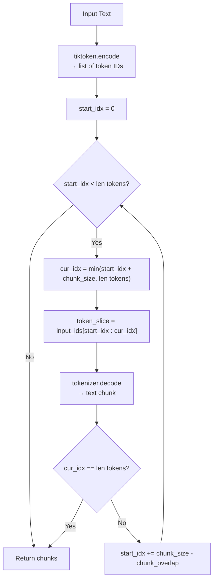
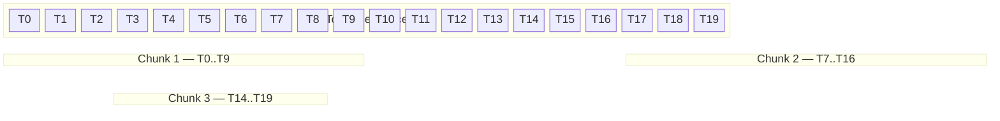

# Fixed-Size Chunking by Token

## The Simple Idea (Feynman Explanation)

LLMs don't read characters — they read **tokens**. A token is roughly a word-piece: `"natural"` is 1 token, `"processing"` is 1 token, `"(NLP)"` is 3 tokens. When you chunk by character count, you might give an LLM 100 characters that are actually 25 tokens, or 100 characters that are 40 tokens. The LLM's context window is measured in tokens, not characters.

Token-based chunking fixes this: you encode the whole text into token IDs first, then slice the ID array into windows of exactly `chunk_size` tokens. Each window is decoded back to text. The character length of each chunk will vary, but the token count is always ≤ `chunk_size`.

Think of it like cutting a film reel by frame count instead of by centimetres. Each frame is a different width on screen, but you always get exactly N frames per segment.

---

## Algorithm

Uses `CharacterTextSplitter.from_tiktoken_encoder()`. The core logic is in `split_text_on_tokens()` in `base.py`.

### Step 1 — Encode text to token IDs

```python
input_ids = tokenizer.encode(text)
# "Hello world" → [15339, 1917]
# Each integer is one token in the cl100k_base vocabulary
```

### Step 2 — Slide a window of `chunk_size` tokens

```
start_idx = 0
while start_idx < len(input_ids):
    cur_idx = min(start_idx + chunk_size, len(input_ids))
    chunk_ids = input_ids[start_idx : cur_idx]
    decoded = tokenizer.decode(chunk_ids)
    splits.append(decoded)
    if cur_idx == len(input_ids):
        break                              # reached the end
    start_idx += chunk_size - chunk_overlap  # advance window
```

### Step 3 — Decode each window back to text

Each slice of token IDs is decoded into a human-readable string. Because tokens represent variable amounts of text, the character length of each chunk differs even though the token count is the same.

---

## Worked Example

**Code:**
```python
splitter = CharacterTextSplitter.from_tiktoken_encoder(
    encoding_name="cl100k_base",
    chunk_size=100,
    chunk_overlap=0,
    separator=""
)
```

**Input text** (the NLP paragraph):
```
\nNatural language processing (NLP) is a subfield of linguistics, computer science, and artificial
intelligence. It is concerned with the interactions between computers\nand human language, in
particular how to program computers to process and analyze\nlarge amounts of natural language data.\n
```

**Trace** (`chunk_size=100`, `chunk_overlap=0`):

```
Step 1 — Encode:
  input_ids = tokenizer.encode(text)
  Total tokens: 56

Step 2 — Window 1:
  start_idx = 0
  cur_idx   = min(0 + 100, 56) = 56
  chunk_ids = input_ids[0:56]   → all 56 tokens
  decoded   → full text (split into 3 char-level chunks by CharacterTextSplitter)

  Wait — from_tiktoken_encoder wraps split_text_on_tokens inside CharacterTextSplitter.
  The token splitter produces 1 token-window (56 tokens < 100), then CharacterTextSplitter
  splits that decoded text by separator="" at the character level with chunk_size=100 chars.

  Character-level split of the 290-char decoded text at chunk_size=100:
    Chunk 1: chars  0–98  → 99 chars  → 21 tokens
    Chunk 2: chars 99–198 → 100 chars → 18 tokens
    Chunk 3: chars 199–289 → 91 chars → 17 tokens
```

**Output:**
```
Chunk 1 [99 chars]:  Natural language processing (NLP) is a subfield of linguistics, computer science, and artificial in
Chunk 2 [100 chars]: telligence. It is concerned with the interactions between computers and human language, in particul
Chunk 3 [91 chars]:  ar how to program computers to process and analyze large amounts of natural language data.

Chunk 1 token count: 21
Chunk 2 token count: 18
Chunk 3 token count: 17
```

The character counts differ (99, 100, 91) because different subword tokens represent different amounts of text. The token counts are all well under 100 — the token budget is respected.

---

## Mermaid Diagram



---

## Sliding Window Visualization

With `chunk_size=10` tokens and `chunk_overlap=3` (illustrative):



With `chunk_overlap=0` (as in the actual code), windows are strictly adjacent — no shared tokens between chunks.

```
chunk_size=100, chunk_overlap=0:

  Window 1: tokens [0 .. 99]    → Chunk 1
  Window 2: tokens [100 .. 199] → Chunk 2
  Window 3: tokens [200 .. 299] → Chunk 3
  (no overlap — each token appears in exactly one chunk)
```

---

## Key Findings

- **Character count varies** (99, 100, 91) even though the token budget is uniform. Subword tokens encode different amounts of text, so character lengths are inconsistent.
- **Token-aware chunking** guarantees each chunk fits within an LLM's context window — something character-based chunking cannot guarantee.
- With `chunk_overlap=0`, windows are strictly adjacent. With `chunk_overlap > 0`, the window advances by `chunk_size - overlap` tokens, so the overlapping tokens appear in both the current and next chunk.
- `chunk_size=100` tokens is small. Typical RAG pipelines use 256–512 tokens per chunk for dense retrieval.
- **Alternatives** for tokenization: spaCy (linguistic boundaries), SentenceTransformers (semantic), NLTK (general NLP), KoNLPy (Korean). Each produces different token boundaries and affects chunk quality.

---

## Pros, Cons & When to Use

| | |
|---|---|
| ✅ **LLM-accurate sizing** | Token count directly maps to an LLM's context window — no silent truncation. |
| ✅ **Consistent token budget** | Every chunk is guaranteed to fit within `chunk_size` tokens regardless of character length. |
| ✅ **Encoding-aware** | Uses the same tokenizer as the target LLM (e.g., `cl100k_base` for GPT-4), so sizing is exact. |
| ❌ **Meaning-blind** | Like character chunking, it still cuts at arbitrary token positions — mid-sentence splits are common. |
| ❌ **Tokenizer dependency** | Requires `tiktoken` and the correct encoding name; switching LLMs may require re-chunking. |
| ❌ **Character length unpredictable** | Chunks vary in character length, which can complicate display or downstream character-based processing. |

**Suitable for:**
- Any pipeline that feeds chunks directly into an LLM with a strict token limit (GPT-4, Claude, etc.).
- Embedding-based retrieval where you need to guarantee chunks fit within the embedding model's max sequence length.
- Systems where you know the target model's tokenizer and want precise context window utilisation.

**Not suitable for:**
- Use cases where sentence or paragraph integrity matters (use recursive or semantic chunking instead).
- Multi-model pipelines where different models use different tokenizers — chunks sized for one model may be wrong for another.
