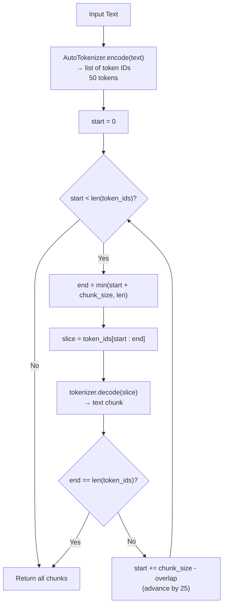
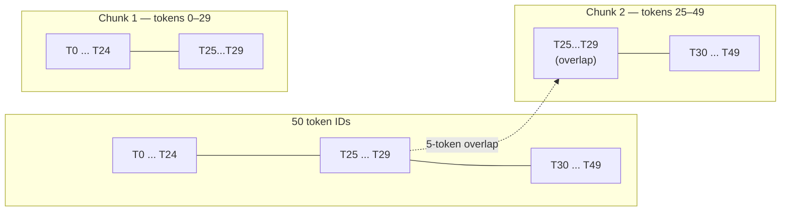

# Fixed-Size Chunking by Token

## The Simple Idea (Feynman Explanation)

LLMs don't read characters — they read **tokens**. A token is roughly a word-piece: `"natural"` is 1 token, `"processing"` is 1 token, `"( nlp )"` is 5 tokens. When you chunk by character count, you might give a model 100 characters that are 25 tokens, or 100 characters that are 40 tokens. The model's context window is measured in tokens, not characters.

Token-based chunking fixes this: encode the whole text into token IDs, slice the ID array into windows of exactly `chunk_size` tokens, then decode each window back to text. The character length of each chunk varies, but the token count is always ≤ `chunk_size`.

Think of it like cutting a film reel by **frame count** instead of by centimetres. Each frame is a different width on screen, but you always get exactly N frames per segment.

---

## Tokenizer Used

This implementation uses **HuggingFace `transformers`** with `bert-base-uncased` (WordPiece tokenizer).

| Property | Value |
|---|---|
| Model | `bert-base-uncased` |
| Vocabulary type | WordPiece |
| Case | Lowercases all text |
| Used by | BERT, RoBERTa, DistilBERT, MiniLM |

> **Why WordPiece lowercases:** `bert-base-uncased` was trained on lowercased text, so its tokenizer normalises input to lowercase. `bert-base-cased` preserves case if needed.

---

## Algorithm

### Step 1 — Encode text to token IDs

```python
tokenizer = AutoTokenizer.from_pretrained("bert-base-uncased")
token_ids = tokenizer.encode(text, add_special_tokens=False)
# "Hello World" → [7592, 2088]
# add_special_tokens=False omits [CLS] and [SEP] boundary tokens
```

### Step 2 — Slide a window of `chunk_size` tokens

```python
def sliding_window(token_ids, chunk_size, overlap):
    start = 0
    while start < len(token_ids):
        end = min(start + chunk_size, len(token_ids))
        yield start, end
        if end == len(token_ids):
            break
        start += chunk_size - overlap  # advance, keeping `overlap` tokens shared
```

Each iteration yields a `(start, end)` index pair. The window advances by `chunk_size - overlap` each step, so the last `overlap` tokens of one chunk become the first `overlap` tokens of the next.

### Step 3 — Decode each window back to text

```python
chunk_text = tokenizer.decode(token_ids[s:e], skip_special_tokens=True)
```

---

## Worked Example

**Settings:** `CHUNK_SIZE = 30`, `CHUNK_OVERLAP = 5`

**Input text** (NLP paragraph, 50 tokens after encoding):

```
Natural language processing (NLP) is a subfield of linguistics, computer science,
and artificial intelligence. It is concerned with the interactions between computers
and human language, in particular how to program computers to process and analyze
large amounts of natural language data.
```

**Trace:**

```
Encode → 50 token IDs

Window 1:  start=0,  end=min(0+30, 50)=30  → tokens [0..29]  → 30 tokens
Window 2:  start=0+(30-5)=25, end=min(25+30,50)=50 → tokens [25..49] → 25 tokens
           end==len(token_ids) → stop
```

**Output:**

```
Total tokens: 50

Chunk 1 [tokens 0–29, 30 tokens]:
  'natural language processing ( nlp ) is a subfield of linguistics,
   computer science, and artificial intelligence. it is concerned with
   the interactions between computers and'

Chunk 2 [tokens 25–49, 25 tokens]:
  'the interactions between computers and human language, in particular
   how to program computers to process and analyze large amounts of
   natural language data.'
```

Tokens 25–29 (`the interactions between computers and`) appear in **both** chunks — that's the 5-token overlap.

---

## Mermaid Diagram



---

## Sliding Window Visualization

`chunk_size=30`, `chunk_overlap=5` on 50 tokens:



---

## Key Findings

- **True token chunking**: the window slices the token ID array directly — every chunk contains exactly `chunk_size` tokens (except the last window which may be shorter).
- **WordPiece lowercases**: `bert-base-uncased` normalises `(NLP)` → `( nlp )`. Use `bert-base-cased` if case matters.
- **`add_special_tokens=False`**: omits `[CLS]` and `[SEP]` tokens. Including them would waste 2 tokens per chunk on boundary markers that carry no content.
- **Overlap works at the token level**: the 5-token overlap is exact — not approximate like character-based overlap.
- Typical RAG pipelines use 256–512 tokens per chunk. `CHUNK_SIZE=30` is intentionally small here to show the overlap clearly.

---

## Pros, Cons & When to Use

| | |
|---|---|
| ✅ **True token-level sizing** | Window slices the token array directly — token count is exact, not estimated. |
| ✅ **Model-matched tokenizer** | Using the same tokenizer as your embedding/inference model guarantees chunks fit within its sequence limit. |
| ✅ **Exact overlap** | Overlap is measured in tokens, not characters — consistent across all chunks. |
| ❌ **Meaning-blind** | Cuts at arbitrary token positions — mid-sentence splits are common. |
| ❌ **Lowercases text** | `bert-base-uncased` loses case information. Use `bert-base-cased` if that matters. |
| ❌ **Character length unpredictable** | Chunks vary in character length even though token count is fixed. |

**Suitable for:**
- Embedding pipelines using BERT-family models where chunks must fit within the model's 512-token limit.
- Any pipeline where you want chunk sizes matched exactly to the tokenizer of your target model.

**Not suitable for:**
- Pipelines targeting OpenAI models — use `tiktoken` with `cl100k_base` instead.
- Use cases where sentence or paragraph integrity matters — use recursive or semantic chunking instead.
