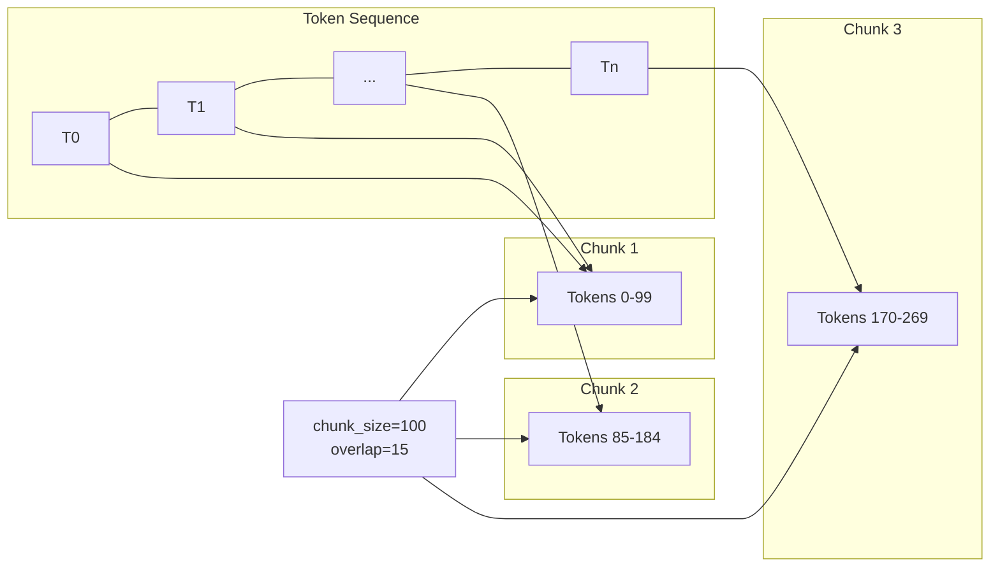

# Fixed-Size Chunking by Token

## Algorithm

Uses `CharacterTextSplitter.from_tiktoken_encoder()` to split text into chunks of a fixed number of **tokens**, measured by `tiktoken` with the `cl100k_base` encoding (used by GPT-4, text-embedding-3-*, etc.).

The core logic is in `split_text_on_tokens()` in `base.py`.

### Step-by-Step Logic

**Step 1 — Encode text to token IDs**

The input text is tokenized into a sequence of integer token IDs using the specified encoding.

```python
input_ids = tokenizer.encode(text)
# e.g., "Hello world" → [15339, 1917]
```

**Step 2 — Slide a window of `tokens_per_chunk` tokens**

Start at position 0 and advance by `(tokens_per_chunk - chunk_overlap)` each iteration.

```
start_idx = 0
while start_idx < len(input_ids):
    cur_idx = min(start_idx + tokens_per_chunk, len(input_ids))
    chunk_ids = input_ids[start_idx:cur_idx]
    if not chunk_ids: break
    decoded = tokenizer.decode(chunk_ids)
    if decoded: splits.append(decoded)
    if cur_idx == len(input_ids): break
    start_idx += tokens_per_chunk - chunk_overlap
```

**Step 3 — Decode each token window back to text**

Each window of token IDs is decoded into human-readable text. The character length of each chunk varies because different tokens represent different amounts of text.

**Trace with `chunk_size=100` tokens, `chunk_overlap=0`:**

```
Text: "Natural language processing (NLP) is a subfield..."
Encoded: [14120, 1471, 3753, 517, 11241, 25, 13019, 389, ...]  (56 tokens total)

Window 1: tokens 0-99   → but only 56 tokens exist
→ Since 56 < 100, only 1 window covers everything
→ Chunk 1: "Natural language processing (NLP) is a ... natural language data."
→ Chunk 1 token count: 56

But with longer text (150+ tokens):
Window 1:  tokens 0-99   → decode → Chunk 1 (21 tokens)
Window 2:  tokens 0-99 + (100-0) = 100-199 → but start_idx advances by 100
           Actually: start_idx = 0 + (100 - 0) = 100
Window 2:  tokens 100-199 → decode → Chunk 2 (varies)
```

**Key difference from character chunking:** The chunk size is measured in tokens, not characters. Tokens are a better measure of "how much an LLM can process" than raw characters.

### Mermaid Diagram

```mermaid
flowchart TD
    A[Input Text] --> B[tiktoken.encode\n→ token IDs]
    B --> C[start_idx = 0]
    C --> D{start_idx < len(tokens)?}
    D -- No --> E[Return chunks]
    D -- Yes --> F[cur_idx = min\nstart_idx + chunk_size\nlen(tokens)]
    F --> G[Extract token slice\ninput_ids[start_idx:cur_idx]]
    G --> H[tokenizer.decode\n→ text chunk]
    H --> I{cur_idx == len(tokens)?}
    I -- Yes --> E
    I -- No --> J[Advance window:\nstart_idx += chunk_size - overlap]
    J --> D
```

### Sliding Window Visualization



## Output

```
Chunk 1 [99 chars]: Natural language processing (NLP) is a subfield of linguistics, computer science, and artificial in
Chunk 2 [100 chars]: telligence. It is concerned with the interactions between computers and human language, in particul
Chunk 3 [91 chars]: ar how to program computers to process and analyze large amounts of natural language data.

Chunk 1 token count: 21
Chunk 2 token count: 18
Chunk 3 token count: 17
```

## Key Findings

- **Character count varies** (99, 100, 91 chars) even though token count is uniform. Common subwords/spaces tokenize to fewer tokens per character, so chunks have inconsistent character lengths despite identical token budgets.
- **Token-aware chunking** guarantees each chunk fits an LLM's context window, avoiding subtle truncation that character-based chunking causes.
- With `chunk_overlap=0`, windows are strictly adjacent with no overlap. With overlap > 0, the window slides by `chunk_size - overlap` tokens each step, producing overlapping token sequences.
- `chunk_size=100` tokens is quite small — typical retrieval uses 75-150 tokens per chunk for dense retrieval scenarios.
- **Alternatives** for tokenization: spaCy (linguistic), SentenceTransformers (semantic), NLTK (general NLP), KoNLPy (Korean). Each produces different token boundaries and affects chunk quality.
