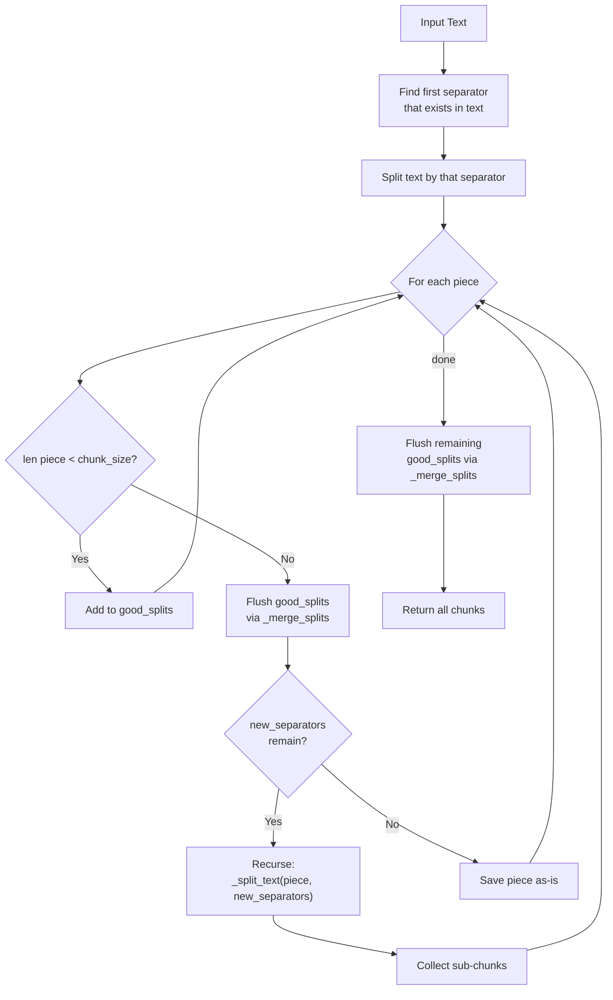
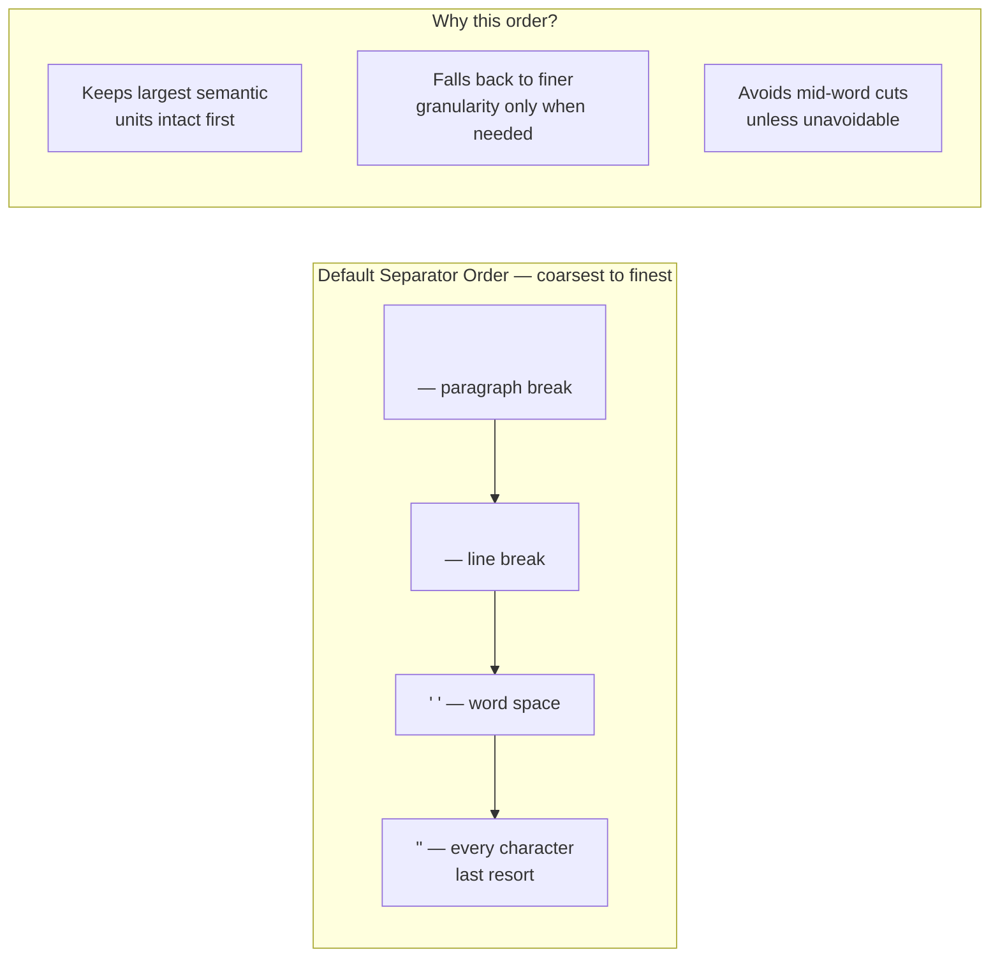

# Recursive Chunking

## The Simple Idea (Feynman Explanation)

Imagine you're packing books into boxes. Your rule: each box holds at most 100 pages.

1. First, try to keep whole **chapters** together. If a chapter fits in one box, great.
2. If a chapter is too long, break it into **paragraphs** and try again.
3. If a paragraph is still too long, break it into **sentences**.
4. If a sentence is still too long, break it into **words**.
5. Last resort: break at any **character**.

That's recursive chunking. It tries the coarsest split first and only goes finer when a piece is still too big. The result: chunks that respect natural language boundaries as much as possible.

---

## Algorithm

Uses `langchain_text_splitters.RecursiveCharacterTextSplitter`. The core logic is in `_split_text()` in `character.py`.

### Step 1 — Select the best separator

Given the ordered separator list (default: `["\n\n", "\n", " ", ""]`), find the first separator that actually exists in the current text. That becomes the active separator; the rest become `new_separators` for recursive calls.

```
separators = ["\n\n", "\n", " ", ""]
text = "Line 1\nLine 2\n\nParagraph 2\nLine 4"

Check "\n\n" → found!
→ active separator = "\n\n"
→ new_separators   = ["\n", " ", ""]
```

### Step 2 — Split using the selected separator

```
splits = text.split("\n\n")
→ ["Line 1\nLine 2", "Paragraph 2\nLine 4"]
```

### Step 3 — Process each piece

For each piece:
- **Fits** (`len(piece) < chunk_size`): add to `good_splits` accumulator.
- **Too big** (`len(piece) >= chunk_size`):
  1. Flush `good_splits` into chunks via `_merge_splits`.
  2. If `new_separators` remain → **recurse** with `_split_text(piece, new_separators)`.
  3. If no separators remain → save piece as-is.

### Step 4 — Merge accumulated `good_splits`

Uses the same `_merge_splits` logic as `CharacterTextSplitter`: accumulate pieces up to `chunk_size`, then finalize and apply overlap by popping from the front.

---

## Worked Example

**Code:**
```python
splitter = RecursiveCharacterTextSplitter(
    chunk_size=100,
    chunk_overlap=15
)
```

**Full trace:**

```
Text: "\nNatural language processing (NLP) is a subfield of linguistics, computer science,
       and artificial intelligence. It is concerned with the interactions between computers
       \nand human language, in particular how to program computers to process and analyze
       \nlarge amounts of natural language data.\n"

chunk_size=100, chunk_overlap=15

1. Try "\n\n" → not found in text.
2. Try "\n"   → found. new_separators = [" ", ""]
3. Split by "\n" → 4 pieces (leading \n produces an empty string, which is dropped):
     piece A: "Natural language processing ... and artificial intelligence." (167 chars)
     piece B: "and human language, in particular how to program computers to process and analyze" (81 chars)
     piece C: "large amounts of natural language data." (39 chars)

4. piece A (167 chars ≥ 100) → recurse with new_separators=[" ", ""]
     Try " " → found. Split into ~20 words, each word < 100.
     Merge words into chunks of ≤ 100 chars:
       Chunk 1: "Natural language processing (NLP) is a subfield of linguistics, computer science, and artificial"
                → 96 chars
       Overlap: pop front words until total ≤ 15
                → last word retained: "artificial" (10 chars) — but LangChain retains
                  "and artificial" (14 chars) as the overlap tail
       Chunk 2: "and artificial intelligence. It is concerned with the interactions between computers"
                → 84 chars (starts with the 14-char overlap tail)

5. piece B (81 chars < 100) → good_splits = [piece B]
6. piece C (39 chars < 100) → good_splits = [piece B, piece C]

7. Merge good_splits:
     81 + 1(sep) + 39 = 121 > 100
     → Chunk 3: piece B alone → 81 chars
     → Chunk 4: piece C alone → 39 chars
```

**Output:**
```
Chunk 1 [96 chars]: Natural language processing (NLP) is a subfield of linguistics, computer science, and artificial
Chunk 2 [84 chars]: and artificial intelligence. It is concerned with the interactions between computers
Chunk 3 [81 chars]: and human language, in particular how to program computers to process and analyze
Chunk 4 [39 chars]: large amounts of natural language data.
```

Chunk 1 ends with `artificial` and Chunk 2 starts with `and artificial` — that's the 14-character overlap tail carried forward.

---

## Mermaid Diagram



---

## Separator Hierarchy



---

## Key Findings

- **Overlap is visible**: Chunk 1 ends with `artificial` and Chunk 2 starts with `and artificial` — a 14-character overlap tail. This works because the first line was recursively split by `" "` into words, giving the overlap mechanism many small pieces to selectively retain.
- **Closer to `chunk_size`**: Chunks are 96, 84, 81, 39 chars — much better than the naive character splitter, which left a 167-char oversized piece intact.
- **Cleanest boundaries**: Splits at paragraph → line → word → character, only going finer when forced.
- **Trade-off**: More computation than `CharacterTextSplitter` (recursive calls per oversized piece), but produces more semantically coherent chunks.
- Overlap is most effective when the finest separator (`" "` or `""`) is reached, because many small pieces can be selectively popped from the front.
