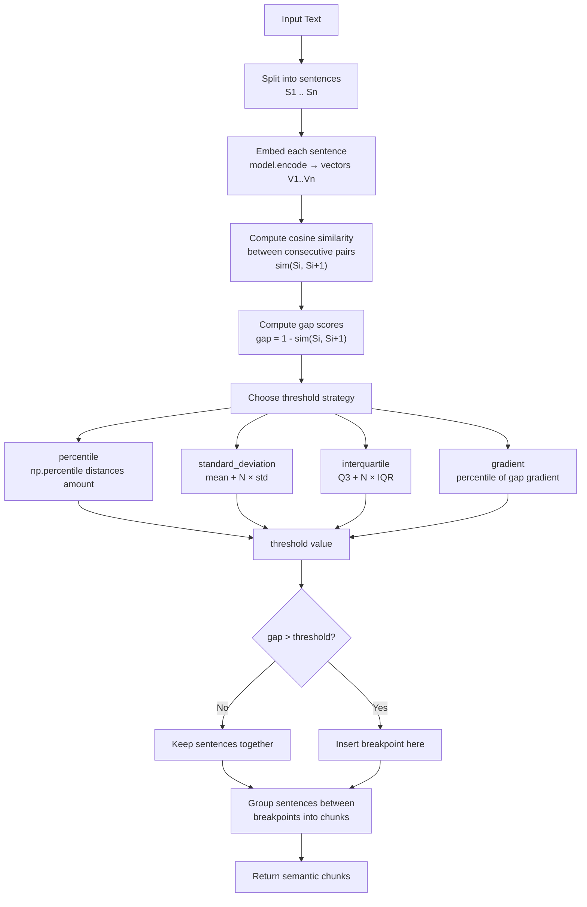
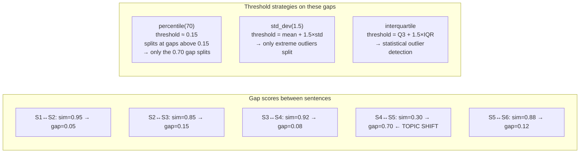

# Semantic Chunking

## The Simple Idea (Feynman Explanation)

Every other chunking technique is blind to meaning — it just counts characters, tokens, or newlines. Semantic chunking asks a different question: **"Do these two sentences talk about the same thing?"**

Here's the intuition:

1. Split the text into sentences.
2. Turn each sentence into a vector (a list of numbers that captures its meaning).
3. Compare neighbouring sentences: if sentence 3 and sentence 4 are about very different topics, their vectors will point in very different directions — the **cosine similarity** between them will be low.
4. A low similarity between neighbours = a topic boundary = a good place to cut.

Think of it like reading a book and noticing when the author switches subjects. You don't need a ruler — you just feel the shift. Semantic chunking automates that feeling using embeddings.

---

## Algorithm

Uses `langchain_experimental.text_splitter.SemanticChunker` with a sentence embedding model.

### Step 1 — Split text into sentences

```
Input: "The Eiffel Tower is located in Paris.
        It was built in 1889 for the World's Fair.
        Photosynthesis converts sunlight into energy."

Sentences:
  S1: "The Eiffel Tower is located in Paris."
  S2: "It was built in 1889 for the World's Fair."
  S3: "Photosynthesis converts sunlight into energy."
```

### Step 2 — Embed each sentence

Each sentence is encoded into a dense vector by the embedding model (`all-MiniLM-L6-v2` produces 384-dimensional vectors).

```
S1 → [0.23, -0.45, 0.12, ...]   # "Paris / Eiffel Tower" region of embedding space
S2 → [0.21, -0.42, 0.15, ...]   # similar direction → same topic
S3 → [-0.31, 0.56, 0.02, ...]   # very different direction → different topic
```

### Step 3 — Compute cosine similarity between consecutive pairs

```
sim(S1, S2) = 0.95   → high similarity → same topic
sim(S2, S3) = 0.12   → low similarity  → topic shift
```

### Step 4 — Convert similarities to distance (gap) scores

```
gap(S1↔S2) = 1 - sim(S1, S2) = 1 - 0.95 = 0.05   (small gap → same topic)
gap(S2↔S3) = 1 - sim(S2, S3) = 1 - 0.12 = 0.88   (large gap → topic shift)

distances = [0.05, 0.88]
```

The gap score is simply `1 - cosine_similarity`. A large gap means the sentences are semantically far apart.

### Step 5 — Identify breakpoints using a threshold strategy

The threshold is computed from the distribution of all gap scores. Any gap **above** the threshold becomes a breakpoint.

| Strategy | Threshold formula | Effect with `amount=20` |
|---|---|---|
| `percentile` | `np.percentile(distances, amount)` | threshold = 20th percentile value; gaps above it (the top 80%) trigger a split — very aggressive |
| `standard_deviation` | `mean + amount × std` | threshold = mean + 20×std — extremely conservative |
| `interquartile` | `Q3 + amount × IQR` | threshold = Q3 + 20×IQR |
| `gradient` | `np.percentile(gradient, amount)` | same percentile logic applied to the rate of change |

**Important:** for `percentile`, `breakpoint_threshold_amount=20` means `np.percentile(distances, 20)` — the threshold is the **20th percentile value**. Gaps above that value (i.e., the top 80% of gaps) trigger a split. A lower amount = lower threshold = more splits. A higher amount = higher threshold = fewer splits.

```
With percentile, amount=20:
  distances = [0.05, 0.88]
  threshold = np.percentile([0.05, 0.88], 20) = 0.05 + 0.2 × (0.88 - 0.05) = 0.216

  gap(S1↔S2) = 0.05 → 0.05 > 0.216? No  → no split
  gap(S2↔S3) = 0.88 → 0.88 > 0.216? Yes → breakpoint between S2 and S3
```

### Step 6 — Form chunks

Group sentences between breakpoints into a single chunk.

```
Chunk 1: S1 + S2 → "The Eiffel Tower is located in Paris. It was built in 1889 for the World's Fair."
Chunk 2: S3      → "Photosynthesis converts sunlight into energy."
```

---

## Mermaid Diagram



---

## Threshold Strategy Comparison



---

## Typical Pipeline in Practice

```
PDF → extract text → SemanticChunker → embed chunks → FAISS index → top-k retriever
```

---

## Output

```
Chunk 1 [80 chars]: The Eiffel Tower is located in Paris. It was built in 1889 for the World's Fair.

Chunk 2 [45 chars]: Photosynthesis converts sunlight into energy.
```

---

## Key Findings

- **Semantic coherence**: Related sentences stay together regardless of character count. A fixed-size splitter would split them at arbitrary positions.
- **Variable chunk sizes**: Chunk length is determined by content, not a fixed limit — the defining difference from all other techniques.
- **No overlap needed**: Each chunk is a semantically complete unit.
- **Embedding cost**: Requires one model inference per sentence — the most computationally expensive approach.
- **Threshold direction matters**: For `percentile`, a *lower* `breakpoint_threshold_amount` means a *lower* threshold, which means *more* splits. This is the opposite of what the name "amount" might suggest.
- **Best for**: Documents with clear topical shifts — scientific papers, legal documents, FAQs. Less useful for homogeneous text where semantic boundaries are subtle.
