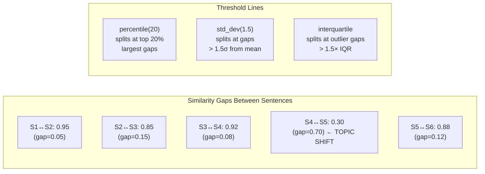
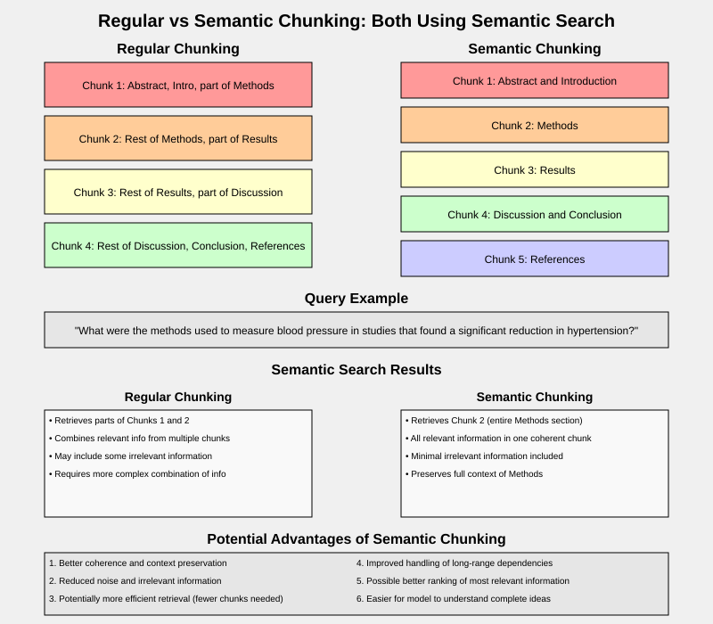

# Semantic Chunking

## Origin

First proposed by **Greg Kamradt**, later implemented in LangChain as `SemanticChunker`. Unlike fixed-size approaches that split at arbitrary character/token positions, semantic chunking splits text at **natural topic boundaries** using embedding similarity.

## Algorithm

Uses `langchain_experimental.text_splitter.SemanticChunker` with sentence embeddings to split text at natural semantic boundaries.

### Step-by-Step Logic

**Step 1 — Split text into sentences**

The input text is segmented into individual sentences using a sentence detector (typically `nltk.sent_tokenize` or a language-model-based splitter).

```
Input: "The Eiffel Tower is located in Paris. It was built in 1889 for the World's Fair. Photosynthesis converts sunlight into energy."
Sentences:
  S1: "The Eiffel Tower is located in Paris."
  S2: "It was built in 1889 for the World's Fair."
  S3: "Photosynthesis converts sunlight into energy."
```

**Step 2 — Embed each sentence**

Each sentence is converted into a dense vector embedding using a sentence transformer model (e.g., `all-MiniLM-L6-v2`, OpenAI embeddings). These embeddings capture the semantic meaning of each sentence in a high-dimensional space.

```
S1 → [0.23, -0.45, 0.12, ...]  (384-dim vector for MiniLM)
S2 → [0.21, -0.42, 0.15, ...]
S3 → [-0.31, 0.56, 0.02, ...]
```

**Step 3 — Compute pairwise similarity gaps**

Cosine similarity is computed between consecutive sentence embeddings. A high similarity means the sentences are on the same topic; a sharp drop signals a topic boundary.

```
sim(S1, S2) = 0.95  → same topic (Eiffel Tower)
sim(S2, S3) = 0.12  → large drop → topic shift
gaps = [difference(0.95), difference(0.12)]
     = [0.05, 0.83]
```

**Step 4 — Identify breakpoints using threshold strategy**

The gaps are analyzed using one of four breakpoint threshold types to determine where to split:

| Strategy | Logic | Use Case |
|----------|-------|----------|
| `percentile` | Split at gaps > Nth percentile of all gaps | Balanced; 20th percentile = break at top 20% largest drops |
| `standard_deviation` | Split at gaps > N standard deviations from mean | Conservative; only breaks at unusually large drops |
| `interquartile` | Split at gaps > 1.5× IQR above Q3 | Statistical outlier detection |
| `gradient` | Split at peaks in the rate of similarity change | Finds inflection points in topic drift |

```
With percentile(20):
Sorted gaps: [0.05, 0.83]
80th percentile threshold ≈ 0.83 * 0.8 + 0.05 * 0.2 = 0.674
Gaps above threshold: [0.83]
→ Breakpoint between S2 and S3
```

**Step 5 — Form chunks**

Sentences between breakpoints are grouped into a single chunk. No overlap is needed since each chunk is semantically self-contained.

```
Chunk 1: S1 + S2  ("The Eiffel Tower is located in Paris. It was built in 1889 for the World's Fair.")
Chunk 2: S3       ("Photosynthesis converts sunlight into energy.")
```

### Mermaid Diagram

```mermaid
flowchart TD
    A[Input Text] --> B[sent_tokenize\n→ sentences S1..Sn]
    B --> C[Embed each sentence\n→ vectors V1..Vn]
    C --> D[Compute cos similarity\nbetween consecutive pairs\nsim(Si, Si+1)]
    D --> E[Calculate gap scores\n1 - sim(Si, Si+1)]
    E --> F[Select breakpoint\nthreshold strategy]
    
    F --> G[percentile]
    F --> H[standard_deviation]
    F --> I[interquartile]
    F --> J[gradient]
    
    G --> K[Compute gap\npercentile threshold]
    H --> L[Compute gap\nmean + N*std threshold]
    I --> M[Compute IQR-based\noutlier threshold]
    J --> N[Find peaks in\nsimilarity gradient]
    
    K --> O{Is gap > threshold?}
    L --> O
    M --> O
    N --> O
    
    O -- No --> P[Keep sentences together]
    O -- Yes --> Q[Insert breakpoint]
    
    P --> R[Group into chunks\nbetween breakpoints]
    Q --> R
    R --> S[Return semantic chunks]
```

### Breakpoint Threshold Comparison



### Typical Pipeline in Practice

```
PDF Document → read_pdf_to_string() → SemanticChunker → FAISS Vector Store → Retriever (top-k)
```

- PDF is extracted to plain text.
- Text is split into semantic chunks using embeddings.
- Chunks are embedded again and indexed in a **FAISS** vector store.
- A **retriever** fetches the top-k most relevant chunks for a query.

## Output

```
Chunk 1 [80 chars]: The Eiffel Tower is located in Paris. It was built in 1889 for the World's Fair.

Chunk 2 [45 chars]: Photosynthesis converts sunlight into energy.
```

## Comparison Diagram



The diagram illustrates how regular chunking splits topics across arbitrary boundaries (Abstract/Intro/Methods mixed), while semantic chunking preserves entire topical sections (Methods stays together, Results stays together). For queries like *"What were the methods used to measure blood pressure?"*, semantic chunking retrieves the complete Methods section in one coherent chunk, whereas regular chunking requires stitching fragments from multiple chunks.

## Key Findings

- **Semantic coherence**: Related sentences stay together. A fixed-size splitter would merge or split these across arbitrary boundaries.
- **Variable chunk sizes**: Lengths are determined by content, not a fixed limit — the defining difference from all other techniques.
- **No overlap needed**: Chunks are semantically complete units, making overlap unnecessary.
- **Embedding cost**: Requires model inference per sentence — the most computationally expensive approach. For large documents, this is significant.
- **Threshold tuning** is critical: `breakpoint_threshold_amount` is sensitive. Too high → too many tiny chunks; too low → fails to split unrelated topics.
- **Best for**: Documents with clear topical shifts — scientific papers, legal documents, comprehensive reports, FAQs. Less useful for homogeneous text where semantic boundaries are subtle.
