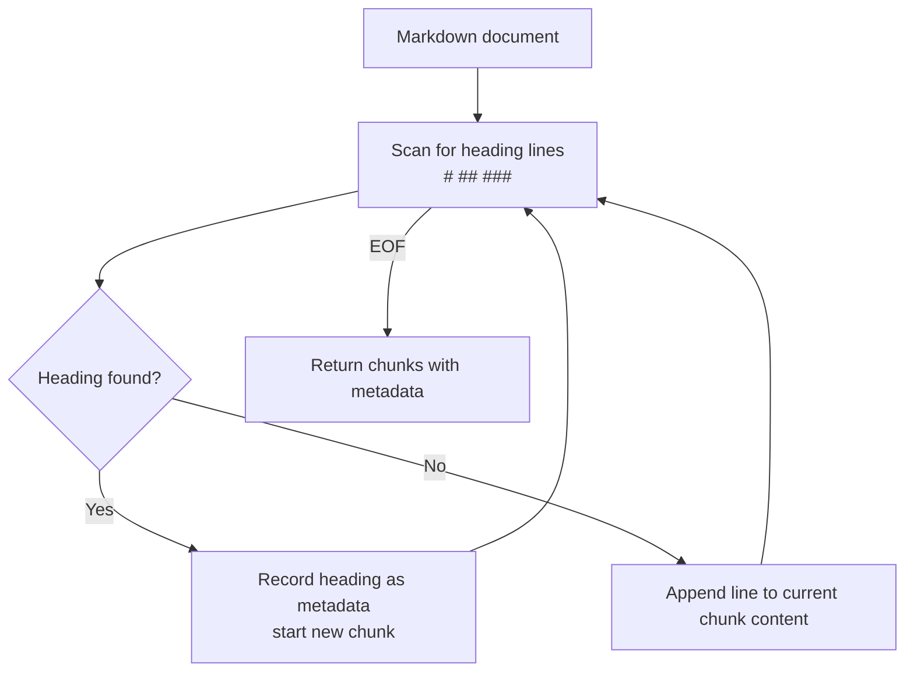
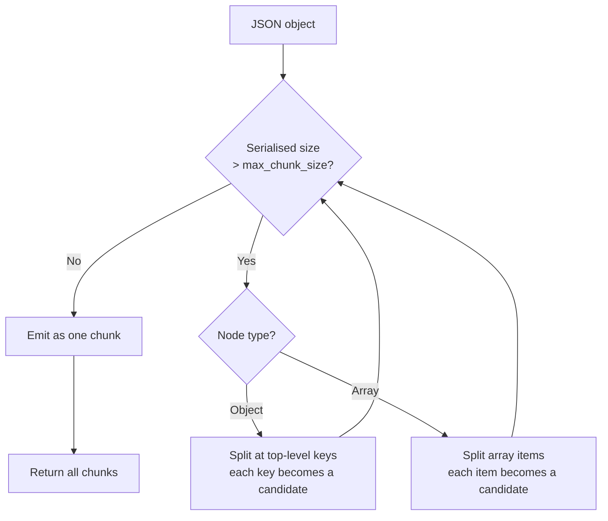
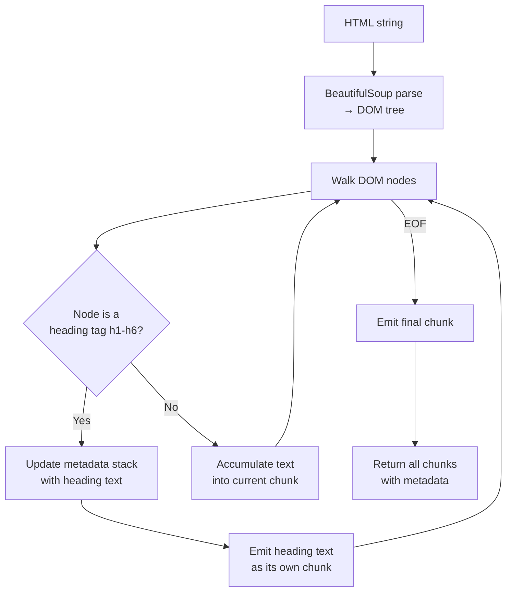
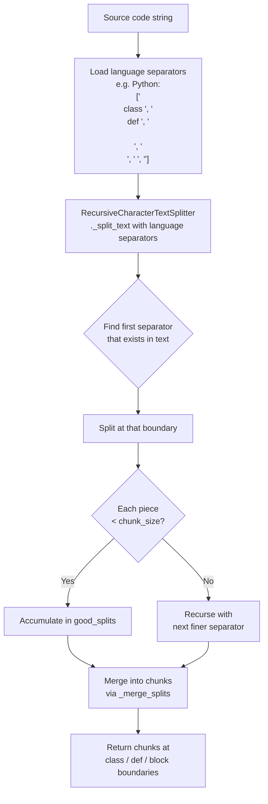
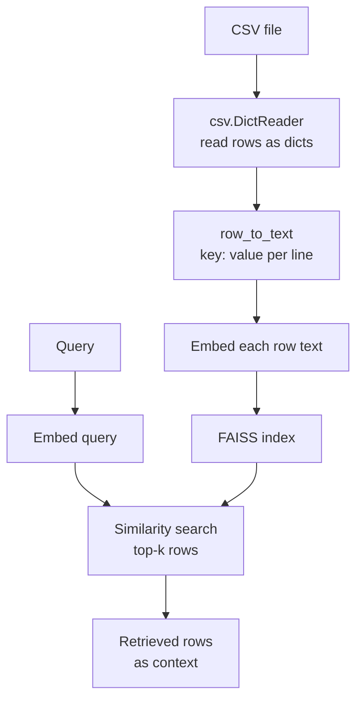
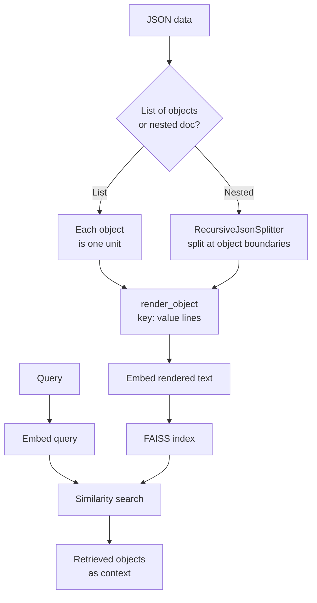
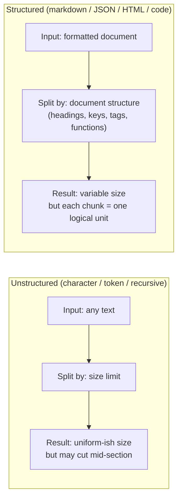

# Structured Document Chunking

## The Simple Idea (Feynman Explanation)

All previous chunking techniques are **format-blind** — they treat every document as a flat string of characters or tokens. But most real documents have structure: a JSON API response has nested keys, an HTML page has headings, a Python file has classes and functions, a Markdown report has sections.

Structured chunking reads that structure and uses it as the split boundary. Instead of asking *"how many characters fit here?"*, it asks *"where does this logical unit end?"*

Think of it like cutting a newspaper: a blind cutter slices at every 10 cm. A structured cutter reads the layout and cuts between articles, keeping each story intact.

---

## Techniques Covered

| # | File / Folder | Splitter / Approach | Format | Split boundary |
|---|---|---|---|---|
| 1 | `1_structured_document_chunking_markdown.py` | `MarkdownHeaderTextSplitter` | Markdown | `#`, `##`, `###` headings |
| 2 | `2_structured_document_chunking_json.py` | `RecursiveJsonSplitter` | JSON | Object / array boundaries |
| 3 | `3_structured_document_chunking_code.py` | `RecursiveCharacterTextSplitter.from_language()` | Source code | `class`, `def`, `\n\n` |
| 4 | `4_structured_document_chunking_html.py` | `HTMLHeaderTextSplitter` | HTML | `<h1>`–`<h6>` tags |
| 5 | `5_rag_over_csv/` | Row-to-text rendering | CSV | One row = one retrieval unit |
| 6 | `6_rag_over_json/` | Object-to-text rendering | JSON | One object = one retrieval unit |

---

## 1 — Markdown (`MarkdownHeaderTextSplitter`)

### How it works

Scans the document for heading lines (`#`, `##`, `###`, etc.) and splits at each heading boundary. The heading text is stored as **metadata**, not content.

```python
from langchain_text_splitters import MarkdownHeaderTextSplitter

headers_to_split_on = [("#", "h1_title"), ("##", "h2_section")]
splitter = MarkdownHeaderTextSplitter(headers_to_split_on=headers_to_split_on)
chunks = splitter.split_text(markdown_doc)
```

### Output

```
Chunk 1
  Metadata: {'h1_title': 'Annual Report 2024', 'h2_section': 'Executive Summary'}
  Content:  Revenue grew 23% YoY driven by cloud segment. Operating margin improved to 18%.

Chunk 2
  Metadata: {'h1_title': 'Annual Report 2024', 'h2_section': 'Financial Performance'}
  Content:  Total revenue: $4.2B  Net income: $756M  Free cash flow: $1.1B

Chunk 3
  Metadata: {'h1_title': 'Annual Report 2024', 'h2_section': 'Risk Factors'}
  Content:  Supply chain disruptions remain a concern. Regulatory changes in EU may impact operations.
```

### Mermaid Diagram



---

## 2 — JSON (`RecursiveJsonSplitter`)

### How it works

Walks the JSON tree recursively. When a node's serialised size exceeds `max_chunk_size` characters, it splits at the nearest object or array boundary — never mid-key or mid-value. Each chunk is a valid JSON fragment.

```python
from langchain_text_splitters import RecursiveJsonSplitter

splitter = RecursiveJsonSplitter(max_chunk_size=200)
chunks = splitter.split_json(json_data=json_doc)
```

### Output

```
Chunk 1: {'company': 'Acme Corp', 'founded': 1998,
           'headquarters': {'city': 'San Francisco', 'state': 'CA', 'zip': '94105'}}

Chunk 2: {'products': [{'id': 'p1', 'name': 'Widget Pro', ...},
                        {'id': 'p2', 'name': 'Gadget Lite', ...},
                        {'id': 'p3', 'name': 'SuperTool', ...}]}

Chunk 3: {'financials': {'revenue': 4200000, 'net_income': 756000, 'currency': 'USD'}}
```

### Mermaid Diagram



---

## 3 — HTML (`HTMLHeaderTextSplitter`)

### How it works

Parses the HTML with BeautifulSoup and splits at `<h1>`–`<h6>` tag boundaries. All ancestor headings are accumulated into the chunk's metadata. The content is the stripped plain text between the current heading and the next heading of equal or higher level.

```python
from langchain_text_splitters import HTMLHeaderTextSplitter

headers_to_split_on = [("h1", "document_title"), ("h2", "section"), ("h3", "subsection")]
splitter = HTMLHeaderTextSplitter(headers_to_split_on=headers_to_split_on)
chunks = splitter.split_text(html_doc)
```

> **Dependency:** requires `bs4` — add with `uv add bs4`

### Output

```
Chunk 1  Metadata: {'document_title': 'Annual Report 2024'}
         Content:  Annual Report 2024

Chunk 2  Metadata: {'document_title': 'Annual Report 2024', 'section': 'Executive Summary'}
         Content:  Executive Summary

Chunk 3  Metadata: {'document_title': 'Annual Report 2024', 'section': 'Executive Summary'}
         Content:  Revenue grew 23% YoY driven by cloud segment.
                   Operating margin improved to 18%.

Chunk 4  Metadata: {'document_title': 'Annual Report 2024', 'section': 'Financial Performance'}
         Content:  Financial Performance

Chunk 5  Metadata: {'document_title': 'Annual Report 2024', 'section': 'Financial Performance'}
         Content:  Total revenue: $4.2B  Net income: $756M

Chunk 6  Metadata: {'document_title': 'Annual Report 2024', 'section': 'Financial Performance', 'subsection': 'Quarterly Breakdown'}
         Content:  Quarterly Breakdown

Chunk 7  Metadata: {'document_title': 'Annual Report 2024', 'section': 'Financial Performance', 'subsection': 'Quarterly Breakdown'}
         Content:  Q1: $980M | Q2: $1.02B | Q3: $1.1B | Q4: $1.1B

Chunk 8  Metadata: {'document_title': 'Annual Report 2024', 'section': 'Risk Factors'}
         Content:  Risk Factors

Chunk 9  Metadata: {'document_title': 'Annual Report 2024', 'section': 'Risk Factors'}
         Content:  Supply chain disruptions remain a concern.
                   Regulatory changes in EU may impact operations.
```

Note: each heading tag produces its own chunk (e.g., chunk 2 is just the heading text "Executive Summary"), followed by a content chunk (chunk 3). This is how `HTMLHeaderTextSplitter` works — it emits the heading text as a separate chunk before the body content.

### Mermaid Diagram



---

## 4 — Code (`RecursiveCharacterTextSplitter.from_language`)

### How it works

`from_language()` loads a language-specific separator list. For Python:

```
["\nclass ", "\ndef ", "\n\tdef ", "\n\n", "\n", " ", ""]
```

This is the same recursive algorithm as `RecursiveCharacterTextSplitter`, but the separator priority is tuned to split at class and function boundaries first, then blank lines, then lines, then words — only falling back to character-level cuts as a last resort.

```python
from langchain_text_splitters import RecursiveCharacterTextSplitter, Language

splitter = RecursiveCharacterTextSplitter.from_language(
    language=Language.PYTHON,
    chunk_size=200,
    chunk_overlap=20,
)
chunks = splitter.split_text(python_code)
```

**Supported languages:** `python`, `js`, `ts`, `java`, `go`, `rust`, `cpp`, `html`, `markdown`, `latex`, and [more](https://python.langchain.com/docs/how_to/code_splitter/).

### Output

```
Chunk 1 [56 chars]:
  import os
  from dataclasses import dataclass

  @dataclass

Chunk 2 [65 chars]:
  class Config:
      host: str
      port: int
      debug: bool = False

Chunk 3 [190 chars]:
  def connect(config: Config) -> bool:
      """Establish a connection using the given config."""
      if config.debug:
          print(f"Connecting to {config.host}:{config.port}")
      return True

Chunk 4 [190 chars]:
  class DatabaseClient:
      def __init__(self, config: Config):
          self.config = config
          self._connected = False

      def open(self):
          self._connected = connect(self.config)

Chunk 5 [186 chars]:
  def query(self, sql: str) -> list:
          if not self._connected:
              raise RuntimeError("Not connected")
          return []

      def close(self):
          self._connected = False
```

### Mermaid Diagram



---

## 5 — RAG over CSV (row-to-text rendering)

### How it works

A CSV file is already structured — each row is one entity. The challenge is that a vector search engine only understands text. The solution is to render each row as labeled key-value text so the embedding model understands what each value means.

```python
def row_to_text(row: dict) -> str:
    return "\n".join(f"{key}: {value}" for key, value in row.items() if value)

# "Alice Chen,Engineering,95000" becomes:
# name: Alice Chen
# department: Engineering
# salary: 95000
```

Each rendered row is one retrieval unit. The original row values are stored as metadata for exact-value filtering.

### Output

```
Query: 'Who are the engineers and what do they earn?'
  [score=0.408] Alice Chen — Engineering
  [score=0.384] Carol White — Engineering
  [score=0.360] Eve Torres — Engineering

Query: 'Which employees are inactive?'
  [score=0.380] Frank Lee — HR
  [score=0.351] Alice Chen — Engineering
```

### Mermaid Diagram



### Key findings

- **Column names are context, not noise.** Indexing `"95000"` alone is useless. Indexing `"salary: 95000"` lets the retriever understand what the number means.
- **Metadata filters outperform embeddings for exact values.** A query for `status = "active"` is better served by a metadata filter than by semantic similarity.
- **Wide rows need grouping.** A row with 50 columns produces a long, diluted embedding. Group related columns into logical sections.

See [`5_rag_over_csv/README.md`](5_rag_over_csv/README.md) for the full worked example and pros/cons.

---

## 6 — RAG over JSON (object-to-text rendering)

### How it works

JSON is a tree. Dumping the entire JSON as a string produces a noisy embedding. The right approach is to split at object boundaries and render each object as readable key-value text that preserves the hierarchy.

```python
def render_object(obj: dict, prefix: str = "") -> str:
    lines = []
    for key, value in obj.items():
        full_key = f"{prefix}.{key}" if prefix else key
        if isinstance(value, dict):
            lines.append(render_object(value, prefix=full_key))
        elif isinstance(value, list):
            lines.append(f"{full_key}: {', '.join(str(v) for v in value)}")
        else:
            lines.append(f"{full_key}: {value}")
    return "\n".join(lines)

# {"award": "Nobel Prize", "year": 1911, "winners": ["Marie Curie"]} becomes:
# award: Nobel Prize
# year: 1911
# winners: Marie Curie
```

### Output

```
Query: 'Which Nobel Prize did Marie Curie win alone?'
  [score=0.617] Chemistry 1911 — Marie Curie
  [score=0.566] Physics 1903 — Marie Curie, Pierre Curie, Henri Becquerel

Query: 'Who won the Nobel Peace Prize?'
  [score=0.640] Peace 1964 — Martin Luther King Jr.
```

### Mermaid Diagram



### Key findings

- **Key names are context.** Indexing `"1911"` alone is meaningless. Indexing `"year: 1911"` tells the retriever this is a year.
- **Nested paths prevent ambiguity.** Use `address.city` and `billing.city` to distinguish fields with the same name at different levels.
- **Raw JSON strings are poor embeddings.** Curly braces, quotes, and colons add noise. Always render to readable text before indexing.
- **For deeply nested documents**, use `RecursiveJsonSplitter` (covered in section 2 above) to split at object boundaries before rendering.

See [`6_rag_over_json/README.md`](6_rag_over_json/README.md) for the full worked example and pros/cons.

---

## Comparison: Structured vs Unstructured Chunking



---

## Pros, Cons & When to Use

| | |
|---|---|
| ✅ **Logically coherent chunks** | Each chunk maps to a real unit: a section, a JSON object, a function. |
| ✅ **Rich metadata** | Markdown and HTML splitters attach heading hierarchy as metadata — enables filtered retrieval (e.g., "only search the Risk Factors section"). |
| ✅ **No mid-concept cuts** | A function body or JSON object is never split across two chunks (unless it exceeds `chunk_size`). |
| ❌ **Format-specific** | Each splitter only works on its target format. You need to know the document type upfront. |
| ❌ **Heading-text chunks** | `HTMLHeaderTextSplitter` emits heading text as separate chunks (e.g., chunk 2 = just "Executive Summary"). These may need post-filtering. |
| ❌ **No size guarantee** | A very long section or function will produce an oversized chunk. Combine with a secondary size-based splitter if needed. |

**Suitable for:**
- API responses and config files → JSON splitter.
- Web-scraped content, documentation sites → HTML splitter.
- Source code indexing, code search → code splitter with `from_language()`.
- Reports, wikis, README files → Markdown splitter.
- Any RAG pipeline where metadata-filtered retrieval is needed (e.g., "find this in section X").

**Not suitable for:**
- Plain prose with no structural markers — use recursive or semantic chunking instead.
- Mixed-format documents (e.g., Markdown with embedded HTML) — pick the dominant format or pre-process first.
