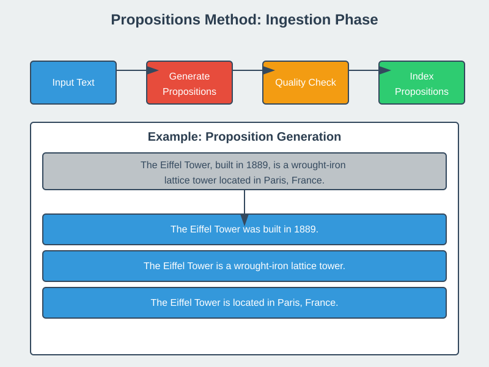
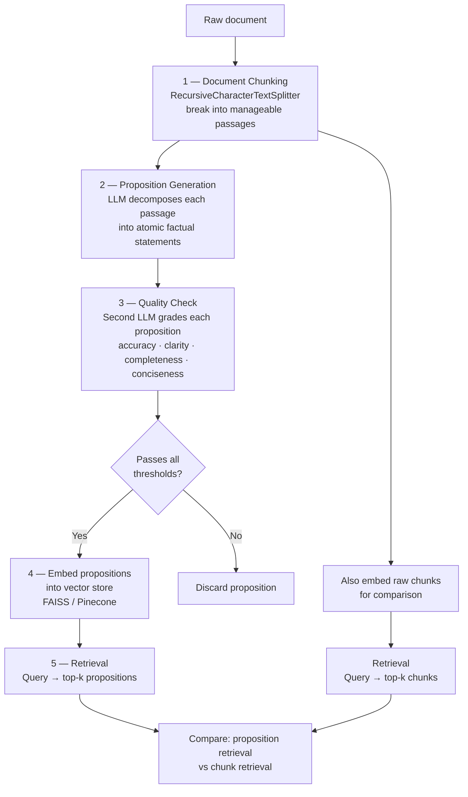
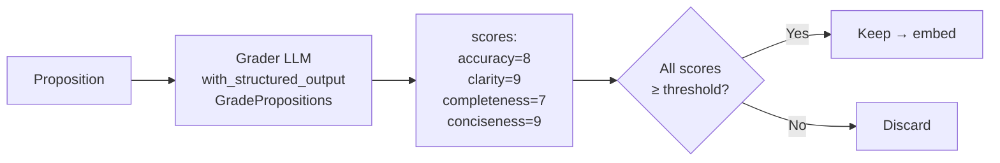

# Proposition / Agentic Chunking

## The Simple Idea (Feynman Explanation)

Every other chunking technique splits text by **position** — at a character boundary, a token count, a heading, or a similarity drop. None of them understand what the text *means*.

Proposition chunking flips the approach: instead of cutting the text, you ask an LLM to **rewrite** it as a list of atomic facts. Each fact is one chunk.

Imagine a dense paragraph like:

> *"Marie Curie, born in Warsaw in 1867, was the first woman to win a Nobel Prize. She won it twice — in Physics (1903) and Chemistry (1911)."*

A character splitter might cut this mid-sentence. A semantic splitter keeps it as one chunk. Proposition chunking turns it into **six independent facts**, each retrievable on its own:

```
[P1] Marie Curie was born in Warsaw.
[P2] Marie Curie was born in 1867.
[P3] Marie Curie was the first woman to win a Nobel Prize.
[P4] Marie Curie won the Nobel Prize in Physics in 1903.
[P5] Marie Curie won the Nobel Prize in Chemistry in 1911.
[P6] Marie Curie is the only person to win Nobel Prizes in two different sciences.
```

Now a query like *"When did Marie Curie win the Chemistry Nobel?"* retrieves exactly P5 — not a 200-character blob that happens to contain the answer buried inside.

This technique is based on the paper **["Dense X Retrieval: What Retrieval Granularity Should We Use?"](https://doi.org/10.48550/arXiv.2312.06648)** (Chen et al., 2023).

---

## Pipeline Overview



The full pipeline has five stages:



---

## Stage 1 — Document Chunking

Before propositionizing, the document is split into passages small enough for the LLM to process reliably. This uses `RecursiveCharacterTextSplitter` — the same recursive technique from section 3.

```python
from langchain_text_splitters import RecursiveCharacterTextSplitter

splitter = RecursiveCharacterTextSplitter(chunk_size=800, chunk_overlap=100)
passages = splitter.split_text(document)
```

Each passage is then fed independently to the proposition generator.

---

## Stage 2 — Proposition Generation

The LLM receives a passage and a prompt enforcing three rules:

1. **One fact per proposition** — no compound statements.
2. **Self-contained** — fully understandable without reading surrounding text.
3. **No pronouns** — replace *"she"*, *"it"*, *"they"* with the actual proper noun.

```python
prompt = f"""Decompose the following passage into atomic, self-contained
factual propositions. Each proposition must:
- Express exactly ONE fact
- Be fully understandable without additional context
- Use proper nouns, not pronouns

Passage: {passage}"""
```

Structured JSON output is enforced so the response is always a parseable list — no markdown, no numbering, no prose:

```python
response_format={
    "type": "json_schema",
    "json_schema": {
        "name": "propositions_list",
        "strict": True,
        "schema": {
            "type": "object",
            "properties": {
                "propositions": {"type": "array", "items": {"type": "string"}}
            },
            "required": ["propositions"],
            "additionalProperties": False
        }
    }
}
```

---

## Stage 3 — Quality Check

Not every generated proposition is good. A second LLM grades each one on four dimensions, each scored 1–10:

| Dimension | What it measures |
|---|---|
| **Accuracy** | Does the proposition faithfully reflect the original text? |
| **Clarity** | Is it understandable without any additional context? |
| **Completeness** | Does it include necessary details — dates, qualifiers, names? |
| **Conciseness** | Is it as short as possible without losing important information? |

```python
class GradePropositions(BaseModel):
    accuracy:     int = Field(description="Rate 1-10: faithfulness to original text")
    clarity:      int = Field(description="Rate 1-10: understandable without context")
    completeness: int = Field(description="Rate 1-10: includes necessary details")
    conciseness:  int = Field(description="Rate 1-10: concise without losing information")
```

The grader uses `with_structured_output(GradePropositions)` so scores come back as a typed Python object — no parsing needed.

### Quality Check Example

**Source text:**
```
In 1969, Neil Armstrong became the first person to walk on the Moon
during the Apollo 11 mission.
```

| Proposition | Accuracy | Clarity | Completeness | Conciseness | Keep? |
|---|---|---|---|---|---|
| Neil Armstrong was an astronaut. | 10 | 10 | 10 | 10 | ✅ |
| Neil Armstrong walked on the Moon in 1969. | 10 | 10 | 10 | 10 | ✅ |
| Neil Armstrong was the first person to walk on the Moon. | 10 | 10 | 10 | 10 | ✅ |
| Neil Armstrong walked on the Moon during the Apollo 11 mission. | 10 | 10 | 10 | 10 | ✅ |
| He went to space. | 6 | 4 | 3 | 8 | ❌ (pronoun, vague) |

A proposition is retained only when **all four scores** meet the configured threshold (e.g., ≥ 7). This filters out vague, pronoun-contaminated, or incomplete propositions before they reach the vector store.



---

## Stage 4 — Embedding & Vector Store

Propositions that pass the quality check are embedded and indexed:

```python
# Embed propositions
proposition_vectorstore = FAISS.from_texts(good_propositions, embedding_model)

# Also embed raw chunks for comparison
chunk_vectorstore = FAISS.from_texts(passages, embedding_model)
```

Both stores are built in parallel so retrieval can be compared.

---

## Stage 5 — Retrieval & Comparison

Two retrievers are tested against the same queries:

```python
prop_retriever  = proposition_vectorstore.as_retriever(search_kwargs={"k": 3})
chunk_retriever = chunk_vectorstore.as_retriever(search_kwargs={"k": 3})
```

**Why compare both?** Proposition retrieval returns precise atomic facts. Chunk retrieval returns broader context. For a query like *"What year did Armstrong land on the Moon?"*, proposition retrieval returns one clean sentence; chunk retrieval returns the whole paragraph. For a query needing broader context, chunk retrieval may be more useful.

---

## Worked Example

**Input passage:**
```
Marie Curie, born in Warsaw in 1867, was the first woman to win a Nobel Prize.
She won it twice — in Physics (1903) and Chemistry (1911) — making her the only
person to win Nobel Prizes in two different sciences.
```

**Generated propositions (after quality check):**
```
[P1] Marie Curie was born in Warsaw.
[P2] Marie Curie was born in 1867.
[P3] Marie Curie was the first woman to win a Nobel Prize.
[P4] Marie Curie won the Nobel Prize in Physics in 1903.
[P5] Marie Curie won the Nobel Prize in Chemistry in 1911.
[P6] Marie Curie is the only person to win Nobel Prizes in two different sciences.
```

3 sentences → 6 independently retrievable facts.

---

## Comparison: Proposition vs Other Techniques

| Technique | Split boundary | Understands meaning | Output unit |
|---|---|---|---|
| Character | Fixed char count | ❌ | Text fragment |
| Token | Fixed token count | ❌ | Text fragment |
| Recursive | Paragraph / line / word | ❌ | Text fragment |
| Semantic | Embedding similarity drop | Partially | Topical passage |
| Structured | Document tags / keys | ❌ | Structural section |
| **Proposition** | **LLM decomposition** | **✅** | **Atomic fact** |

---

## Setup

Requires an `OPENAI_API_KEY` in a `.env` file in this directory:

```
OPENAI_API_KEY=sk-...
```

`dotenv` and `openai` are already in `pyproject.toml`. Run with:

```bash
uv run python 1_agentic_chunking.py
```

---

## Pros, Cons & When to Use

| | |
|---|---|
| ✅ **Highest retrieval precision** | Each chunk is exactly one fact — queries retrieve the precise answer, not a surrounding paragraph. |
| ✅ **No pronoun ambiguity** | Proper nouns replace all pronouns, so every chunk is self-contained without context. |
| ✅ **Quality-assured** | The grading stage filters out vague, incomplete, or pronoun-contaminated propositions before indexing. |
| ✅ **Handles dense text** | A single sentence with 5 facts becomes 5 retrievable chunks instead of 1 coarse blob. |
| ❌ **Two LLM calls per passage** | Generation + quality check = 2× API cost compared to single-pass approaches. |
| ❌ **LLM hallucination risk** | The model may rephrase facts slightly or introduce errors. Quality check mitigates but does not eliminate this. |
| ❌ **Loses narrative flow** | Propositions are isolated facts — tone, argument structure, and causality are discarded. |
| ❌ **No hard size guarantee** | A very complex sentence may produce many propositions; a simple one may produce one. |

**Suitable for:**
- High-precision Q&A over factual documents: encyclopedias, medical records, legal clauses, product specs.
- Knowledge bases where individual facts need to be independently retrievable.
- Pipelines where retrieval precision matters more than indexing cost.
- Use cases requiring dual retrieval (proposition + chunk) to balance precision and context.

**Not suitable for:**
- Large-scale offline indexing where LLM API cost is prohibitive.
- Documents where narrative, tone, or argument structure must be preserved (essays, stories).
- Real-time chunking — two LLM calls per passage makes this unsuitable for on-the-fly processing.
