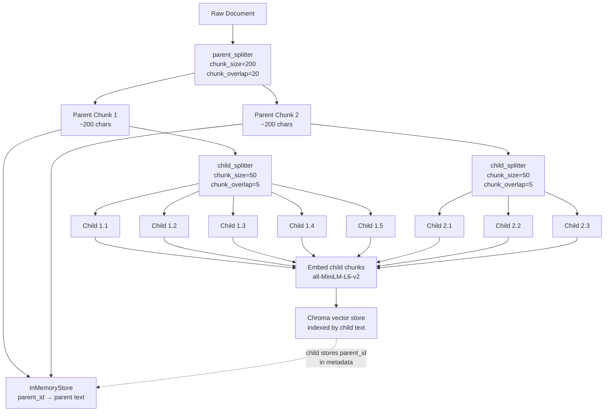
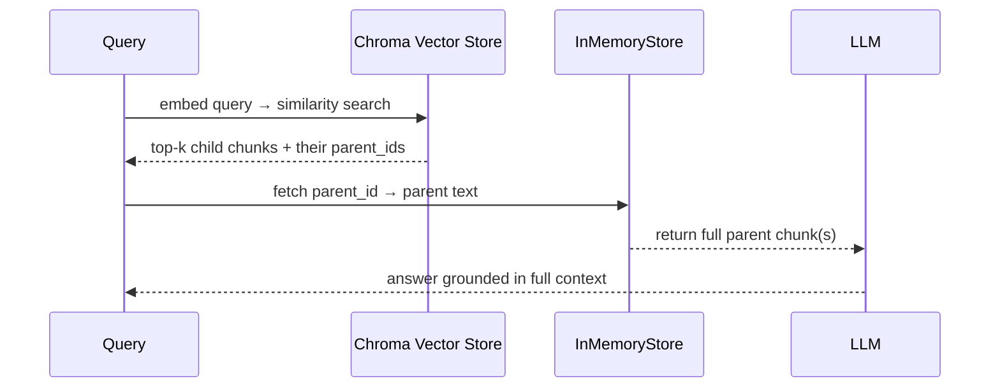
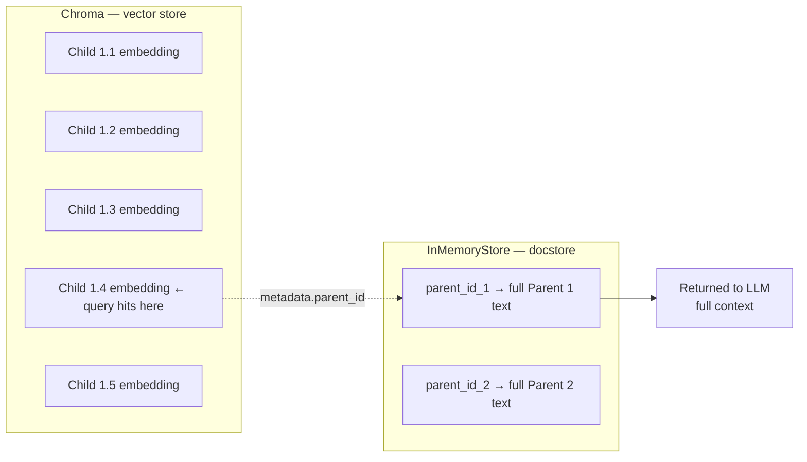

# Hierarchical / Parent-Child Chunking

## The Simple Idea (Feynman Explanation)

Every other chunking technique forces a trade-off:

- **Small chunks** → precise retrieval (the right sentence is found), but the returned text lacks context (the LLM only sees a fragment).
- **Large chunks** → rich context returned, but retrieval is imprecise (the query matches a big blob that contains the answer somewhere inside).

Parent-child chunking solves this by using **two sizes at once**:

- **Child chunks** (small, ~50 chars) are what you **search** — they're precise enough that a query matches exactly the right piece.
- **Parent chunks** (large, ~200 chars) are what you **return** — once a child is matched, its parent is fetched and sent to the LLM, giving it full context.

Think of a library index card system. The index card (child) is small and specific — easy to find. But when you find the right card, you go get the whole book chapter (parent) to actually read.

```
Query: "How much money do I get for my home office setup?"

Search hits child:  "is provided annually for home office equipment."  ← precise match
Returns parent:     "Our company remote work policy allows flexible hours.
                     Employees must be online during core hours from 10 AM to 3 PM EST.
                     A stipend of $500 is provided annually for home office equipment. Regarding"
                                                                         ← full context for LLM
```

---

## Architecture



---

## Retrieval Flow



---

## Algorithm

### Step 1 — Split into parent chunks

```python
parent_splitter = RecursiveCharacterTextSplitter(chunk_size=200, chunk_overlap=20)
parent_docs = parent_splitter.split_documents(docs)
```

### Step 2 — Split each parent into child chunks

```python
child_splitter = RecursiveCharacterTextSplitter(chunk_size=50, chunk_overlap=5)
```

Each child stores a reference (`parent_id`) to its parent in its metadata. This link is what `ParentDocumentRetriever` uses to look up the parent after a child is matched.

### Step 3 — Index children in vector store, store parents in docstore

```python
vectorstore = Chroma(collection_name="split_parents", embedding_function=LocalEmbeddings())
store       = InMemoryStore()

retriever = ParentDocumentRetriever(
    vectorstore=vectorstore,   # children are embedded here
    docstore=store,            # parents are stored here
    child_splitter=child_splitter,
    parent_splitter=parent_splitter,
)

retriever.add_documents(docs)  # splits, links, embeds, and stores in one call
```

### Step 4 — Query: match child, return parent

```python
retrieved_docs = retriever.invoke("How much money do I get for my home office setup?")
# → returns the parent chunk, not the child that matched
```

---

## Worked Example

**Raw document:**
```
Our company remote work policy allows flexible hours. Employees must be online
during core hours from 10 AM to 3 PM EST. A stipend of $500 is provided annually
for home office equipment. Regarding security, all employees must use the company
VPN and enable two-factor authentication on all work accounts.
```

**Parent chunks** (`chunk_size=200`):
```
Parent 1:
  Our company remote work policy allows flexible hours. Employees must be online
  during core hours from 10 AM to 3 PM EST. A stipend of $500 is provided annually
  for home office equipment. Regarding

Parent 2:
  Regarding security, all employees must use the company VPN and enable
  two-factor authentication on all work accounts.
```

**Child chunks** (`chunk_size=50`):
```
Children of Parent 1:
  Child 1.1 → "Our company remote work policy allows flexible"
  Child 1.2 → "hours. Employees must be online during core hours"
  Child 1.3 → "from 10 AM to 3 PM EST. A stipend of $500 is"
  Child 1.4 → "is provided annually for home office equipment."
  Child 1.5 → "Regarding"

Children of Parent 2:
  Child 2.1 → "Regarding security, all employees must use the"
  Child 2.2 → "the company VPN and enable two-factor"
  Child 2.3 → "authentication on all work accounts."
```

**Query:** `"How much money do I get for my home office setup?"`

```
1. Embed query → search Chroma
2. Closest child: Child 1.4 — "is provided annually for home office equipment."
3. Look up parent_id of Child 1.4 → Parent 1
4. Return Parent 1 (full 200-char context) to the LLM
```

**Result:**
```
Number of documents returned: 1

Retrieved Parent:
  Our company remote work policy allows flexible hours. Employees must be online
  during core hours from 10 AM to 3 PM EST. A stipend of $500 is provided annually
  for home office equipment. Regarding
```

The child matched precisely. The parent provided the full context.

---

## Why Two Stores?



The vector store only holds child embeddings — small, precise, fast to search. The docstore holds the full parent text — never embedded, just looked up by ID. This separation keeps the vector index lean while the returned context is rich.

---

## Key Findings

- **Retrieval precision + context richness**: child chunks are small enough to match specific queries; parent chunks are large enough to give the LLM meaningful context.
- **`ParentDocumentRetriever` handles the linking**: `add_documents()` splits, assigns `parent_id` metadata to each child, embeds children into the vector store, and stores parents in the docstore — all in one call.
- **Overlap on children is small (5 chars)**: because children are only used for matching, not for reading. Overlap on parents (20 chars) ensures no context is lost at parent boundaries.
- **`InMemoryStore` is for prototyping**: replace with `RedisStore`, `MongoDBStore`, or any LangChain-compatible docstore for production.
- **Child 1.5 is just "Regarding"**: a side effect of the overlap between Parent 1 and Parent 2. In production, filter out single-word children before indexing.

---

## Pros, Cons & When to Use

| | |
|---|---|
| ✅ **Best of both worlds** | Small chunks for precise retrieval, large chunks for rich LLM context. |
| ✅ **No context loss** | The LLM always receives the full parent — never a fragment that cuts off mid-sentence. |
| ✅ **Simple to implement** | `ParentDocumentRetriever` handles all splitting, linking, and storage in one abstraction. |
| ❌ **Two storage systems** | Requires both a vector store (Chroma/FAISS) and a docstore (InMemoryStore/Redis). |
| ❌ **Tiny children can be noisy** | Very small `chunk_size` for children (e.g., 50 chars) can produce single-word or partial-sentence chunks that match poorly. |
| ❌ **Parent size still fixed** | Parents are still split by character count — a topic can still span two parents if it exceeds `chunk_size`. |

**Suitable for:**
- Q&A over policy documents, manuals, and reports where precise fact retrieval and full-sentence context both matter.
- Any RAG pipeline where small-chunk retrieval produces good matches but the returned text is too short for the LLM to answer well.
- Production systems that need a simple upgrade from flat chunking without switching to semantic or proposition chunking.

**Not suitable for:**
- Documents where topics don't align with fixed character boundaries — use semantic chunking for parent splitting instead.
- Extremely large corpora where maintaining a docstore alongside a vector store adds operational overhead.
