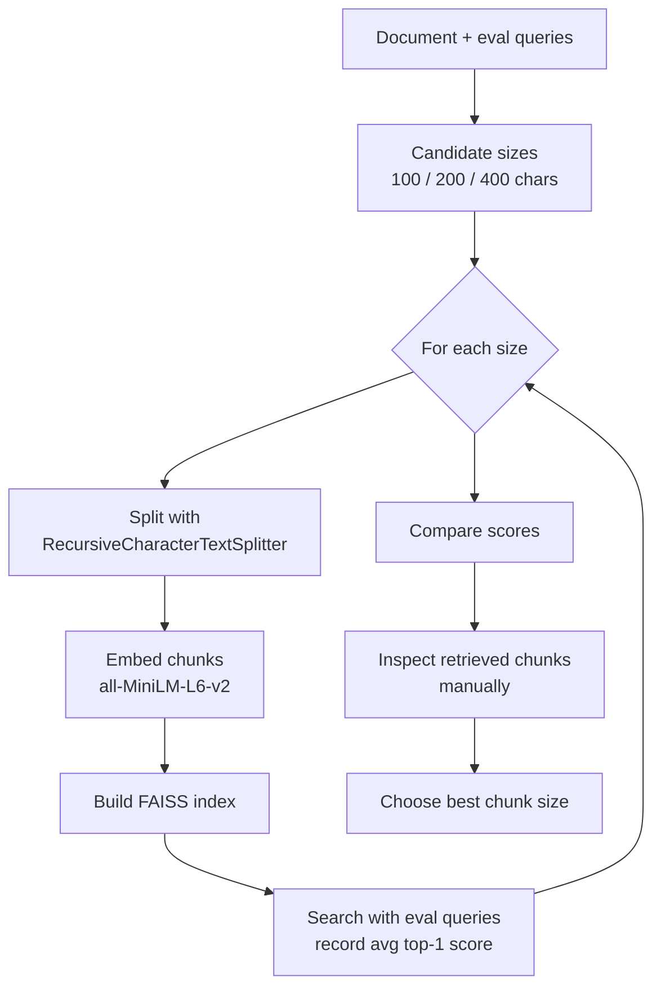
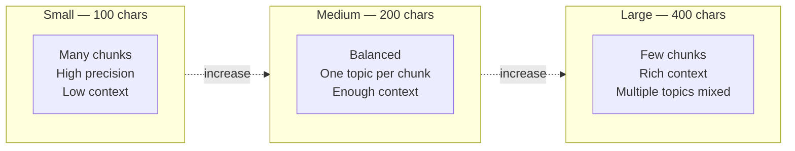

# Chunk Size Selection

## The Simple Idea (Feynman Explanation)

Imagine cutting a long article into flashcards. If each card has only one sentence, you can find the exact sentence you need — but each card lacks context, so the answer might be incomplete. If each card has five paragraphs, you always have context — but the fact you need is buried inside a huge card.

Chunk size is that same trade-off. There is no universally correct answer. The right size depends on your documents, your queries, and your embedding model. The only way to find it is to **measure**.

```
Small chunks (100 chars):
  + High precision — each chunk is about one thing
  - Low context — a sentence fragment may not be enough to answer

Large chunks (400 chars):
  + Rich context — full paragraphs stay together
  - Diluted signal — multiple topics in one embedding reduce precision

Sweet spot (200 chars in this example):
  Balances precision and context for the given document and queries
```

---

## Algorithm

### Step 1 — Pick candidate sizes

Choose 3–5 sizes that span the range you want to evaluate. Common starting points: 100, 200, 400 characters (or 128, 256, 512 tokens).

### Step 2 — Build one index per size

For each candidate size, split the document, embed all chunks, and build a FAISS index.

```python
splitter = RecursiveCharacterTextSplitter(chunk_size=size, chunk_overlap=20)
chunks = splitter.split_text(document)
embeddings = model.encode(chunks).astype("float32")
faiss.normalize_L2(embeddings)
index = faiss.IndexFlatIP(embeddings.shape[1])
index.add(embeddings)
```

### Step 3 — Run evaluation queries against each index

For each query, retrieve the top-1 chunk and record the cosine similarity score. Average across all queries.

### Step 4 — Compare scores and inspect chunks manually

The size with the highest average top-1 score is the best fit. Also inspect retrieved chunks manually — a high score on a bad chunk means the metric is misleading.

---

## Worked Example

**Document:** 4 paragraphs on NLP, machine learning, deep learning, and transformers.

**Queries:** "What is NLP used for?", "How does machine learning work?", "What are transformers in AI?"

**Results:**

| Chunk size | # chunks | Avg chars/chunk | Avg top-1 score |
|---|---|---|---|
| 100 | 14 | 69.1 | 0.698 |
| 200 | 7 | 139.1 | 0.682 |
| 400 | 4 | 244.2 | **0.706** |

400 chars scores marginally higher — but manual inspection shows it merges two topics per chunk. 200 chars gives cleaner, more focused chunks.

**Best retrieved chunks at chunk_size=200:**
```
Query: 'What is NLP used for?'
  Rank 1 [score=0.738]: Natural language processing (NLP) is a subfield of linguistics...

Query: 'How does machine learning work?'
  Rank 1 [score=0.705]: Machine learning is a method of data analysis that automates...

Query: 'What are transformers in AI?'
  Rank 1 [score=0.603]: Transformers are a type of neural network architecture...
```

---

## Mermaid Diagram



---

## Size vs Quality Trade-off



---

## Key Findings

- **No universal best size.** The winning size differs for legal documents, code files, FAQ pages, and narrative text.
- **Score alone is not enough.** A high cosine similarity on a chunk that mixes two topics is misleading — always inspect manually.
- **Overlap matters more at small sizes.** At chunk_size=100, a 20-char overlap is 20% of the chunk. At chunk_size=400, it is only 5%.
- **Parent-child chunking is often better than picking one global size.** Index small chunks for precision, return the parent chunk for context. See `7_hierarchical_or_parent-child_chunking`.
- **Embedding model max sequence length is a hard ceiling.** `all-MiniLM-L6-v2` has a 256-token limit. Chunks larger than this are silently truncated.

---

## Pros, Cons & When to Use

| | |
|---|---|
| ✅ **Evidence-based** | Replaces guesswork with a measurable comparison on real queries. |
| ✅ **Cheap** | No LLM calls — just embedding + similarity search. |
| ✅ **Document-specific** | Different document types have different optimal sizes. |
| ❌ **Requires representative queries** | If eval queries don't match real user queries, the winning size may be wrong. |
| ❌ **Score can mislead** | High similarity to a bad chunk looks identical to high similarity to a good chunk. |
| ❌ **One size for the whole corpus** | A single global size is a compromise for heterogeneous document collections. |

**Suitable for:**
- Any RAG system before going to production — always measure before committing to a chunk size.
- Systems with a known set of representative user queries to evaluate against.

**Not suitable for:**
- Replacing parent-child chunking when both precision and context are critical.
- Corpora with highly heterogeneous document types — consider per-type chunk sizes instead.
