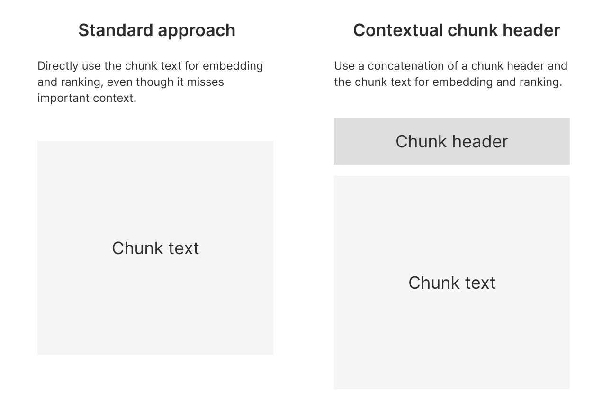
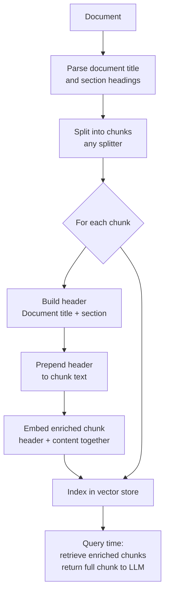
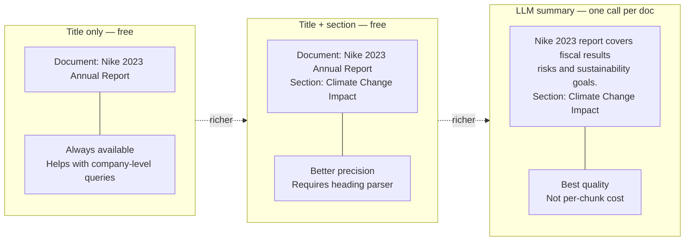

# Contextual Chunk Headers (CCH)

## The Simple Idea (Feynman Explanation)

Imagine reading a page torn out of a book. The page says: *"Climate-related risks include increased raw material costs and disruption to manufacturing facilities."* Who is this about? What company? Without the surrounding pages, you have no idea.

Now imagine the same page with a sticky note at the top: *"Nike 2023 Annual Report — Climate Change Impact"*. Suddenly the page is fully understandable on its own.

That is Contextual Chunk Headers. When a document is split into chunks, each chunk loses its surrounding context. A header prepended to the chunk restores that context — the document title, section name, or both — so the embedding model understands what the chunk is about even when it uses implicit references like "the company", "they", or "it".

```
Without header:
  "Climate-related risks include increased raw material costs..."
  → embedding has no idea this is about Nike
  → query "Nike climate change" may not retrieve this chunk

With header:
  "Document: Nike 2023 Annual Report > Climate Change Impact
   Climate-related risks include increased raw material costs..."
  → embedding knows this is about Nike's climate risks
  → query "Nike climate change" retrieves this chunk reliably
```

---



## Algorithm

### Step 1 — Split the document into chunks

Use any splitter. CCH is independent of the chunking method — it works on top of whatever chunks you already have.

```python
splitter = RecursiveCharacterTextSplitter(chunk_size=200, chunk_overlap=20)
chunks = splitter.split_text(document)
```

### Step 2 — Build the header for each chunk

The simplest header is just the document title. A richer header includes the section hierarchy:

```python
# Simple — document title only (free, always available)
header = f"Document: {document_title}\n\n"

# Rich — title + section path (requires heading parser)
header = f"Document: {document_title}\nSection: {section_name}\n\n"

# Richest — LLM-generated summary + section (one LLM call per document)
header = f"{llm_summary}\nSection: {section_name}\n\n"
```

### Step 3 — Prepend the header before embedding

```python
chunks_with_headers = [f"{header}{chunk}" for chunk in chunks]
```

The header is embedded together with the content. At retrieval time, the full enriched chunk is returned to the LLM.

---

## Worked Example

**Document:** Nike 2023 Annual Report (4 sections: Executive Summary, Risk Factors, Climate Change Impact, Financial Performance)

**Query:** `"Nike climate change impact"`

| Version | Top-1 score | Retrieved chunk |
|---|---|---|
| Without header | 0.837 | `"Climate Change Impact\nNike is committed..."` |
| With header | 0.834 | `"Document: Nike 2023 Annual Report\n\nClimate Change Impact\nNike is committed..."` |

In this example the score difference is small because the chunk already contains "Nike" explicitly. The real benefit appears when chunks use implicit references. From the reference notebook (`contextual_chunk_headers.ipynb`): a chunk about "climate-related risks" with **no company name** scores **0.1** without a header and **0.92** with the document title prepended.

**Chunks after adding headers:**
```
Chunk 1:
  Document: Nike 2023 Annual Report

  Executive Summary
  Nike delivered strong results in fiscal 2023, with revenues of $51.2 billion...

Chunk 5:
  Document: Nike 2023 Annual Report

  Climate Change Impact
  Nike is committed to reducing its carbon footprint by 70 percent by 2025...
```

---

## Mermaid Diagram



---

## Header Richness vs Cost



---

## Benchmark Results (KITE — from reference notebook)

Evaluated on 4 datasets, 50 questions total. CCH config uses document title + LLM summary. All other parameters identical. Graded 0–10 by GPT-4o.

| Dataset | No CCH | With CCH | Change |
|---|---|---|---|
| AI Papers | 4.5 | 4.7 | +4% |
| BVP Cloud 10-Ks | 2.6 | 6.3 | **+142%** |
| Sourcegraph Handbook | 5.7 | 5.8 | +2% |
| Supreme Court Opinions | 6.1 | 7.4 | **+21%** |
| **Average** | 4.72 | **6.04** | **+28%** |

The biggest gains are on financial documents (10-Ks) and legal opinions — both use implicit references heavily.

---

## Key Findings

- **Headers help most when chunks use implicit references.** A chunk that says "the company" or "they" without naming the subject benefits enormously from a header that supplies the subject.
- **Document title alone is often enough.** Title alone is cheaper and still provides significant improvement over no header.
- **Headers do not hurt when chunks are already explicit.** In the worst case, the header adds a few tokens and the score stays the same.
- **One LLM call per document, not per chunk.** If you use an LLM to generate a document summary for the header, you pay once per document — far cheaper than Contextual Retrieval (which calls an LLM per chunk).
- **Combine with any chunking method.** CCH is a post-processing step — it works on top of character, token, recursive, semantic, or structured chunks.

---

## Pros, Cons & When to Use

| | |
|---|---|
| ✅ **Large retrieval improvement** | +28% average on KITE; up to +142% on financial documents. |
| ✅ **Cheap** | Document title is free. LLM summary costs one call per document, not per chunk. |
| ✅ **Format-agnostic** | Works on top of any chunking method without changing retrieval logic. |
| ❌ **Requires document metadata** | You need the document title and ideally section headings. |
| ❌ **Longer chunks** | Adding a header increases token count, which may push chunks over the embedding model's sequence limit. |

**Suitable for:**
- Corporate documents, annual reports, legal filings, academic papers — any document where chunks use implicit references.
- Multi-document corpora where the same term appears in different contexts across documents.
- Any RAG system as a low-cost, high-impact improvement before trying more expensive techniques like Contextual Retrieval.

**Not suitable for:**
- Documents where every chunk is already fully self-contained (e.g., a FAQ where each Q&A pair is one chunk).
- Very short chunks where the header would dominate the content.
