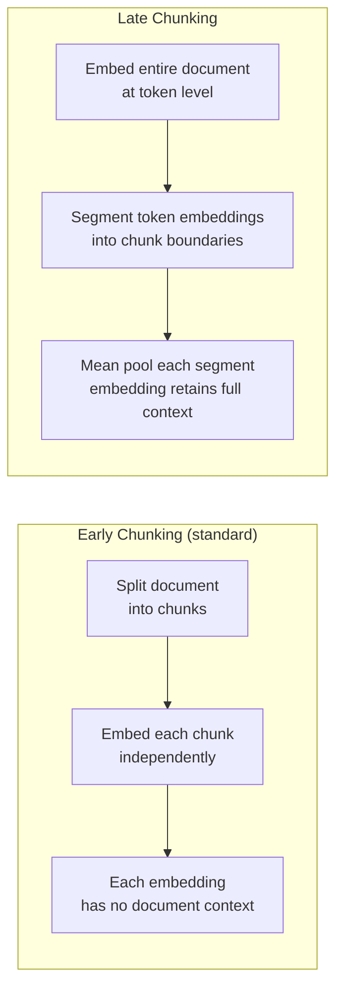
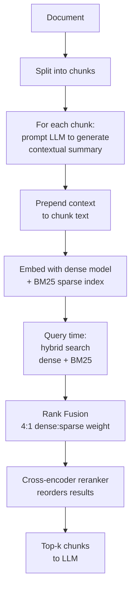
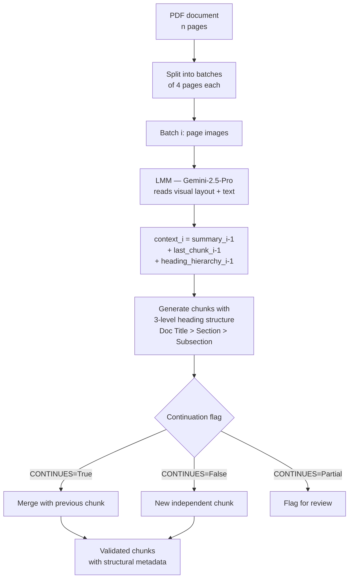
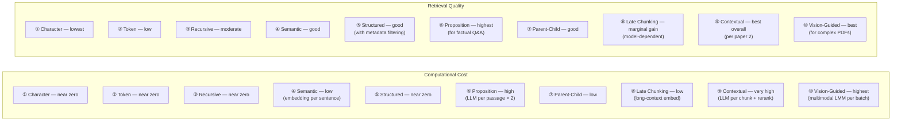
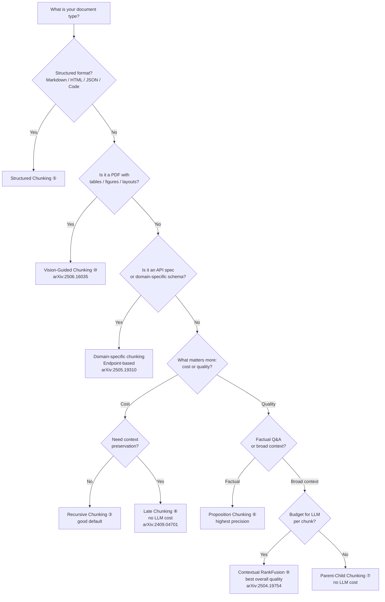

# Chunking Strategies for RAG — Overview & Research Analysis

This folder covers seven chunking techniques implemented in this repository, plus three emerging techniques from recent research (2025) that are not yet implemented. The final section provides a comparative performance analysis drawn directly from three papers.

---

## Techniques in This Repository

| # | Technique | Core idea | Split boundary |
|---|---|---|---|
| 1 | Fixed-size by character | Count characters | Fixed char limit |
| 2 | Fixed-size by token | Count tokens | Fixed token limit |
| 3 | Recursive character | Try separators hierarchically | Paragraph → line → word → char |
| 4 | Semantic | Embedding similarity drop | Topic shift |
| 5 | Structured (Markdown / HTML / JSON / Code) | Parse document format | Headings, keys, tags, functions |
| 6 | Proposition / Agentic | LLM decomposes into atomic facts | Meaning |
| 7 | Parent-Child (Hierarchical) | Search small, return large | Two-level size hierarchy |
| 8 | Chunk Size Selection | Evaluate candidate chunk sizes | Retrieval and answer quality |
| 9 | Contextual Chunk Headers | Prepend heading breadcrumbs | Document structure |

---

## Three Emerging Techniques from Recent Research

These are **not yet implemented** in this repository. Each addresses a limitation of the techniques above.

---

### 8 — Late Chunking

**Paper:** Günther et al. (2024) — *Late Chunking: Contextual Chunk Embeddings Using Long-Context Embedding Models* ([arXiv:2409.04701](https://arxiv.org/abs/2409.04701))
**Studied in:** Merola & Singh (2025) — *Reconstructing Context: Evaluating Advanced Chunking Strategies for Retrieval-Augmented Generation* ([arXiv:2504.19754](https://arxiv.org/abs/2504.19754))

#### The Problem It Solves

In standard (early) chunking, the document is split first, then each chunk is embedded independently. Each chunk's embedding has no knowledge of the rest of the document — context is lost at the boundary.

#### How It Works

Instead of splitting before embedding, the **entire document** is fed to a long-context embedding model first. The model produces token-level embeddings for every token in the document. Only then are the token embeddings segmented into chunks, and mean pooling is applied per chunk.

#### Key Properties

- No additional training required — works with any long-context embedding model.
- Each chunk embedding is informed by the full document context.
- Computationally cheaper than contextual retrieval (no LLM call per chunk).

---

### 9 — Contextual Retrieval (ContextualRankFusion)

**Introduced by:** Anthropic (September 2024)
**Studied in:** Merola & Singh (2025) — *Reconstructing Context: Evaluating Advanced Chunking Strategies for Retrieval-Augmented Generation* ([arXiv:2504.19754](https://arxiv.org/abs/2504.19754))

#### The Problem It Solves

A chunk like *"The company's revenue grew by 3% over the previous quarter."* is meaningless without knowing which company or which quarter. Standard chunking strips this context.

#### How It Works

Three steps are added on top of standard chunking:

**Step 1 — Contextualization:** After splitting, each chunk is enriched by prompting an LLM to generate a brief summary situating the chunk within the full document. This context is prepended to the chunk before embedding.

**Step 2 — Rank Fusion (BM25 + dense):** Both the chunk text and its generated context are indexed with dense embeddings and BM25 sparse embeddings. Retrieval combines both with a 4:1 weight ratio (dense:sparse), capturing both semantic similarity and exact lexical matches.

**Step 3 — Reranking:** Retrieved chunks are reordered by a cross-encoder reranker (e.g., Jina Reranker V2) that scores each query-chunk pair individually.

#### Key Properties

- Highest retrieval quality of the three emerging techniques.
- Expensive: one LLM call per chunk during indexing.
- Memory-intensive: contextualization of long documents can use 20 GB+ VRAM.

---

### 10 — Vision-Guided (Multimodal) Chunking

**Paper:** Tripathi et al. (2025) — *Vision-Guided Chunking Is All You Need* ([arXiv:2506.16035](https://arxiv.org/abs/2506.16035))

#### The Problem It Solves

All text-based chunking methods are blind to visual structure. A PDF with a table spanning three pages, a flowchart, or a multi-column layout gets mangled by text extraction. The visual layout carries meaning that text-only methods discard.

#### How It Works

A Large Multimodal Model (LMM, e.g., Gemini-2.5-Pro) processes the PDF as **images** in batches of 4 pages. It reads both the visual layout and the text, then generates semantically coherent chunks with a 3-level heading hierarchy. Cross-batch context is preserved via a summary + last-chunk + heading-hierarchy mechanism.

#### Key Properties

- Handles multi-page tables, flowcharts, embedded figures, and multi-column layouts.
- Produces ~5× more chunks than vanilla text extraction — finer, more precise granularity.
- Each chunk carries a full heading path (`Doc > Section > Subsection`) as metadata.
- Continuation flags enable automated merging of split procedural content.
- Requires a multimodal API (Gemini, GPT-4V) — highest cost of all techniques.

---

## Comparative Performance Analysis

### Paper 1: Vision-Guided vs Vanilla RAG
*"Vision-Guided Chunking Is All You Need: Enhancing RAG with Multimodal Document Understanding"*
*Tripathi et al. (2025) — [arXiv:2506.16035](https://arxiv.org/abs/2506.16035)*
*Dataset: Internal benchmark of diverse PDF documents (technical manuals, financial reports, research papers)*

| Chunking Method | RAG Accuracy |
|---|---|
| Vanilla RAG (fixed-size chunking) | 0.78 |
| Vision-Guided RAG (multimodal LMM) | **0.89** |

**+14% accuracy improvement** from vision-guided chunking. The improvement is attributed to:
- Preservation of multi-page table structures
- Intact procedural step sequences
- Hierarchical heading metadata enabling precise retrieval
- ~5× more granular chunks reducing retrieval noise

---

### Paper 2: Late Chunking vs Contextual Retrieval vs Traditional
*"Reconstructing Context: Evaluating Advanced Chunking Strategies for Retrieval-Augmented Generation"*
*Merola & Singh (2025) — [arXiv:2504.19754](https://arxiv.org/abs/2504.19754)*
*Dataset: NFCorpus (medical IR) and MSMarco (passage QA)*
*Embedding model: Jina-V3 (best performer)*

#### Late Chunking vs Early Chunking (NFCorpus, Jina-V3)

| Method | NDCG@5 | MAP@5 | F1@5 |
|---|---|---|---|
| Early — Fixed-size | 0.374 | 0.107 | 0.186 |
| Late — Fixed-size | **0.380** | 0.103 | 0.185 |
| Early — Semantic | 0.377 | 0.111 | **0.192** |
| Late — Simple-Qwen | 0.384 | 0.105 | 0.185 |
| Late — Topic-Qwen | 0.383 | 0.102 | 0.179 |

Late chunking shows marginal improvement over early chunking with Jina-V3. However, with BGE-M3, early chunking (NDCG@5: 0.246) **significantly outperforms** late chunking (NDCG@5: 0.070) — late chunking is model-dependent.

#### Late Chunking vs Early Chunking (MSMarco, Stella-V5)

| Method | NDCG@5 | MAP@5 |
|---|---|---|
| Early — Fixed-size | **0.630** | **0.501** |
| Late — Fixed-size | 0.503 | 0.340 |

Early chunking wins decisively on MSMarco with Stella-V5. Late chunking is not universally better.

#### Contextual Retrieval vs Late Chunking (NFCorpus, Jina-V3, Fixed-Window)

| Method | NDCG@5 | MAP@5 | F1@5 | NDCG@10 | MAP@10 | F1@10 |
|---|---|---|---|---|---|---|
| Late Chunking | 0.309 | 0.143 | 0.202 | 0.294 | 0.160 | 0.192 |
| Contextual RankFusion | **0.317** | **0.146** | **0.206** | **0.308** | **0.166** | **0.202** |

Contextual RankFusion consistently outperforms late chunking, but at significantly higher computational cost.

#### Fixed-size vs Semantic Chunking (Contextual setup, Jina-V3)

| Chunking | Retrieval | NDCG@5 | MAP@5 | F1@5 |
|---|---|---|---|---|
| Fixed-Window Uncontextualized | Traditional | 0.303 | 0.137 | 0.193 |
| Semantic Uncontextualized | Traditional | 0.307 | 0.143 | 0.197 |
| Fixed-Window Contextualized | RankFusion | **0.317** | **0.146** | **0.206** |
| Semantic Contextualized | RankFusion | **0.317** | **0.146** | **0.209** |

**Key finding:** Fixed-size and semantic chunking perform nearly identically. The retrieval method (RankFusion + reranking) matters far more than the chunking granularity.

---

### Paper 3: Endpoint-Based vs Naive Chunking for API Discovery
*"Retrieval-Augmented Generation for Service Discovery: Chunking Strategies and Benchmarking"*
*Pesl et al. (2025) — [arXiv:2505.19310](https://arxiv.org/abs/2505.19310)*
*Domain: OpenAPI specification chunking for service discovery*
*Benchmark: SOCBench-D (novel) and RestBench (real-world)*

This paper studies a domain-specific chunking problem: how to chunk OpenAPI (REST API) specifications so an LLM can discover the right endpoint for a given task.

**Key finding:** Endpoint-based chunking (one chunk per API endpoint, preserving the full endpoint specification) significantly outperforms naive fixed-size chunking for API documentation. Naive chunking fragments endpoint descriptions across chunk boundaries, making it impossible to retrieve a complete endpoint spec in one shot.

**Discovery Agent:** An agentic approach where the LLM first retrieves endpoint summaries, then fetches full specification details on demand. This improves precision significantly but reduces recall — the agent may miss relevant endpoints if the summary doesn't match the query.

| Approach | Precision | Recall |
|---|---|---|
| Naive chunking | Low | Moderate |
| Endpoint-based chunking | **High** | **High** |
| Discovery Agent (agentic) | **Highest** | Lower (misses some) |

**Implication for this repository:** Domain-specific chunking (like endpoint-based for APIs) consistently outperforms generic chunking strategies when the document has a well-defined logical unit (endpoint, clause, record).

---

## Overall Comparison: All Techniques

---

## Decision Guide

---

## Key Takeaways from the Research

1. **Chunking method matters less than retrieval method** (*Reconstructing Context*, [arXiv:2504.19754](https://arxiv.org/abs/2504.19754)): Fixed-size and semantic chunking perform nearly identically when the retrieval pipeline (RankFusion + reranking) is strong. Invest in retrieval quality before optimising chunking granularity.

2. **Late chunking is model-dependent** (*Reconstructing Context*, [arXiv:2504.19754](https://arxiv.org/abs/2504.19754)): It improves results with Jina-V3 but degrades significantly with BGE-M3 and Stella-V5 on MSMarco. Always benchmark with your specific embedding model before adopting it.

3. **Contextual retrieval consistently wins on quality** (*Reconstructing Context*, [arXiv:2504.19754](https://arxiv.org/abs/2504.19754)): ContextualRankFusion outperforms late chunking across all metrics, but requires an LLM call per chunk and a reranker — budget accordingly.

4. **Vision-guided chunking is the right choice for complex PDFs** (*Vision-Guided Chunking Is All You Need*, [arXiv:2506.16035](https://arxiv.org/abs/2506.16035)): +14% accuracy over vanilla RAG on diverse PDF documents. The ~5× increase in chunk count enables more precise retrieval. The cost is a multimodal LMM API.

5. **Domain-specific chunking beats generic chunking** (*RAG for Service Discovery*, [arXiv:2505.19310](https://arxiv.org/abs/2505.19310)): For structured schemas (APIs, legal clauses, database records), chunking at the natural logical unit (endpoint, clause, row) outperforms all generic strategies. Know your document type.

6. **Reranking is critical** (*Reconstructing Context*, [arXiv:2504.19754](https://arxiv.org/abs/2504.19754)): Adding a cross-encoder reranker after retrieval consistently improves results regardless of chunking method. It is the single highest-leverage addition to a RAG pipeline.

---

## References

| Paper | Authors | Year | Link |
|---|---|---|---|
| Vision-Guided Chunking Is All You Need | Tripathi et al. | 2025 | [arXiv:2506.16035](https://arxiv.org/abs/2506.16035) |
| Reconstructing Context: Evaluating Advanced Chunking Strategies for RAG | Merola & Singh | 2025 | [arXiv:2504.19754](https://arxiv.org/abs/2504.19754) |
| RAG for Service Discovery: Chunking Strategies and Benchmarking | Pesl et al. | 2025 | [arXiv:2505.19310](https://arxiv.org/abs/2505.19310) |
| Late Chunking: Contextual Chunk Embeddings | Günther et al. | 2024 | [arXiv:2409.04701](https://arxiv.org/abs/2409.04701) |
| Dense X Retrieval (Proposition Chunking) | Chen et al. | 2023 | [arXiv:2312.06648](https://arxiv.org/abs/2312.06648) |
