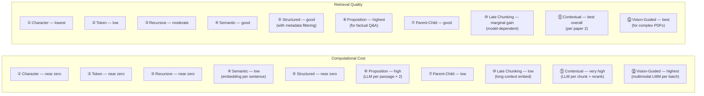
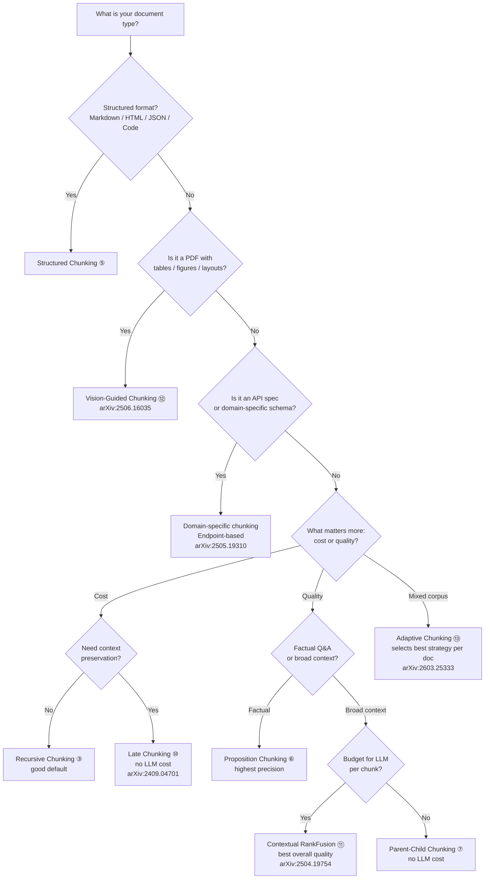

# Chunking Strategies for RAG — Overview & Research Analysis

This folder covers nine chunking techniques implemented in this repository, plus three emerging techniques from recent research (2025) documented in their own folders. The final section provides a comparative performance analysis drawn directly from three papers.

---

## Techniques in This Repository

| #   | Technique                                                     | Core idea                                  | Split boundary                  |
| --- | ------------------------------------------------------------- | ------------------------------------------ | ------------------------------- |
| 1   | Fixed-size by character                                       | Count characters                           | Fixed char limit                |
| 2   | Fixed-size by token                                           | Count tokens                               | Fixed token limit               |
| 3   | Recursive character                                           | Try separators hierarchically              | Paragraph → line → word → char  |
| 4   | Semantic                                                      | Embedding similarity drop                  | Topic shift                     |
| 5   | Structured (Markdown / HTML / JSON / Code)                    | Parse document format                      | Headings, keys, tags, functions |
| 6   | Proposition / Agentic                                         | LLM decomposes into atomic facts           | Meaning                         |
| 7   | Parent-Child (Hierarchical)                                   | Search small, return large                 | Two-level size hierarchy        |
| 8   | Chunk Size Selection                                          | Evaluate candidate chunk sizes             | Retrieval and answer quality    |
| 9   | Contextual Chunk Headers                                      | Prepend heading breadcrumbs                | Document structure              |
| 10  | [Late Chunking](10_late_chunking/README.md)                   | Embed whole doc first, pool per segment    | Document-aware token embeddings |
| 11  | [Contextual Retrieval](11_contextual_retrieval/README.md)     | LLM context prepend + BM25 hybrid + rerank | Full hybrid pipeline            |
| 12  | [Vision-Guided Chunking](12_vision_guided_chunking/README.md) | Multimodal LMM reads PDF as images         | Visual layout + text            |
| 13  | [Adaptive Chunking](13_adaptive_chunking/README.md)           | Score N strategies per document, pick best | Document-specific metric suite  |

> Techniques 10–13 are **not yet implemented** — each folder contains a full explanation, algorithm, and performance data from the source papers.

---

## Comparative Performance Analysis

### Paper 1: Vision-Guided vs Vanilla RAG

_"Vision-Guided Chunking Is All You Need: Enhancing RAG with Multimodal Document Understanding"_
_Tripathi et al. (2025) — [arXiv:2506.16035](https://arxiv.org/abs/2506.16035)_
_Dataset: Internal benchmark of diverse PDF documents (technical manuals, financial reports, research papers)_

| Chunking Method                    | RAG Accuracy |
| ---------------------------------- | ------------ |
| Vanilla RAG (fixed-size chunking)  | 0.78         |
| Vision-Guided RAG (multimodal LMM) | **0.89**     |

**+14% accuracy improvement** from vision-guided chunking. The improvement is attributed to:

- Preservation of multi-page table structures
- Intact procedural step sequences
- Hierarchical heading metadata enabling precise retrieval
- ~5× more granular chunks reducing retrieval noise

---

### Paper 2: Late Chunking vs Contextual Retrieval vs Traditional

_"Reconstructing Context: Evaluating Advanced Chunking Strategies for Retrieval-Augmented Generation"_
_Merola & Singh (2025) — [arXiv:2504.19754](https://arxiv.org/abs/2504.19754)_
_Dataset: NFCorpus (medical IR) and MSMarco (passage QA)_
_Embedding model: Jina-V3 (best performer)_

#### Late Chunking vs Early Chunking (NFCorpus, Jina-V3)

| Method             | NDCG@5    | MAP@5 | F1@5      |
| ------------------ | --------- | ----- | --------- |
| Early — Fixed-size | 0.374     | 0.107 | 0.186     |
| Late — Fixed-size  | **0.380** | 0.103 | 0.185     |
| Early — Semantic   | 0.377     | 0.111 | **0.192** |
| Late — Simple-Qwen | 0.384     | 0.105 | 0.185     |
| Late — Topic-Qwen  | 0.383     | 0.102 | 0.179     |

Late chunking shows marginal improvement over early chunking with Jina-V3. However, with BGE-M3, early chunking (NDCG@5: 0.246) **significantly outperforms** late chunking (NDCG@5: 0.070) — late chunking is model-dependent.

#### Late Chunking vs Early Chunking (MSMarco, Stella-V5)

| Method             | NDCG@5    | MAP@5     |
| ------------------ | --------- | --------- |
| Early — Fixed-size | **0.630** | **0.501** |
| Late — Fixed-size  | 0.503     | 0.340     |

Early chunking wins decisively on MSMarco with Stella-V5. Late chunking is not universally better.

#### Contextual Retrieval vs Late Chunking (NFCorpus, Jina-V3, Fixed-Window)

| Method                | NDCG@5    | MAP@5     | F1@5      | NDCG@10   | MAP@10    | F1@10     |
| --------------------- | --------- | --------- | --------- | --------- | --------- | --------- |
| Late Chunking         | 0.309     | 0.143     | 0.202     | 0.294     | 0.160     | 0.192     |
| Contextual RankFusion | **0.317** | **0.146** | **0.206** | **0.308** | **0.166** | **0.202** |

Contextual RankFusion consistently outperforms late chunking, but at significantly higher computational cost.

#### Fixed-size vs Semantic Chunking (Contextual setup, Jina-V3)

| Chunking                      | Retrieval   | NDCG@5    | MAP@5     | F1@5      |
| ----------------------------- | ----------- | --------- | --------- | --------- |
| Fixed-Window Uncontextualized | Traditional | 0.303     | 0.137     | 0.193     |
| Semantic Uncontextualized     | Traditional | 0.307     | 0.143     | 0.197     |
| Fixed-Window Contextualized   | RankFusion  | **0.317** | **0.146** | **0.206** |
| Semantic Contextualized       | RankFusion  | **0.317** | **0.146** | **0.209** |

**Key finding:** Fixed-size and semantic chunking perform nearly identically. The retrieval method (RankFusion + reranking) matters far more than the chunking granularity.

---

### Paper 3: Endpoint-Based vs Naive Chunking for API Discovery

_"Retrieval-Augmented Generation for Service Discovery: Chunking Strategies and Benchmarking"_
_Pesl et al. (2025) — [arXiv:2505.19310](https://arxiv.org/abs/2505.19310)_
_Domain: OpenAPI specification chunking for service discovery_
_Benchmark: SOCBench-D (novel) and RestBench (real-world)_

This paper studies a domain-specific chunking problem: how to chunk OpenAPI (REST API) specifications so an LLM can discover the right endpoint for a given task.

**Key finding:** Endpoint-based chunking (one chunk per API endpoint, preserving the full endpoint specification) significantly outperforms naive fixed-size chunking for API documentation. Naive chunking fragments endpoint descriptions across chunk boundaries, making it impossible to retrieve a complete endpoint spec in one shot.

**Discovery Agent:** An agentic approach where the LLM first retrieves endpoint summaries, then fetches full specification details on demand. This improves precision significantly but reduces recall — the agent may miss relevant endpoints if the summary doesn't match the query.

| Approach                  | Precision   | Recall              |
| ------------------------- | ----------- | ------------------- |
| Naive chunking            | Low         | Moderate            |
| Endpoint-based chunking   | **High**    | **High**            |
| Discovery Agent (agentic) | **Highest** | Lower (misses some) |

**Implication for this repository:** Domain-specific chunking (like endpoint-based for APIs) consistently outperforms generic chunking strategies when the document has a well-defined logical unit (endpoint, clause, record).

---

### Paper 4: Adaptive Chunking — Select the Best Strategy Per Document

_"Adaptive Chunking: Optimizing Chunking-Method Selection for RAG"_
_de Moura Júnior, Lelong & Blangero (2026) · Accepted at LREC 2026 · [arXiv:2603.25333](https://arxiv.org/abs/2603.25333)_
_Domain: Diverse corpus — legal, technical, and social science documents_
_Code: [github.com/ekimetrics/adaptive-chunking](https://github.com/ekimetrics/adaptive-chunking)_

Every prior approach picks one chunking strategy and applies it to all documents. This paper challenges that assumption directly: different documents have different structures, and the best chunking method depends on the document itself.

**The framework:**

1. Apply multiple chunking strategies to a document (fixed-size, recursive, semantic, structured, etc.)
2. Score each strategy's output using five intrinsic metrics — no retrieval needed
3. Select the highest-scoring strategy
4. Embed and store only those chunks in the vector database

The five metrics measure chunk quality from different angles:

| Metric | Abbreviation | What it measures |
|---|---|---|
| References Completeness | RC | Are cross-references (citations, footnotes, section links) kept intact within a chunk? |
| Block Integrity | BI | Are logical blocks (paragraphs, code blocks, list items) preserved without mid-block splits? |
| Intrachunk Cohesion | ICC | How semantically similar are sentences within the same chunk? |
| Document Contextual Coherence | DCC | How well does each chunk's embedding relate to its surrounding chunks in document order? |
| Size Compliance | SC | Do chunk sizes fall within the target token range? |

Together they form a complementary suite: RC and BI catch structural breaks, ICC measures meaning density within a chunk, DCC measures continuity across the document, and SC ensures chunks are usable by the downstream model.

The paper also introduces two new chunkers:
- **LLM-regex splitter** — uses an LLM to identify split points, then regex to execute them cleanly
- **Split-then-merge recursive splitter** — first over-splits aggressively, then merges adjacent small chunks until size and cohesion targets are met

**Results on a diverse corpus (legal, technical, social science):**

| Setup | Answer Correctness | Questions Answered Successfully |
|---|---|---|
| Best single fixed strategy (baseline) | 62–64% | 49 |
| Adaptive Chunking (metric-guided selection) | **72%** | **65 (+33%)** |

The improvement comes entirely from better chunking — same models, same prompts, same retriever.

**Key findings:**

1. No single chunking method wins across all document types. Legal documents favour structural chunking; technical documents respond better to semantic or recursive splitting; social science prose benefits from cohesion-optimised splits.
2. The five metrics are intrinsic — computed without running any retrieval or generation. This makes them cheap to compute and independent of any downstream model.
3. The adaptive selection step adds negligible runtime overhead compared to embedding and indexing costs.
4. The new split-then-merge splitter outperforms naive recursive splitting on documents with highly variable paragraph lengths.

---

## Overall Comparison: All Techniques

> See dedicated READMEs for the three emerging techniques: [Late Chunking](10_late_chunking/README.md) · [Contextual Retrieval](11_contextual_retrieval/README.md) · [Vision-Guided Chunking](12_vision_guided_chunking/README.md)

---

## Decision Guide

---

## Key Takeaways from the Research

1. **Chunking method matters less than retrieval method** (_Reconstructing Context_, [arXiv:2504.19754](https://arxiv.org/abs/2504.19754)): Fixed-size and semantic chunking perform nearly identically when the retrieval pipeline (RankFusion + reranking) is strong. Invest in retrieval quality before optimising chunking granularity.

2. **Late chunking is model-dependent** (_Reconstructing Context_, [arXiv:2504.19754](https://arxiv.org/abs/2504.19754)): It improves results with Jina-V3 but degrades significantly with BGE-M3 and Stella-V5 on MSMarco. Always benchmark with your specific embedding model before adopting it.

3. **Contextual retrieval consistently wins on quality** (_Reconstructing Context_, [arXiv:2504.19754](https://arxiv.org/abs/2504.19754)): ContextualRankFusion outperforms late chunking across all metrics, but requires an LLM call per chunk and a reranker — budget accordingly.

4. **Vision-guided chunking is the right choice for complex PDFs** (_Vision-Guided Chunking Is All You Need_, [arXiv:2506.16035](https://arxiv.org/abs/2506.16035)): +14% accuracy over vanilla RAG on diverse PDF documents. The ~5× increase in chunk count enables more precise retrieval. The cost is a multimodal LMM API.

5. **Domain-specific chunking beats generic chunking** (_RAG for Service Discovery_, [arXiv:2505.19310](https://arxiv.org/abs/2505.19310)): For structured schemas (APIs, legal clauses, database records), chunking at the natural logical unit (endpoint, clause, row) outperforms all generic strategies. Know your document type.

6. **Reranking is critical** (_Reconstructing Context_, [arXiv:2504.19754](https://arxiv.org/abs/2504.19754)): Adding a cross-encoder reranker after retrieval consistently improves results regardless of chunking method. It is the single highest-leverage addition to a RAG pipeline.

7. **Adaptive, document-aware chunking significantly outperforms any fixed strategy** (_Adaptive Chunking_, [arXiv:2603.25333](https://arxiv.org/abs/2603.25333)): Selecting the best chunking method per document — guided by five intrinsic metrics (RC, BI, ICC, DCC, SC) — raises answer correctness from 62–64% to 72% and increases successfully answered questions by over 30%, without changing models or prompts. No single strategy wins on all document types.

---

## References

| Paper                                                                   | Authors                            | Year | Link                                                 |
| ----------------------------------------------------------------------- | ---------------------------------- | ---- | ---------------------------------------------------- |
| Vision-Guided Chunking Is All You Need                                  | Tripathi et al.                    | 2025 | [arXiv:2506.16035](https://arxiv.org/abs/2506.16035) |
| Reconstructing Context: Evaluating Advanced Chunking Strategies for RAG | Merola & Singh                     | 2025 | [arXiv:2504.19754](https://arxiv.org/abs/2504.19754) |
| RAG for Service Discovery: Chunking Strategies and Benchmarking         | Pesl et al.                        | 2025 | [arXiv:2505.19310](https://arxiv.org/abs/2505.19310) |
| Adaptive Chunking: Optimizing Chunking-Method Selection for RAG         | de Moura Júnior, Lelong & Blangero | 2026 | [arXiv:2603.25333](https://arxiv.org/abs/2603.25333) |
| Late Chunking: Contextual Chunk Embeddings                              | Günther et al.                     | 2024 | [arXiv:2409.04701](https://arxiv.org/abs/2409.04701) |
| Dense X Retrieval (Proposition Chunking)                                | Chen et al.                        | 2023 | [arXiv:2312.06648](https://arxiv.org/abs/2312.06648) |
