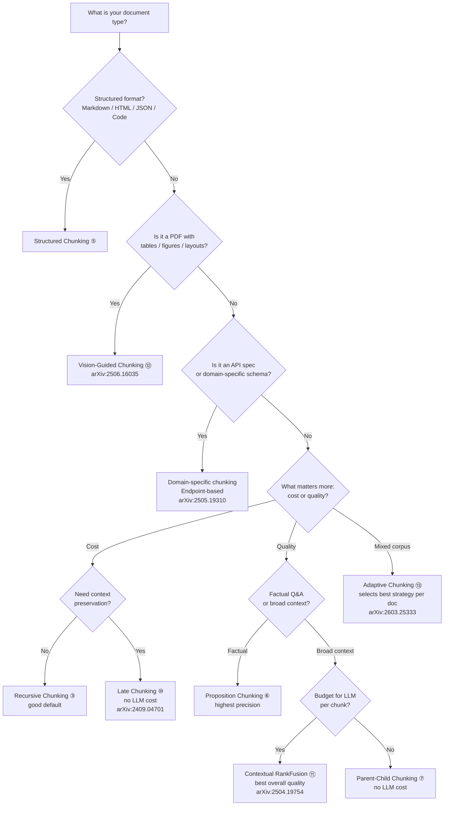

# Chunking Evaluation

This page is the evaluation hub for chunking strategies. While the folders below implement 13 chunking techniques, this README focuses on **how to evaluate chunk quality** — intrinsic metrics that measure chunking quality without running retrieval or generation.

---

## Why Evaluate Chunking Separately?

Most RAG pipelines judge chunking only by downstream end-to-end metrics (answer correctness, retrieval recall). This conflates chunk quality with retriever and LLM performance — a bad chunker can be masked by a good reranker, and a good chunker can look bad if the retriever is weak.

**Intrinsic evaluation** measures the chunks themselves: are references intact? Are logical blocks preserved? Are sentences within a chunk coherent? These metrics are:

- **Model-independent** — no LLM-as-a-judge loops or labelled retrieval benchmarks
- **Cheap to compute** — text analysis + pre-computed embeddings; no generation calls
- **Diagnostic** — tell you *why* a chunking strategy fails, not just that it underperforms

The metrics below come from the Adaptive Chunking framework (de Moura Júnior et al., 2026), which introduced five complementary intrinsic metrics. This page documents them one by one, starting with References Completeness (RC).

---

## Evaluation Techniques

### 1. References Completeness (RC)

#### Definition

**References Completeness (RC)** measures whether cross-references within a document are kept intact within a single chunk. A reference is "broken" when a chunk boundary falls between the reference's start and end — forcing the retriever to find only half the information.

Two types of references are checked:

| Reference type | Examples | Detection method |
|---|---|---|
| Explicit references | Citations (`[1]`, `(Author, 2023)`), footnotes (`¹`), section links (`see §3.2`, `as per clause 4.2`) | Regex pattern matching |
| Entity-pronoun coreferences | `Dr. Smith ... he`, `the company ... its`, `the model ... it` | Coreference resolution model |

---

#### Why It Matters

If a citation and its target, or a pronoun and its antecedent, land in different chunks, the LLM sees only part of the reference. Retrieval may pull the chunk with the citation but miss the definition chunk, or find the pronoun without its entity — leading to incomplete or hallucinated answers.

**Example — broken pronoun reference:**

> "Elon Musk is the CEO of Tesla. **[CHUNK BOUNDARY]** He founded SpaceX in 2002."

A user queries "Who founded SpaceX?" The retriever returns only the second chunk — the LLM sees `He` but cannot resolve who `He` refers to. This is a **Missing Reference Error**.

**Example — broken explicit reference:**

> "...the party shall be liable for damages not exceeding **[CHUNK BOUNDARY]** the amount specified in clause 4.2..."

A retriever searching for "damages limit" returns only the first chunk — the limit value is in the next chunk and is never seen by the LLM.

---

#### How to Determine Broken vs Intact

A reference is **broken** (mᵢ = 1) when a chunk boundary falls between the entity and its pronoun. The check uses character offsets — not chunk numbers — so it catches boundaries at any position, not just sentence edges.

**Step-by-step:**

```
1. Number every character in the document sequentially from 0
2. Mark where each chunk starts (these are the boundaries B)
3. For each entity-pronoun pair (eᵢ, pᵢ):
     sᵢ = offset of the first character of entity eᵢ
     tᵢ = offset of the last character of pronoun pᵢ
4. If any boundary b ∈ B satisfies  sᵢ < b ≤ tᵢ, the pair is broken
```

**Walk through with offsets:**

Document with markers (each `·` is a character, `|` is a chunk boundary):

```
T h e · t r a n s f o r m e r · m o d e l · r e v o l u t i o n i z e d · N L P . | I t · i n t r o d u c e d · 2 0 1 7 . | T h e · m o d e l · u s e s · s e l f - a t t e n t i o n .
0                                         41                    42                66                  67
```

Boundaries B = {42, 67}.

| Pair | Entity start (sᵢ) | Pronoun end (tᵢ) | Boundaries between? | mᵢ |
|---|---|---|---|---|
| `transformer model` → `It` | 4 | 50 | b = 42 is within (4 < 42 ≤ 50) | **1** |
| `transformer model` → `The model` | 4 | 73 | b = 42 is within (4 < 42 ≤ 73) | **1** |

For pair 1: sᵢ=4, tᵢ=50. Boundary 42 falls between them → broken.

For pair 2: sᵢ=4, tᵢ=73. Boundary 42 falls between them → broken. Note that boundary 67 also falls within range (4 < 67 ≤ 73) — any single boundary breaking the span is enough for mᵢ = 1.

---

#### Algorithm

```
Input:  Set of chunks C = {c₁, c₂, ..., cₖ}
        Source document D

1. Extract all chunk boundary positions B = {b₁, b₂, ..., bₖ₋₁}
   where bⱼ is the character offset of the start of chunk cⱼ₊₁

2. Find all entity-pronoun pairs P = {(e₁, p₁), ..., (eₙ, pₙ)}
   using a coreference resolution model.
   For each pair, record:
     sᵢ = start offset of entity eᵢ
     tᵢ = end offset of pronoun pᵢ

3. For each pair (eᵢ, pᵢ):
     mᵢ = 1  if  ∃ b ∈ B : sᵢ < b ≤ tᵢ  (boundary between entity and pronoun)
     mᵢ = 0  otherwise

4. RC = 1 − (1/N) × Σᵢ₌₁ᴺ mᵢ
```

An RC of 1.0 means every reference is fully contained within a single chunk. An RC of 0.5 means half of all references are broken across chunk boundaries.

---

#### Worked Example

Document: *"The **transformer model** revolutionized NLP. **It** uses self-attention. **The model** was introduced in 2017 [1]."*

**Fixed-size chunking (40 chars):**

```
Chunk 1: "The transformer model revolutionized NLP."
Chunk 2: "It uses self-attention. The model was"
Chunk 3: "introduced in 2017 [1]."
```

- Entity-pronoun pair 1: `transformer model` (chunk 1) → `It` (chunk 2) → **broken** (m₁ = 1)
- Entity-pronoun pair 2: `transformer model` (chunk 1) → `The model` (chunk 2) → **broken** (m₂ = 1)
- Citation `[1]` in chunk 3, its referent likely in an earlier chunk → depends on where the reference definition appears

RC = 1 − (1/2) × (1 + 1) = **0.0** (all coreferences broken)

**Sentence-based chunking:**

```
Chunk 1: "The transformer model revolutionized NLP. It uses self-attention."
Chunk 2: "The model was introduced in 2017 [1]."
```

- Entity-pronoun pair 1: `transformer model` → `It` → same chunk → **intact** (m₁ = 0)
- Entity-pronoun pair 2: `transformer model` → `The model` → different chunks → **broken** (m₂ = 1)

RC = 1 − (1/2) × (0 + 1) = **0.5**

---

#### Results (from de Moura Júnior et al., 2026)

RC scores across chunking methods on a mixed legal/technical/social science corpus:

| Chunking Method | RC (%) |
|---|---|
| Sentence splitter | 86.3 |
| Semantic chunking | 97.5 |
| LangChain recursive | 96.1 |
| LLM-regex (GPT) | 98.0 |
| **Adaptive Chunking** | **99.0** |

The adaptive method reaches near-perfect RC by selecting the strategy that best preserves references per document — structured for legal (clause-level), semantic for prose, recursive for technical docs.

---

#### References

- **Adaptive Chunking (RC definition & algorithm):** de Moura Júnior, Lelong & Blangero (2026) — *Adaptive Chunking: Optimizing Chunking-Method Selection for RAG* — LREC 2026 — [arXiv:2603.25333](https://arxiv.org/abs/2603.25333)

---

### 2. Upcoming

More intrinsic evaluation techniques will be documented here as they are added to the repository:

- **Block Integrity (BI)** — Are paragraphs, code blocks, list items, and tables kept intact?
- **Intrachunk Cohesion (ICC)** — How semantically similar are sentences within the same chunk?
- **Document Contextual Coherence (DCC)** — How well do adjacent chunks relate to each other?
- **Size Compliance (SC)** — Do chunks fall within the target token range?

---

## Chunking Techniques in This Repository

The folders below implement 13 chunking strategies. They are the **subject** of evaluation — the metrics above measure their output quality.

| # | Technique | Core idea | Split boundary |
|---|---|---|---|---|
| 1 | [Fixed-size by character](1_fixed_size_chunking_by_character/README.md) | Count characters | Fixed char limit |
| 2 | [Fixed-size by token](2_fixed_size_chunking_by_token/README.md) | Count tokens | Fixed token limit |
| 3 | [Recursive character](3_recursive_chunking/README.md) | Try separators hierarchically | Paragraph → line → word → char |
| 4 | [Semantic](4_semantic_chunking/README.md) | Embedding similarity drop | Topic shift |
| 5 | [Structured (Markdown / HTML / JSON / Code)](5_structured_document_chunking/README.md) | Parse document format | Headings, keys, tags, functions |
| 6 | [Proposition / Agentic](6_proposition_or_agentic_chunking/README.md) | LLM decomposes into atomic facts | Meaning |
| 7 | [Parent-Child (Hierarchical)](7_hierarchical_or_parent-child_chunking/README.md) | Search small, return large | Two-level size hierarchy |
| 8 | [Chunk Size Selection](8_chunk_size_selection/README.md) | Evaluate candidate chunk sizes | Retrieval and answer quality |
| 9 | [Contextual Chunk Headers](9_contextual_chunk_headers/README.md) | Prepend heading breadcrumbs | Document structure |
| 10 | [Late Chunking](10_late_chunking/README.md) | Embed whole doc first, pool per segment | Document-aware token embeddings |
| 11 | [Contextual Retrieval](11_contextual_retrieval/README.md) | LLM context prepend + BM25 hybrid + rerank | Full hybrid pipeline |
| 12 | [Vision-Guided Chunking](12_vision_guided_chunking/README.md) | Multimodal LMM reads PDF as images | Visual layout + text |
| 13 | [Adaptive Chunking](13_adaptive_chunking/README.md) | Score N strategies per doc, pick best | Document-specific metric suite |

## Decision Guide



---

## Key Takeaways from the Research

1. **Intrinsic metrics reveal failure modes that end-to-end metrics miss** (_Adaptive Chunking_, [arXiv:2603.25333](https://arxiv.org/abs/2603.25333)): A chunker can score well on downstream retrieval recall while systematically breaking every cross-reference in the document. RC catches this structural fragmentation directly; end-to-end metrics only see it indirectly (and often too late) when the LLM hallucinates.

2. **No single metric is sufficient — the five are complementary** (_Adaptive Chunking_, [arXiv:2603.25333](https://arxiv.org/abs/2603.25333)): RC catches broken references, BI detects mid-block splits, ICC measures semantic coherence within a chunk, DCC captures document-level continuity, and SC enforces operational constraints. Fixing one dimension alone does not guarantee overall chunk quality. The table below shows how each failure mode maps to a metric:

   | Failure mode | Caught by | What it would miss |
   |---|---|---|
   | Pronoun separated from entity | RC | A chunk with perfect references can still cut a paragraph in half |
   | Paragraph split across chunks | BI | A chunk with perfect block integrity can still be semantically incoherent |
   | Unrelated sentences forced together | ICC | A cohesive chunk can still exceed the token limit |
   | Adjacent chunks contextually disconnected | DCC | A contextually coherent document can still break every citation |

3. **RC is critical for reference-heavy domains** (_Adaptive Chunking_, [arXiv:2603.25333](https://arxiv.org/abs/2603.25333)): Legal contracts, academic papers, technical manuals, and policy documents rely on citations, cross-references, and coreference chains. A chunker scoring low on RC in these domains guarantees downstream quality loss — the LLM will repeatedly see orphaned pronouns and dangling citations. For prose-heavy domains (narrative, casual writing), RC matters less; ICC and DCC dominate.

4. **Coreference-based RC is language-dependent**: The entity-pronoun component of RC requires a coreference resolution model, and most such models are English-only. Documents in other languages can only be evaluated on explicit references (citations, footnotes, section links). This is a current limitation of intrinsic chunking evaluation, not a flaw in RC itself.

5. **Even a single RC measurement can guide chunking decisions**: You do not need the full Adaptive Chunking framework to benefit from RC. Computing RC for a candidate chunking strategy on a sample of your corpus tells you whether reference fragmentation is a problem. If RC < 0.90 in a reference-heavy corpus, switch to a structure-aware chunker (clause-level, section-level, sentence-level with larger windows) before investing in retrieval or reranking improvements.

6. **Adaptive, document-aware chunking significantly outperforms any fixed strategy** (_Adaptive Chunking_, [arXiv:2603.25333](https://arxiv.org/abs/2603.25333)): Selecting the best chunking method per document — guided by the five intrinsic metrics — raises answer correctness from 62–64% to 72% and increases successfully answered questions by over 30%, without changing models or prompts. No single strategy wins on all document types.

7. **The five metrics are model-independent and cheap to compute** (_Adaptive Chunking_, [arXiv:2603.25333](https://arxiv.org/abs/2603.25333)): RC and BI use only text analysis (regex + coreference model). ICC and DCC reuse the embedding pass already needed for indexing. SC is a simple length check. No LLM generation calls are needed. The selection overhead (scoring N strategies) is milliseconds per document — negligible compared to embedding and indexing time.

8. **Intrinsic metrics are upstream of retrieval — they measure what the retriever will see**: Unlike downstream evaluation (answer correctness, retrieval recall), intrinsic metrics evaluate the raw material given to the pipeline. A chunker with high RC, BI, ICC, DCC, and SC produces chunks that are self-contained, coherent, and well-structured. No amount of reranking can fix a chunk that broke every reference — the retriever simply does not have the right units to return.
