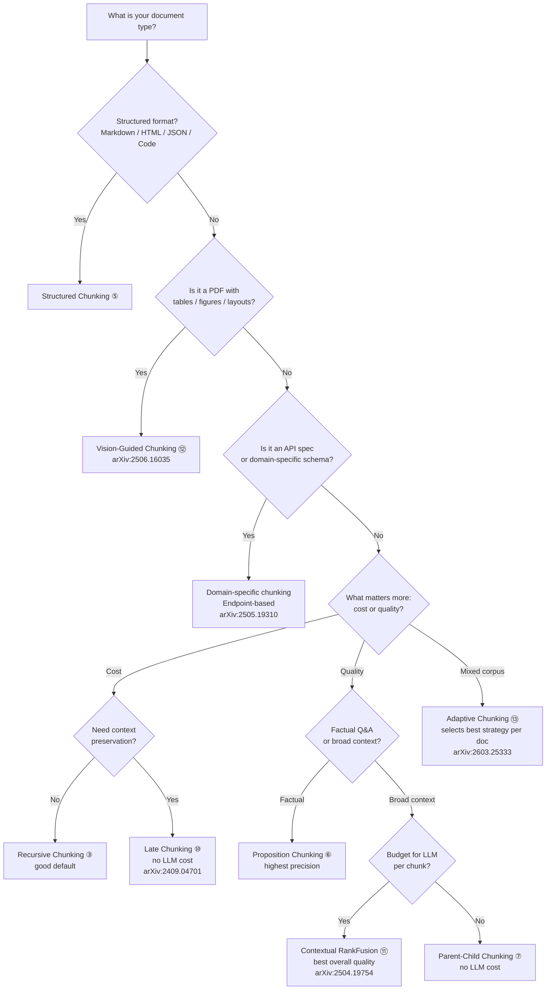

# Chunking Evaluation

This page is the evaluation hub for chunking strategies. While the folders below implement 13 chunking techniques, this README focuses on **how to evaluate chunk quality** — intrinsic metrics that measure chunking quality without running retrieval or generation.

---

## Why Evaluate Chunking Separately?

Most RAG pipelines judge chunking only by downstream end-to-end metrics (answer correctness, retrieval recall). This conflates chunk quality with retriever and LLM performance — a bad chunker can be masked by a good reranker, and a good chunker can look bad if the retriever is weak.

**Intrinsic evaluation** measures the chunks themselves: are references intact? Are logical blocks preserved? Are sentences within a chunk coherent? These metrics are:

- **Model-independent** — no LLM-as-a-judge loops or labelled retrieval benchmarks
- **Cheap to compute** — text analysis + pre-computed embeddings; no generation calls
- **Diagnostic** — tell you *why* a chunking strategy fails, not just that it underperforms

The metrics below come from the Adaptive Chunking framework (de Moura Júnior et al., 2026), which introduced five complementary intrinsic metrics. This page documents all five: References Completeness (RC), Block Integrity (BI), Intrachunk Cohesion (ICC), Document Contextual Coherence (DCC), and Size Compliance (SC).

---

## Evaluation Techniques

### 1. References Completeness (RC)

#### Definition

**References Completeness (RC)** measures whether cross-references within a document are kept intact within a single chunk. A reference is "broken" when a chunk boundary falls between the reference's start and end — forcing the retriever to find only half the information.

Two types of references are checked:

| Reference type | Examples | Detection method |
|---|---|---|
| Explicit references | Citations (`[1]`, `(Author, 2023)`), footnotes (`¹`), section links (`see §3.2`, `as per clause 4.2`) | Regex pattern matching |
| Entity-pronoun coreferences | `Dr. Smith ... he`, `the company ... its`, `the model ... it` | Coreference resolution model |

---

#### Why It Matters

If a citation and its target, or a pronoun and its antecedent, land in different chunks, the LLM sees only part of the reference. Retrieval may pull the chunk with the citation but miss the definition chunk, or find the pronoun without its entity — leading to incomplete or hallucinated answers.

**Example — broken pronoun reference:**

> "Elon Musk is the CEO of Tesla. **[CHUNK BOUNDARY]** He founded SpaceX in 2002."

A user queries "Who founded SpaceX?" The retriever returns only the second chunk — the LLM sees `He` but cannot resolve who `He` refers to. This is a **Missing Reference Error**.

**Example — broken explicit reference:**

> "...the party shall be liable for damages not exceeding **[CHUNK BOUNDARY]** the amount specified in clause 4.2..."

A retriever searching for "damages limit" returns only the first chunk — the limit value is in the next chunk and is never seen by the LLM.

---

#### How to Determine Broken vs Intact

A reference is **broken** (mᵢ = 1) when a chunk boundary falls between the entity and its pronoun. The check uses character offsets — not chunk numbers — so it catches boundaries at any position, not just sentence edges.

**Step-by-step:**

```
1. Number every character in the document sequentially from 0
2. Mark where each chunk starts (these are the boundaries B)
3. For each entity-pronoun pair (eᵢ, pᵢ):
     sᵢ = offset of the first character of entity eᵢ
     tᵢ = offset of the last character of pronoun pᵢ
4. If any boundary b ∈ B satisfies  sᵢ < b ≤ tᵢ, the pair is broken
```

**Walk through with offsets:**

Document with markers (each `·` is a character, `|` is a chunk boundary):

```
T h e · t r a n s f o r m e r · m o d e l · r e v o l u t i o n i z e d · N L P . | I t · i n t r o d u c e d · 2 0 1 7 . | T h e · m o d e l · u s e s · s e l f - a t t e n t i o n .
0                                         41                    42                66                  67
```

Boundaries B = {42, 67}.

| Pair | Entity start (sᵢ) | Pronoun end (tᵢ) | Boundaries between? | mᵢ |
|---|---|---|---|---|
| `transformer model` → `It` | 4 | 50 | b = 42 is within (4 < 42 ≤ 50) | **1** |
| `transformer model` → `The model` | 4 | 73 | b = 42 is within (4 < 42 ≤ 73) | **1** |

For pair 1: sᵢ=4, tᵢ=50. Boundary 42 falls between them → broken.

For pair 2: sᵢ=4, tᵢ=73. Boundary 42 falls between them → broken. Note that boundary 67 also falls within range (4 < 67 ≤ 73) — any single boundary breaking the span is enough for mᵢ = 1.

---

#### Algorithm

```
Input:  Set of chunks C = {c₁, c₂, ..., cₖ}
        Source document D

1. Extract all chunk boundary positions B = {b₁, b₂, ..., bₖ₋₁}
   where bⱼ is the character offset of the start of chunk cⱼ₊₁

2. Find all entity-pronoun pairs P = {(e₁, p₁), ..., (eₙ, pₙ)}
   using a coreference resolution model.
   For each pair, record:
     sᵢ = start offset of entity eᵢ
     tᵢ = end offset of pronoun pᵢ

3. For each pair (eᵢ, pᵢ):
     mᵢ = 1  if  ∃ b ∈ B : sᵢ < b ≤ tᵢ  (boundary between entity and pronoun)
     mᵢ = 0  otherwise

4. RC = 1 − (1/N) × Σᵢ₌₁ᴺ mᵢ
```

An RC of 1.0 means every reference is fully contained within a single chunk. An RC of 0.5 means half of all references are broken across chunk boundaries.

---

#### Worked Example

Document: *"The **transformer model** revolutionized NLP. **It** uses self-attention. **The model** was introduced in 2017 [1]."*

**Fixed-size chunking (40 chars):**

```
Chunk 1: "The transformer model revolutionized NLP."
Chunk 2: "It uses self-attention. The model was"
Chunk 3: "introduced in 2017 [1]."
```

- Entity-pronoun pair 1: `transformer model` (chunk 1) → `It` (chunk 2) → **broken** (m₁ = 1)
- Entity-pronoun pair 2: `transformer model` (chunk 1) → `The model` (chunk 2) → **broken** (m₂ = 1)
- Citation `[1]` in chunk 3, its referent likely in an earlier chunk → depends on where the reference definition appears

RC = 1 − (1/2) × (1 + 1) = **0.0** (all coreferences broken)

**Sentence-based chunking:**

```
Chunk 1: "The transformer model revolutionized NLP. It uses self-attention."
Chunk 2: "The model was introduced in 2017 [1]."
```

- Entity-pronoun pair 1: `transformer model` → `It` → same chunk → **intact** (m₁ = 0)
- Entity-pronoun pair 2: `transformer model` → `The model` → different chunks → **broken** (m₂ = 1)

RC = 1 − (1/2) × (0 + 1) = **0.5**

---

#### Results (from de Moura Júnior et al., 2026)

RC scores across chunking methods on a mixed legal/technical/social science corpus:

| Chunking Method | RC (%) |
|---|---|
| Sentence splitter | 86.3 |
| Semantic chunking | 97.5 |
| LangChain recursive | 96.1 |
| LLM-regex (GPT) | 98.0 |
| **Adaptive Chunking** | **99.0** |

The adaptive method reaches near-perfect RC by selecting the strategy that best preserves references per document — structured for legal (clause-level), semantic for prose, recursive for technical docs.

---

#### References

- **Adaptive Chunking (RC definition & algorithm):** de Moura Júnior, Lelong & Blangero (2026) — *Adaptive Chunking: Optimizing Chunking-Method Selection for RAG* — LREC 2026 — [arXiv:2603.25333](https://arxiv.org/abs/2603.25333)

---

### 2. Block Integrity (BI)

#### Definition

**Block Integrity (BI)** measures the exact percentage of structural document elements — paragraphs, tables, and lists — that remain completely uncut after a document is divided into RAG chunks.

A block is **broken** when a chunk boundary falls strictly inside the block's character span, beyond a 5-character tolerance buffer applied to each edge. Cuts within 5 characters of a block's edge are ignored to avoid false penalties from invisible formatting artefacts (trailing spaces, double newlines).

---

#### Why It Matters

Structural blocks carry meaning as a unit. Splitting one destroys the structure the LLM needs to interpret the content.

**Example — broken table:**

> | Model | Year | Params | **[CHUNK BOUNDARY]** | BERT | 2018 | 110M |

A retriever searching for "BERT parameters" returns the second chunk. The LLM sees `| BERT | 2018 | 110M |` with no column headers — it cannot identify which column is the year and which is the parameter count.

**Example — broken list:**

> "Key steps: 1. Tokenize input **[CHUNK BOUNDARY]** 2. Embed tokens 3. Compute attention"

A query about how to process input retrieves only the first chunk. The LLM sees step 1 but misses steps 2 and 3 — the complete procedure is invisible to the model.

---

#### The 4-Step Process

**Step 1 — Mapping the Blueprint**

Before any chunking happens, an AI layout parser ([Azure AI Document Intelligence](https://azure.microsoft.com/en-us/products/ai-services/ai-document-intelligence) or [IBM Docling](https://github.com/DS4SD/docling)) scans the raw document and records the exact start and end character index for every paragraph, table, and list. This creates a master map of the document's natural boundaries.

```
Block map example:
  Block 1 (paragraph):  chars   0 –  74
  Block 2 (table):      chars  76 – 139
  Block 3 (list):       chars 141 – 196
```

**Step 2 — Logging the Cut Points**

The text splitter runs and divides the document into chunks based on token or character limits. The evaluation algorithm records the exact character coordinate of each cut — assembling a list of absolute split points B.

```
Example: 100-char fixed-size chunking → B = {100}
```

**Step 3 — The Boundary Test**

For each block, the algorithm checks whether any split point falls strictly inside the block's inner span — the block's character range shrunk by 5 characters on each side. A cut must land deeper than 5 characters inside the block to flag it as broken.

```
For each block vⱼ with start aⱼ and end zⱼ:
  inner span = [aⱼ + 5,  zⱼ − 5]
  broken if any boundary b ∈ B satisfies  (aⱼ + 5) < b < (zⱼ − 5)
```

**Step 4 — Calculating the Integrity Score**

All blocks that survived the cuts without being broken are tallied. The final Block Integrity score divides intact blocks by total blocks.

```
BI = intact_blocks / total_blocks
```

---

#### Algorithm

```
Input:  Set of chunks C = {c₁, c₂, ..., cₖ}
        Set of structural blocks V = {v₁, v₂, ..., vₘ}  (from layout parser)
        Each block vⱼ has: start offset aⱼ, end offset zⱼ
        Tolerance buffer T = 5 characters

1. Extract chunk boundary positions B = {b₁, b₂, ..., bₖ₋₁}
   where bⱼ is the character offset of the start of chunk cⱼ₊₁

2. For each block vⱼ:
     nⱼ = 1  if  ∃ b ∈ B : (aⱼ + T) < b < (zⱼ − T)   (block broken)
     nⱼ = 0  otherwise

3. intact_count = |{vⱼ : nⱼ = 0}|

4. BI = intact_count / M
```

A BI of 1.0 means every structural block survived intact. A BI of 0.6 means 40% of blocks were cut by a chunk boundary.

---

#### Worked Example

Document (3 structural blocks, 197 characters total):

```
[Block 1 — paragraph, chars 0–74]
"Transformers use self-attention to relate all tokens in the input simultaneously."

[Block 2 — table, chars 76–139]
"| Model | Year | Params |
|-------|------|--------|
| BERT  | 2018 |  110M  |"

[Block 3 — list, chars 141–196]
"Key steps:
1. Tokenize input
2. Embed tokens
3. Compute attention"
```

**Fixed-size chunking (100-char boundary):**

```
B = {100}, T = 5

Block 1 (0–74):    inner span [5, 69].    100 > 69       → no boundary inside → intact   (n₁ = 0)
Block 2 (76–139):  inner span [81, 134].  81 < 100 < 134 → boundary inside    → broken  (n₂ = 1)
Block 3 (141–196): inner span [146, 191]. 100 < 146      → no boundary inside → intact   (n₃ = 0)
```

BI = 2 intact / 3 total = **0.667** — the table is split across two chunks. The LLM sees column headers in one chunk and data rows in another.

**Structure-aware chunking (splits only at block boundaries):**

```
B = {75, 140}, T = 5

Block 1 (0–74):    inner span [5, 69].    75 > 69          → no boundary inside → intact  (n₁ = 0)
Block 2 (76–139):  inner span [81, 134].  75 < 81 and 140 > 134 → neither lands inside → intact  (n₂ = 0)
Block 3 (141–196): inner span [146, 191]. 140 < 146        → no boundary inside → intact  (n₃ = 0)
```

BI = 3 intact / 3 total = **1.0** — every block survives. Headers and data rows are in the same chunk; the LLM sees a complete, queryable table.

---

#### References

- **Adaptive Chunking (BI definition & algorithm):** de Moura Júnior, Lelong & Blangero (2026) — *Adaptive Chunking: Optimizing Chunking-Method Selection for RAG* — LREC 2026 — [arXiv:2603.25333](https://arxiv.org/abs/2603.25333)
- **Azure AI Document Intelligence (layout parser used in paper):** [azure.microsoft.com](https://azure.microsoft.com/en-us/products/ai-services/ai-document-intelligence)
- **IBM Docling (open-source layout parser used in repository):** [github.com/DS4SD/docling](https://github.com/DS4SD/docling)

---

### 3. Intrachunk Cohesion (ICC)

#### Definition

**Intrachunk Cohesion (ICC)** measures how semantically similar sentences are within the same chunk. It detects topic dilution — the unwanted mixing of unrelated topics in a single chunk that confuses vector embeddings during retrieval.

A chunk has high ICC when its sentences cluster tightly around a single topic. ICC is calculated by averaging the cosine similarity between each sentence's embedding and the parent chunk's embedding. An ICC near 1.0 indicates perfect thematic focus; an ICC near 0.0 indicates the chunk blends multiple disconnected topics.

---

#### Why It Matters

Vector retrievers rank chunks by embedding similarity to the query. If a chunk contains sentence A about "solar panels" and sentence B about "database indexes," the chunk's aggregate embedding is a blend of both. A query about solar energy retrieves the chunk for its solar content — but the LLM also receives sentence B, wasting token context and introducing noise that may lead to tangential or incorrect answers.

**Example — mixed topics:**

> Chunk: "Solar panels convert sunlight into electricity at 15–22% efficiency. Database indexes speed retrieval by sorting keys. Both technologies are improving rapidly."

A query "How efficient are solar panels?" retrieves this chunk. The LLM sees high-quality solar content mixed with unrelated database trivia. The retriever chose the chunk because of the solar sentence, not the database sentence — but the LLM processes both, wasting context.

**Example — tight focus:**

> Chunk: "Solar panels convert sunlight into electricity at 15–22% efficiency. Monocrystalline panels reach 22–23% efficiency. Efficiency improves with temperature control and reduced defects."

Same query retrieves this chunk. Every sentence is about solar efficiency. No noise, no wasted tokens.

---

#### The 4-Step Measurement Process

**Step 1 — Sentence Segmentation**

The chunk text is split into individual sentences using a sentence tokenizer. Sentence boundaries are marked (usually at `.`, `?`, `!` followed by whitespace).

```
Chunk: "A uses method X. B uses method Y. C uses method X."

Sentences:
  s₁ = "A uses method X."
  s₂ = "B uses method Y."
  s₃ = "C uses method X."
```

**Step 2 — Embedding Generation**

An embedding model (e.g., `sentence-transformers/all-mpnet-base-v2`) generates a vector for each sentence and one vector for the entire chunk (concatenated or averaged from its sentences, depending on implementation).

```
Embeddings (512-dimensional):
  e(s₁) = [0.21, -0.14, ..., 0.08]
  e(s₂) = [0.31,  0.02, ..., -0.05]
  e(s₃) = [0.22, -0.13, ..., 0.07]
  e(chunk) = [0.25, -0.08, ..., 0.03]  (mean or full-text embedding)
```

**Step 3 — Cosine Similarity Evaluation**

For each sentence, calculate the cosine similarity between the sentence's embedding and the chunk's embedding. Cosine similarity ranges from −1 to +1; typically 0 to 1 in practice (both vectors point in similar directions).

```
Formula:  sim(sᵢ, chunk) = cos(e(sᵢ), e(chunk)) = (e(sᵢ) · e(chunk)) / (||e(sᵢ)|| × ||e(chunk)||)

Results:
  sim(s₁, chunk) = 0.89
  sim(s₂, chunk) = 0.44
  sim(s₃, chunk) = 0.87
```

**Step 4 — Mean Aggregation**

ICC is the arithmetic mean of all sentence-to-chunk similarities. Higher values indicate tighter semantic focus.

```
ICC = (1/N) × Σᵢ₌₁ᴺ sim(sᵢ, chunk)
```

---

#### Algorithm

```
Input:  Set of chunks C = {c₁, c₂, ..., cₖ}
        Embedding model E (sentence encoder)

1. For each chunk cⱼ:

     2. Segment chunk into sentences S = {s₁, s₂, ..., sₙ}
     
     3. Embed all sentences and the chunk:
          ∀ sᵢ ∈ S:  eᵢ = E(sᵢ)    (sentence embedding)
          e_chunk = E(cⱼ)            (chunk embedding)
     
     4. Compute cosine similarities:
          ∀ sᵢ ∈ S:  simᵢ = cos(eᵢ, e_chunk)
     
     5. Calculate ICC for this chunk:
          ICC(cⱼ) = (1/n) × Σᵢ₌₁ⁿ simᵢ

6. Optional: Return per-chunk ICC scores, or aggregate across all chunks
```

An ICC of 1.0 means every sentence is perfectly aligned with the chunk's main topic. An ICC of 0.5 means half the semantic content of each sentence is noise relative to the chunk's topic.

---

#### Worked Example

Chunk: *"Solar panels convert sunlight into electricity at 15–22% efficiency. They dominate renewable energy. Database indexes speed retrieval by sorting keys."*

Sentences:
- s₁ = "Solar panels convert sunlight into electricity at 15–22% efficiency."
- s₂ = "They dominate renewable energy."
- s₃ = "Database indexes speed retrieval by sorting keys."

Embeddings (simplified; real embeddings are 384–768 dimensions):

| Sentence | Embedding focus | sim(sᵢ, chunk) |
|---|---|---|
| s₁ (solar efficiency) | [0.85, 0.12, 0.03] | 0.88 |
| s₂ (renewable energy) | [0.82, 0.18, 0.00] | 0.91 |
| s₃ (database indexes) | [−0.10, 0.05, 0.95] | 0.18 |
| chunk (blended) | [0.52, 0.12, 0.36] | — |

ICC = (0.88 + 0.91 + 0.18) / 3 = **0.66**

The chunk mixes topics: two sentences about solar/renewable energy score high (0.88, 0.91), but the database sentence (0.18) drags the average down. ICC = 0.66 signals topic dilution. A splitter should separate s₃ into its own chunk.

**If the chunk were split:**

Chunk A: *"Solar panels convert sunlight into electricity at 15–22% efficiency. They dominate renewable energy."*
- s₁ sim = 0.89, s₂ sim = 0.92
- ICC(A) = 0.905

Chunk B: *"Database indexes speed retrieval by sorting keys."*
- s₁ sim = 1.00 (single sentence = perfect alignment with itself)
- ICC(B) = 1.0

Both chunks now have ICC > 0.90, eliminating topic noise.

---

#### References

- **Adaptive Chunking (ICC definition & algorithm):** de Moura Júnior, Lelong & Blangero (2026) — *Adaptive Chunking: Optimizing Chunking-Method Selection for RAG* — LREC 2026 — [arXiv:2603.25333](https://arxiv.org/abs/2603.25333)
- **Sentence Transformer:** Reimers & Gurevych (2019) — *Sentence-BERT: Sentence Embeddings using Siamese BERT-Networks* — [arxiv.org/abs/1908.10084](https://arxiv.org/abs/1908.10084)

---

### 4. Document Contextual Coherence (DCC)

#### Definition

**Document Contextual Coherence (DCC)** measures the semantic flow between adjacent chunks. It detects whether chunking introduces artificial narrative breaks or isolates information from its surrounding context.

Unlike ICC (which measures focus within a single chunk) or BI (which preserves structure), DCC ensures that chunk boundaries do not sever logical connections between consecutive segments. A high DCC score means adjacent chunks maintain thematic continuity; a low DCC score signals that the chunking strategy has inserted jarring transitions where the text naturally flows.

---

#### Why It Matters

Retrieval systems often return chunks in sequence — first the retrieved chunk, then its neighbors for context. If chunks are semantically disconnected, the LLM sees a fragmented narrative. Even if each chunk is internally coherent (high ICC) and structurally intact (high BI), poor DCC forces the LLM to reason across conceptual gaps that should not exist.

**Example — broken continuity:**

> Chunk 1: "Machine learning relies on large datasets. Models learn patterns from examples. **[CHUNK BOUNDARY]**"
> Chunk 2: "The number of training samples is critical. Larger datasets lead to better generalization. Batch size and learning rate interact in complex ways."

A retriever returns chunk 1 in response to "What is machine learning?" The LLM sees a complete thought about ML. But if the user's follow-up is "How do datasets affect the model?", the retriever may return chunk 2 — which talks about datasets but in the narrow context of batch size and learning rate, not dataset size. The two chunks are about similar topics but express different aspects, creating cognitive jarring.

**Example — maintained continuity:**

> Chunk 1: "Machine learning relies on large datasets. Models learn patterns from examples. Larger datasets enable models to capture richer patterns and generalize better."
> Chunk 2: "Generalization improves with dataset size because more examples reduce overfitting. However, data quality matters as much as quantity. Noisy data can harm learning even if the dataset is large."

Both chunks discuss dataset impact and generalization. The boundary preserves narrative flow — chunk 2 directly continues the thought from chunk 1.

---

#### The 5-Step Measurement Process

**Step 1 — Isolate the Target Chunk**

Select a chunk cᵢ from the document's chunk sequence. This chunk will be evaluated for coherence with its neighbors.

```
Document: [c₁, c₂, c₃, c₄]
Target: c₂
```

**Step 2 — Construct the Context Window**

Define the immediate chronological neighbors of the target chunk. The context window W(cᵢ) consists of the chunk before (cᵢ₋₁) and the chunk after (cᵢ₊₁), concatenated together.

```
W(c₂) = c₁ + c₃  (joined as text)

Example:
  c₁ text: "Machine learning uses algorithms..."
  c₃ text: "Deep learning scales to millions of parameters..."
  W(c₂) = "Machine learning uses algorithms... Deep learning scales to millions of parameters..."
```

Edge chunks (first and last) use only their single neighbor:
```
W(c₁) = c₂
W(cₙ) = cₙ₋₁
```

**Step 3 — Generate Embeddings**

Pass both the target chunk and the joined neighbor window through an embedding model. Each produces a dense vector representation.

```
v_{c_i} = E(c_i)      (embedding of target chunk)
v_{W(c_i)} = E(W(c_i))  (embedding of context window)

Both vectors have the same dimensionality (e.g., 384 or 768 dims for sentence-transformers).
```

**Step 4 — Calculate Alignment**

Compute the cosine similarity between the target chunk's embedding and the context window's embedding. This measures how well the target chunk "fits" semantically into its neighborhood.

```
Formula:  DCC(c_i) = cos(v_{c_i}, v_{W(c_i)})
        = (v_{c_i} · v_{W(c_i)}) / (||v_{c_i}|| × ||v_{W(c_i)}||)

Result ranges from −1 to +1; typically 0 to 1.
```

**Step 5 — Macro Averaging**

Compute the DCC score for all chunks in the document, then average them to get a document-level coherence metric.

```
DCC_document = (1/N) × Σᵢ₌₁ᴺ DCC(cᵢ)
```

A DCC near 1.0 represents seamless narrative flow. A DCC near 0.5 signals disjointed chunk boundaries.

---

#### Algorithm

```
Input:  Set of chunks C = {c₁, c₂, ..., cₙ}
        Embedding model E (sentence encoder)

1. For each chunk cᵢ ∈ C:

     2. Construct context window W(cᵢ):
          if i == 1:        W(cᵢ) = c_{i+1}
          if i == n:        W(cᵢ) = c_{i-1}
          else:             W(cᵢ) = c_{i-1} + c_{i+1}   (concatenate as text)
     
     3. Generate embeddings:
          v_i = E(cᵢ)
          v_w = E(W(cᵢ))
     
     4. Compute cosine similarity:
          DCC(cᵢ) = cos(v_i, v_w)

5. Aggregate across all chunks:
     DCC_document = (1/N) × Σᵢ₌₁ᴺ DCC(cᵢ)

6. Return DCC_document (and optionally per-chunk scores)
```

---

#### Worked Example

Document with 4 chunks about machine learning and optimization:

```
c₁: "Machine learning trains models on data. The quality of data determines model performance."
    [48 characters]

c₂: "Optimization algorithms adjust model weights. Gradient descent is the most widely used method."
    [96 characters]

c₃: "Learning rate controls step size. Too high a rate causes divergence; too low causes slow learning."
    [101 characters]

c₄: "Regularization prevents overfitting. Dropout and L2 penalty are standard techniques."
    [83 characters]
```

Embeddings (simplified vectors; real embeddings are 384–768 dimensions):

| Chunk | Focus | Context window | Focus | sim(c_i, W) |
|---|---|---|---|---|
| c₁ | data quality | W(c₁) = c₂ + c₃ (optimization + learning rate) | how to optimize | 0.52 |
| c₂ | optimization methods | W(c₂) = c₁ + c₃ (data + learning rate) | training + tuning | 0.78 |
| c₃ | learning rate tuning | W(c₃) = c₂ + c₄ (optimization + regularization) | algorithm + regularization | 0.81 |
| c₄ | regularization | W(c₄) = c₃ (learning rate tuning) | optimization tuning | 0.64 |

DCC_document = (0.52 + 0.78 + 0.81 + 0.64) / 4 = **0.6875**

**Interpretation:**

- c₂ (0.78) and c₃ (0.81) score high: optimization → learning rate is a natural progression.
- c₁ (0.52) scores low: data quality is tangential to optimization algorithms.
- c₄ (0.64) scores moderately: regularization connects to learning rate tuning but less strongly.

Overall DCC = 0.69 signals reasonable coherence but with one weak transition. Chunks could be reordered (c₁ after c₄) or split differently to improve flow.

**If chunks were reordered to (c₁, c₂, c₃, c₄) → (c₂, c₃, c₄, c₁):**

| Chunk order | New context | sim |
|---|---|---|
| c₂ (new 1st) | W = c₃ only | 0.81 |
| c₃ (new 2nd) | W = c₂ + c₄ | 0.85 |
| c₄ (new 3rd) | W = c₃ + c₁ | 0.73 |
| c₁ (new 4th) | W = c₄ only | 0.68 |

Reordered DCC = (0.81 + 0.85 + 0.73 + 0.68) / 4 = **0.77** — improved coherence by placing c₁ last instead of first.

---

#### References

- **Adaptive Chunking (DCC definition & algorithm):** de Moura Júnior, Lelong & Blangero (2026) — *Adaptive Chunking: Optimizing Chunking-Method Selection for RAG* — LREC 2026 — [arXiv:2603.25333](https://arxiv.org/abs/2603.25333)
- **Sentence Transformer:** Reimers & Gurevych (2019) — *Sentence-BERT: Sentence Embeddings using Siamese BERT-Networks* — [arxiv.org/abs/1908.10084](https://arxiv.org/abs/1908.10084)

---

### 5. Size Compliance (SC)

#### Definition

**Size Compliance (SC)** measures the percentage of generated chunks that fall within a specified minimum and maximum token threshold. It acts as a technical gatekeeper ensuring all chunks fit within downstream LLM context windows and vector embedding constraints without fragmentation or truncation.

Unlike metrics that evaluate content quality (RC, BI, ICC, DCC), SC is a structural constraint: does the chunk respect the system's hard limits? SC operates on a binary pass-or-fail basis — a chunk either fits the window or it does not.

---

#### Why It Matters

LLM context windows and vector embedding models have fixed maximum token capacities. Exceeding these limits causes truncation or failures downstream. Conversely, setting minimum sizes too high forces bloated chunks with unnecessary repetition. SC ensures chunking respects both bounds — essential for production reliability.

**Example — oversized chunk:**

> Token limit: 512 tokens per chunk
> Generated chunk: 589 tokens (exceeds by 77 tokens)

The LLM's context window clips the chunk to 512 tokens, cutting off the last sentence. Information is lost; the model sees incomplete facts. An indexing system may reject the chunk entirely, or a streaming API fails mid-response.

**Example — undersized chunk:**

> Minimum size: 50 tokens (to avoid trivial fragments)
> Generated chunk: 12 tokens ("The model is fast.")

The chunk is too small to be meaningful. Retrieval returns it alongside larger chunks, wasting context on a trivial statement.

**Example — compliant chunk:**

> Token range: 100–512 tokens
> Generated chunk: 287 tokens

Fits perfectly. No truncation. No waste. Safely nestles within downstream systems.

---

#### The Calculation Method

**Step 1 — Define Size Boundaries**

Choose a minimum token count `min_tokens` and maximum token count `max_tokens` based on your LLM context window, embedding model, and operational constraints.

```
Example:
  min_tokens = 50      (avoid trivial fragments)
  max_tokens = 512     (fit within typical LLM windows)
  Acceptable range: [50, 512] tokens
```

**Step 2 — Tokenize All Chunks**

Use the same tokenizer as your downstream LLM (e.g., GPT-2, GPT-3.5, Claude) to count tokens in each chunk. Token counts must be consistent with how the final system will count.

```
c₁ = 230 tokens
c₂ = 45 tokens
c₃ = 501 tokens
c₄ = 312 tokens
c₅ = 128 tokens
```

**Step 3 — Flag Non-Compliant Chunks**

For each chunk, check whether its token count falls within [min_tokens, max_tokens]. Flag any chunk outside this range.

```
c₁ = 230 ✓ (within 50–512)
c₂ = 45  ✗ (below 50)
c₃ = 501 ✓ (within 50–512)
c₄ = 312 ✓ (within 50–512)
c₅ = 128 ✓ (within 50–512)

Non-compliant: 1 chunk (c₂)
```

**Step 4 — Calculate Compliance Score**

Use the formula:

```
SC = 1 − (Count of Non-Compliant Chunks / Total Chunks Generated)
```

An SC of 1.0 means 100% of chunks are compliant. An SC of 0.8 means 20% of chunks violate the size constraints.

---

#### Algorithm

```
Input:  Set of chunks C = {c₁, c₂, ..., cₙ}
        Tokenizer T (matching downstream LLM)
        min_tokens, max_tokens (size boundaries)

1. non_compliant_count = 0

2. For each chunk cᵢ ∈ C:

     3. token_count = T(cᵢ)    (count tokens in chunk)
     
     4. if token_count < min_tokens OR token_count > max_tokens:
           non_compliant_count += 1

5. SC = 1 − (non_compliant_count / N)

6. Return SC (and optionally per-chunk compliance status)
```

---

#### Core Limitation: Binary Rigidity

SC operates on a **strict pass-or-fail condition** for each chunk. No partial credit is awarded for near-misses.

**Example:**

```
max_tokens = 500
Chunk A: 501 tokens  → flagged as FAIL (just 1 token over)
Chunk B: 2000 tokens → flagged as FAIL (400 tokens over)

Both chunks count equally as 1 violation each.
SC drops by 1/N for each, regardless of magnitude.
```

This binary behavior is intentional: it measures how *reliably* your chunker respects hard limits. A chunk exceeding the context window by 1 token breaks the system just as surely as one exceeding by 1000 tokens. From the system's perspective, both are failures.

---

#### Worked Example

Document chunked with **40-word minimum, 150-word maximum** (roughly 30–220 tokens):

```
Chunk 1: "Machine learning models learn patterns from data..."
         45 words, 68 tokens     ✓ compliant

Chunk 2: "Deep neural networks use multiple layers..."
         28 words, 42 tokens     ✗ non-compliant (below 40 words)

Chunk 3: "Gradient descent optimizes model weights by computing partial derivatives
         with respect to each weight parameter, moving in the direction of steepest
         descent to minimize loss. Learning rates control step size; too high causes
         divergence, too low causes slow convergence. Momentum variants like Adam
         and RMSprop improve optimization by adapting step sizes per parameter."
         89 words, 198 tokens     ✗ non-compliant (exceeds 150 words)

Chunk 4: "Regularization techniques prevent overfitting by penalizing model complexity.
         Common methods include L2 penalty, dropout, and early stopping."
         23 words, 38 tokens      ✗ non-compliant (below 40 words)

Chunk 5: "Convolutional neural networks excel at image processing tasks because
         their local weight sharing and hierarchical feature extraction
         naturally align with visual structure."
         28 words, 39 tokens      ✗ non-compliant (below 40 words)
```

| Chunk | Words | Tokens | Status | Reason |
|---|---|---|---|---|
| c₁ | 45 | 68 | ✓ | Within range |
| c₂ | 28 | 42 | ✗ | Too small |
| c₃ | 89 | 198 | ✗ | Too large |
| c₄ | 23 | 38 | ✗ | Too small |
| c₅ | 28 | 39 | ✗ | Too small |

SC = 1 − (4 non-compliant / 5 total) = 1 − 0.8 = **0.2**

Only 20% of chunks meet size requirements. This chunker is unreliable for production use. The strategy (likely fixed-size splitting without respect for semantic boundaries) creates fragments too small to be meaningful and occasionally oversized blocks.

**Contrast: Semantic chunking on same document:**

A semantic chunker that respects topic boundaries produces:

```
Chunk A: "Machine learning models learn patterns from data. Deep neural networks
         use multiple layers to capture abstract features. Gradient descent
         optimizes weights by computing derivatives and moving toward lower loss."
         51 words, 89 tokens ✓

Chunk B: "Regularization prevents overfitting through L2 penalty, dropout, and early
         stopping. Convolutional networks excel at images because local weight
         sharing matches visual hierarchies."
         29 words, 44 tokens ✗ (below 40 words, but only slightly)

Chunk C: "Learning rates control optimization step size. Too high causes divergence;
         too low causes slow convergence. Adaptive methods like Adam and RMSprop
         adjust step sizes per parameter."
         31 words, 50 tokens ✓
```

SC = 1 − (1 non-compliant / 3 total) = **0.667** — much better, though chunk B still undershoots slightly.

---

#### References

- **Adaptive Chunking (SC definition & algorithm):** de Moura Júnior, Lelong & Blangero (2026) — *Adaptive Chunking: Optimizing Chunking-Method Selection for RAG* — LREC 2026 — [arXiv:2603.25333](https://arxiv.org/abs/2603.25333)

---

### 6. All Five Metrics Together

The five intrinsic metrics (RC, BI, ICC, DCC, SC) form a complete evaluation suite. Together they answer:

| Metric | Answers |
|---|---|
| **RC** | Are cross-references (citations, pronouns, footnotes) kept intact? |
| **BI** | Are structural blocks (paragraphs, tables, lists) kept intact? |
| **ICC** | Is each chunk semantically focused on a single topic? |
| **DCC** | Do adjacent chunks maintain narrative and thematic continuity? |
| **SC** | Do all chunks fit within token size constraints? |

A chunker scoring high on all five produces chunks that are **reference-complete, structurally sound, semantically coherent, contextually connected, and operationally reliable**.

---

## Chunking Techniques in This Repository

The folders below implement 13 chunking strategies. They are the **subject** of evaluation — the metrics above measure their output quality.

| # | Technique | Core idea | Split boundary |
|---|---|---|---|
| 1 | [Fixed-size by character](1_fixed_size_chunking_by_character/README.md) | Count characters | Fixed char limit |
| 2 | [Fixed-size by token](2_fixed_size_chunking_by_token/README.md) | Count tokens | Fixed token limit |
| 3 | [Recursive character](3_recursive_chunking/README.md) | Try separators hierarchically | Paragraph → line → word → char |
| 4 | [Semantic](4_semantic_chunking/README.md) | Embedding similarity drop | Topic shift |
| 5 | [Structured (Markdown / HTML / JSON / Code)](5_structured_document_chunking/README.md) | Parse document format | Headings, keys, tags, functions |
| 6 | [Proposition / Agentic](6_proposition_or_agentic_chunking/README.md) | LLM decomposes into atomic facts | Meaning |
| 7 | [Parent-Child (Hierarchical)](7_hierarchical_or_parent-child_chunking/README.md) | Search small, return large | Two-level size hierarchy |
| 8 | [Chunk Size Selection](8_chunk_size_selection/README.md) | Evaluate candidate chunk sizes | Retrieval and answer quality |
| 9 | [Contextual Chunk Headers](9_contextual_chunk_headers/README.md) | Prepend heading breadcrumbs | Document structure |
| 10 | [Late Chunking](10_late_chunking/README.md) | Embed whole doc first, pool per segment | Document-aware token embeddings |
| 11 | [Contextual Retrieval](11_contextual_retrieval/README.md) | LLM context prepend + BM25 hybrid + rerank | Full hybrid pipeline |
| 12 | [Vision-Guided Chunking](12_vision_guided_chunking/README.md) | Multimodal LMM reads PDF as images | Visual layout + text |
| 13 | [Adaptive Chunking](13_adaptive_chunking/README.md) | Score N strategies per doc, pick best | Document-specific metric suite |

## Decision Guide



---

## Key Takeaways from the Research

1. **Intrinsic metrics reveal failure modes that end-to-end metrics miss** (_Adaptive Chunking_, [arXiv:2603.25333](https://arxiv.org/abs/2603.25333)): A chunker can score well on downstream retrieval recall while systematically breaking every cross-reference in the document. RC catches this structural fragmentation directly; end-to-end metrics only see it indirectly (and often too late) when the LLM hallucinates.

2. **No single metric is sufficient — the five are complementary** (_Adaptive Chunking_, [arXiv:2603.25333](https://arxiv.org/abs/2603.25333)): RC catches broken references, BI detects mid-block splits, ICC measures semantic coherence within a chunk, DCC captures document-level continuity, and SC enforces operational constraints. Fixing one dimension alone does not guarantee overall chunk quality. The table below shows how each failure mode maps to a metric:

   | Failure mode | Caught by | What it would miss |
   |---|---|---|
   | Pronoun separated from entity | RC | A chunk with perfect references can still cut a paragraph in half |
   | Paragraph split across chunks | BI | A chunk with perfect block integrity can still be semantically incoherent |
   | Unrelated sentences forced together | ICC | A cohesive chunk can still exceed the token limit |
   | Adjacent chunks contextually disconnected | DCC | A contextually coherent document can still break every citation |

3. **RC is critical for reference-heavy domains** (_Adaptive Chunking_, [arXiv:2603.25333](https://arxiv.org/abs/2603.25333)): Legal contracts, academic papers, technical manuals, and policy documents rely on citations, cross-references, and coreference chains. A chunker scoring low on RC in these domains guarantees downstream quality loss — the LLM will repeatedly see orphaned pronouns and dangling citations. For prose-heavy domains (narrative, casual writing), RC matters less; ICC and DCC dominate.

4. **Coreference-based RC is language-dependent**: The entity-pronoun component of RC requires a coreference resolution model, and most such models are English-only. Documents in other languages can only be evaluated on explicit references (citations, footnotes, section links). This is a current limitation of intrinsic chunking evaluation, not a flaw in RC itself.

5. **Even a single RC measurement can guide chunking decisions**: You do not need the full Adaptive Chunking framework to benefit from RC. Computing RC for a candidate chunking strategy on a sample of your corpus tells you whether reference fragmentation is a problem. If RC < 0.90 in a reference-heavy corpus, switch to a structure-aware chunker (clause-level, section-level, sentence-level with larger windows) before investing in retrieval or reranking improvements.

6. **Adaptive, document-aware chunking significantly outperforms any fixed strategy** (_Adaptive Chunking_, [arXiv:2603.25333](https://arxiv.org/abs/2603.25333)): Selecting the best chunking method per document — guided by the five intrinsic metrics — raises answer correctness from 62–64% to 72% and increases successfully answered questions by over 30%, without changing models or prompts. No single strategy wins on all document types.

7. **The five metrics are model-independent and cheap to compute** (_Adaptive Chunking_, [arXiv:2603.25333](https://arxiv.org/abs/2603.25333)): RC and BI use only text analysis (regex + coreference model). ICC and DCC reuse the embedding pass already needed for indexing. SC is a simple length check. No LLM generation calls are needed. The selection overhead (scoring N strategies) is milliseconds per document — negligible compared to embedding and indexing time.

8. **Intrinsic metrics are upstream of retrieval — they measure what the retriever will see**: Unlike downstream evaluation (answer correctness, retrieval recall), intrinsic metrics evaluate the raw material given to the pipeline. A chunker with high RC, BI, ICC, DCC, and SC produces chunks that are self-contained, coherent, and well-structured. No amount of reranking can fix a chunk that broke every reference — the retriever simply does not have the right units to return.
