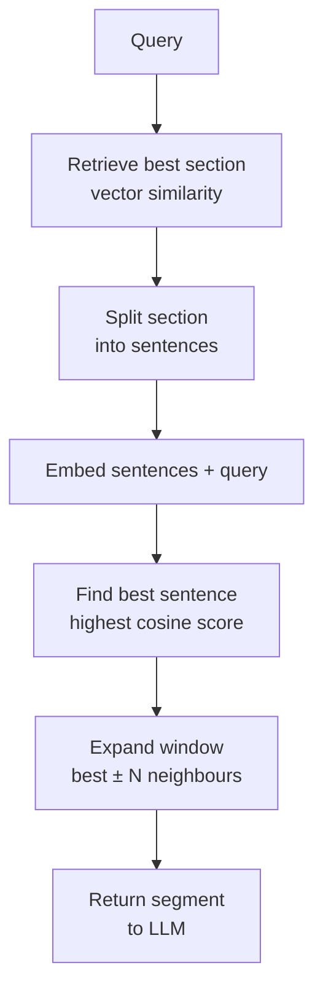

# Relevant Segment Extraction

## The Simple Idea (Feynman Explanation)

Retrieval returns a section. But the answer is in one sentence of that section. Relevant segment extraction finds that sentence and returns it with a small window of surrounding context — enough to understand the answer without the noise of the full section.

Think of it like a highlighter. You retrieve the whole page, then highlight the one paragraph that matters and hand that to the reader instead of the whole page.

The difference from contextual compression: compression filters sentences by relevance score. Segment extraction finds the single best sentence and returns a fixed window around it, preserving narrative flow.

```
Retrieved section (401 chars):
  "Section 3.2 — Refund Policy. All purchases are eligible for a full
   refund within 30 days... To initiate a refund, customers must contact
   support... Digital downloads are non-refundable once accessed.
   Refunds are processed within 5–7 business days to the original payment
   method. Shipping costs are non-refundable unless the return is due to
   our error."

Query: "How long does a refund take to process?"

Best sentence: "Refunds are processed within 5–7 business days..."
Window=1 → return 1 sentence before + best + 1 sentence after
```



---

## Algorithm

### Step 1 — Retrieve the best section

```python
scores, idx = index.search(q_emb, 1)
best_section = sections[idx[0][0]]
```

### Step 2 — Split section into sentences, find the most relevant

```python
sentences = section_text.split(". ")
sent_embs = model.encode(sentences)
scores = (sent_embs @ q_emb.T).flatten()
best = int(np.argmax(scores))
```

### Step 3 — Return the best sentence with a context window

```python
start = max(0, best - window)
end = min(len(sentences), best + window + 1)
segment = ". ".join(sentences[start:end])
```

---

## Worked Example

**Query:** `"How long does a refund take to process?"`

**Retrieved section (401 chars):**
```
Section 3.2 — Refund Policy. All purchases are eligible for a full refund within
30 days of the original purchase date. To initiate a refund, customers must contact
support with their order number. Digital downloads are non-refundable once accessed.
Refunds are processed within 5–7 business days to the original payment method.
Shipping costs are non-refundable unless the return is due to our error.
```

**Best sentence (highest similarity to query):**
```
Refunds are processed within 5–7 business days to the original payment method.
```

**Extracted segment with window=1 (189 chars):**
```
Digital downloads are non-refundable once accessed. Refunds are processed within
5–7 business days to the original payment method. Shipping costs are non-refundable
unless the return is due to our error.
```

50% reduction in context size while preserving the answer and its immediate neighbours.

---

## Mermaid Diagram



---

## Segment Extraction vs Contextual Compression

| | Segment Extraction | Contextual Compression |
|---|---|---|
| Selection method | Find best sentence, fixed window around it | Keep all sentences above threshold |
| Output size | Predictable (2×window+1 sentences) | Variable (depends on threshold) |
| Narrative flow | Preserved (contiguous window) | May be broken (non-contiguous sentences) |
| Best for | Single focused answer | Multiple relevant facts scattered in chunk |

---

## Key Findings

- **Window size controls the precision-context trade-off.** `window=0` returns only the single most relevant sentence. `window=2` returns 5 sentences. Start with `window=1`.
- **Works best on long structured sections** (legal clauses, policy documents, manuals) where the answer is a specific sentence surrounded by related but less relevant content.
- **The extracted segment remains traceable.** Every word came from the original section — the source is preserved for citation.
- **Different from chunking.** Chunking happens before indexing. Segment extraction happens after retrieval — it is a post-retrieval refinement step.

---

## Pros, Cons & When to Use

| | |
|---|---|
| ✅ **Precise evidence** | Returns the exact sentence that answers the query, not a surrounding paragraph. |
| ✅ **Predictable output size** | Fixed window means predictable token count. |
| ✅ **Traceable** | Every word from the original source. |
| ❌ **Misses distributed answers** | If the answer spans multiple non-adjacent sentences, a fixed window may miss parts. |
| ❌ **Window size requires tuning** | Too small → missing context. Too large → noise returns. |

**Suitable for:** Legal documents, policy manuals, technical specifications — any document where the answer is a specific clause or sentence.

**Not suitable for:** Documents where the answer requires synthesising information from multiple paragraphs — use contextual compression or parent-child retrieval instead.
