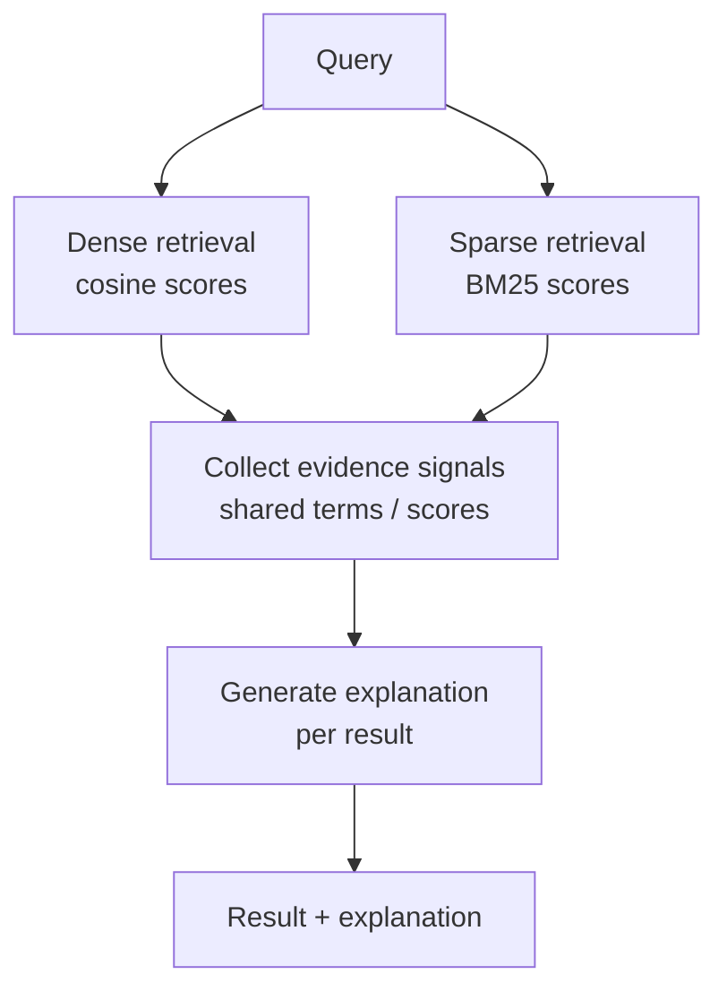

# Explainable Retrieval

## The Simple Idea (Feynman Explanation)

Standard retrieval returns a ranked list with scores. But a score of 0.82 tells you nothing about *why* a document ranked there. Was it shared keywords? Semantic similarity? A metadata match? Without an explanation, debugging retrieval failures is guesswork.

Explainable retrieval attaches a reason to each result. Instead of "chunk 7 scored 0.82", it says "chunk 7 matched because it shares the terms 'capital' and 'France' with the query and has high semantic similarity (0.74)".

Think of it like a search engine that shows you why each result appeared — "this page contains your exact search terms" or "this page is about the same topic as your query".

---

## Algorithm

### Step 1 — Retrieve with both dense and sparse signals

```python
dense_scores, idx = index.search(q_emb, k)
bm25_scores = bm25.get_scores(query_tokens)
```

### Step 2 — Generate explanation from signals

```python
def explain_match(query, doc, dense_score, bm25_score):
    shared = set(query_tokens) & set(doc_tokens)
    reasons = []
    if shared:
        reasons.append(f"shared terms: {', '.join(sorted(shared))}")
    if dense_score > 0.5:
        reasons.append(f"high semantic similarity ({dense_score:.3f})")
    if bm25_score > 1.0:
        reasons.append(f"strong keyword match (BM25={bm25_score:.2f})")
    return "; ".join(reasons)
```

---

## Worked Example

**Query:** `"What is the capital of France?"`

```
Doc: The capital of France is Paris, a city on the Seine river.
  Explanation: shared terms: capital, france, is, of, the;
               high semantic similarity (0.740); strong keyword match (BM25=3.38)

Doc: Paris hosted the 1900 and 1924 Olympic Games.
  Explanation: moderate semantic similarity (0.346)

Doc: France is a country in Western Europe with a population of 68 million.
  Explanation: shared terms: france, is; moderate semantic similarity (0.312)
```

---

## Mermaid Diagram



---

## Explanation Signal Types

| Signal | Example | What it reveals |
|---|---|---|
| Shared terms | `shared terms: capital, france` | Keyword overlap drove the match |
| Semantic similarity | `high semantic similarity (0.74)` | Meaning-based match |
| BM25 score | `strong keyword match (BM25=3.38)` | Rare query terms appear in document |
| Metadata match | `source: policy_doc_2024` | Structural filter applied |

---

## Key Findings

- **Explanations reveal failure modes.** If a wrong document ranks highly, the explanation shows whether it was semantic drift or a keyword false positive.
- **Rule-based explanations are fast and auditable** — no LLM call needed.
- **LLM-generated explanations are richer.** Pass query + chunk to an LLM: "Explain why this document is relevant." More natural language, but adds latency.
- **Explainability builds user trust.** Users can verify citations themselves.

---

## Pros, Cons & When to Use

| | |
|---|---|
| ✅ **Debuggable** | Explains why each result ranked where it did. |
| ✅ **Builds trust** | Users can verify relevance before trusting the answer. |
| ✅ **No extra retrieval cost** | Explanations use signals already computed during retrieval. |
| ❌ **Rule-based explanations are shallow** | They describe signals, not meaning. |

**Suitable for:** Research tools, compliance systems, customer-facing search with citations — anywhere users need to verify retrieval quality.

**Not suitable for:** High-throughput systems where explanation payload adds unacceptable overhead.
