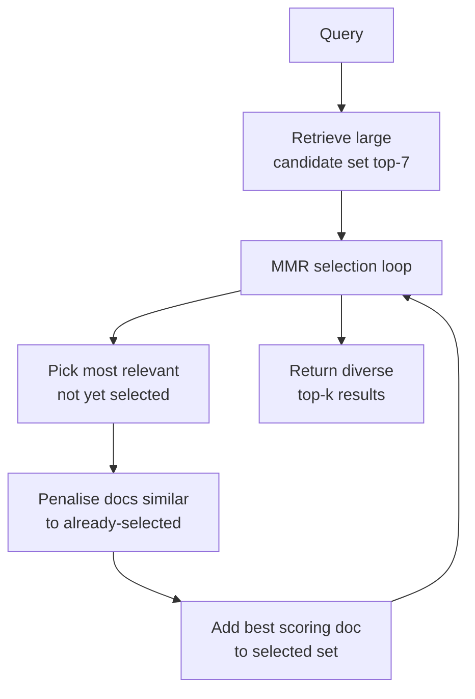

# Dartboard Retrieval (MMR)

## The Simple Idea (Feynman Explanation)

Standard top-k retrieval returns the k most relevant documents. But for a broad query like "Tell me about Python", the top 4 results might all say essentially the same thing — "Python is a programming language" in four different phrasings. You've used 4 context slots to say one thing.

Dartboard retrieval (Maximal Marginal Relevance, MMR) balances relevance and diversity. The first pick is the most relevant document. Each subsequent pick is the document that is most relevant to the query *and* most different from what's already been selected.

Think of a dartboard: the bullseye is the query. You want darts close to the bullseye (relevant), but you also want them spread out (diverse) — not five darts in the same hole.

```
Standard top-4 (pure relevance):
  All 4 results are Python-overview sentences — same information, 4 times.

MMR top-4 (relevance + diversity):
  1. Python is a high-level programming language...  ← most relevant
  2. The GIL limits true multi-threading in CPython  ← different angle (limitation)
  3. Python was created by Guido van Rossum in 1991  ← different angle (history)
  4. Neural networks are inspired by the human brain ← different topic entirely
```

---

## Algorithm (Maximal Marginal Relevance)

```
MMR score = λ × relevance(doc, query) − (1−λ) × max_similarity(doc, selected)

Where:
  relevance = cosine similarity between doc and query
  max_similarity = highest cosine similarity between doc and any already-selected doc
  λ = balance parameter (1.0 = pure relevance, 0.0 = pure diversity)
```

### Step 1 — Retrieve a large candidate set

```python
_, candidate_idx = index.search(q_emb, k=7)   # retrieve more than needed
```

### Step 2 — Iteratively select with MMR

```python
selected = []
remaining = list(range(len(candidates)))

for _ in range(k):
    best_score, best_pos = -inf, None
    for pos in remaining:
        relevance = candidate_embs[pos] @ query_emb
        sim_to_selected = max(candidate_embs[pos] @ candidate_embs[s] for s in selected) if selected else 0
        score = lambda_ * relevance - (1 - lambda_) * sim_to_selected
        if score > best_score:
            best_score, best_pos = score, pos
    selected.append(best_pos)
    remaining.remove(best_pos)
```

---

## Worked Example

**Query:** `"Tell me about Python"`

**Standard top-4 (pure relevance):**
```
1. Python is a high-level programming language known for readability.
2. Python is widely used in data science, web development, and automation.
3. Python was created by Guido van Rossum and released in 1991.
4. Python uses indentation to define code blocks instead of braces.
```
All 4 are Python-overview sentences — redundant context.

**MMR top-4 (λ=0.5):**
```
1. Python is a high-level programming language known for readability.
2. The GIL (Global Interpreter Lock) limits true multi-threading in CPython.
3. Python was created by Guido van Rossum and released in 1991.
4. Neural networks are inspired by the human brain structure.
```
Covers: overview, limitation, history, and a different topic — much more informative.

---

## Mermaid Diagram



---

## λ Parameter Guide

| λ value | Behaviour | Use case |
|---|---|---|
| 1.0 | Pure relevance — same as standard top-k | Precise factual queries |
| 0.7 | Mostly relevant, some diversity | General Q&A |
| 0.5 | Balanced | Exploratory queries |
| 0.3 | Mostly diverse | Brainstorming, broad overviews |

---

## Key Findings

- **Standard top-k wastes context tokens on near-duplicates.** For broad queries, the first 4 results often say the same thing with different words.
- **MMR improves coverage.** The diverse selection covers definitions, limitations, history, and related topics in one prompt.
- **λ=0.5 is a good default for exploratory queries.** For precise factual queries, use λ=1.0 (standard top-k).
- **Diversity should not override relevance for precise questions.** "What year was Python created?" needs the most relevant answer, not a diverse set.

---

## Pros, Cons & When to Use

| | |
|---|---|
| ✅ **Better coverage** | Diverse results cover more aspects of a broad question. |
| ✅ **Reduces redundancy** | No near-duplicate sentences wasting context tokens. |
| ❌ **Slower than top-k** | O(k²) comparisons vs O(k) for standard top-k. |
| ❌ **Wrong for precise queries** | Diversity hurts when the user needs the single most relevant answer. |

**Suitable for:** Broad or exploratory queries — "tell me about X", "what are the options for Y", research assistants.

**Not suitable for:** Precise factual lookups where the user needs the single best answer, not a diverse set.
