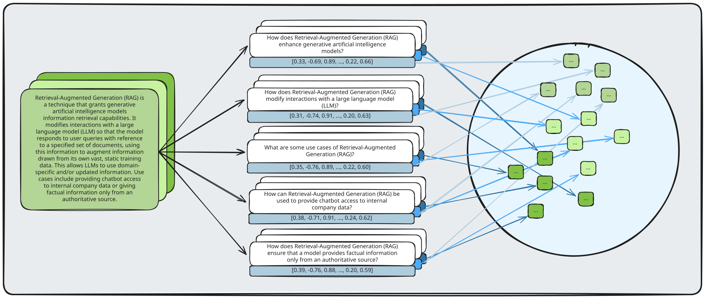
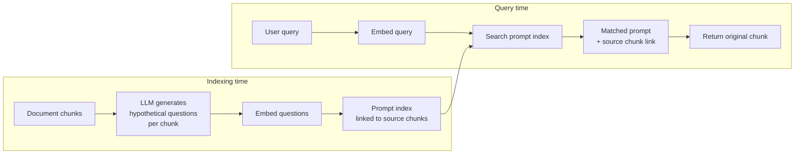

# HyPE: Hypothetical Prompt Embeddings

## The Simple Idea (Feynman Explanation)

HyDE generates a hypothetical *answer* at query time to improve retrieval. HyPE flips this: it generates hypothetical *questions* at indexing time for each document chunk.

The insight is that a user's question matches another question much better than it matches an answer. "How do brain cells send messages?" is semantically closer to "How do neurons communicate?" than it is to "Neurons transmit signals via electrochemical impulses across synapses."

So instead of indexing the answer text, HyPE indexes the questions that the answer could answer. At query time, the user's question is matched against these indexed questions, and the original chunk is returned.

```
Indexing time (HyPE):
  Chunk: "Neurons transmit signals via electrochemical impulses across synapses."
  Generate questions:
    - "How do neurons communicate?"
    - "What is a synapse?"
    - "How are nerve signals transmitted?"
  Index these questions, link back to original chunk.

Query time:
  User: "How do brain cells send messages?"
  → matches "How do neurons communicate?" [score=0.923]
  → return original chunk about neurons
```



---

## Algorithm

### Indexing time — generate and index hypothetical prompts

```python
# For each chunk, generate questions it could answer (LLM in production)
hypothetical_prompts = {
    chunk_idx: ["Question 1?", "Question 2?", "Question 3?"]
}

# Embed all prompts, store link back to source chunk
prompt_embs = model.encode(all_prompts).astype("float32")
prompt_index.add(prompt_embs)
prompt_to_chunk = [chunk_idx for each prompt]
```

### Query time — match against prompt index, return source chunk

```python
q_emb = model.encode([query]).astype("float32")
scores, prompt_idx = prompt_index.search(q_emb, 1)
source_chunk = chunks[prompt_to_chunk[prompt_idx[0][0]]]
```

---

## Worked Example

**Query:** `"What happens during photosynthesis?"`

| Method | Score | Matched |
|---|---|---|
| Standard (chunk index) | 0.755 | `"Photosynthesis converts sunlight, CO2, and water into glucose..."` |
| HyPE (prompt index) | 0.740 | matched prompt: `"What is the equation for photosynthesis?"` → same chunk |

**Query:** `"How do brain cells send messages?"`

| Method | Score | Matched |
|---|---|---|
| Standard (chunk index) | 0.534 | `"Neurons transmit signals via electrochemical impulses..."` |
| HyPE (prompt index) | 0.923 | matched prompt: `"How do neurons communicate?"` → same chunk |

HyPE scores are dramatically higher for the neurons query (0.923 vs 0.534) because the user's question matches a generated question much better than it matches the answer text.

---

## Mermaid Diagram



---

## HyDE vs HyPE

| | HyDE | HyPE |
|---|---|---|
| When | Query time | Indexing time |
| What is generated | Hypothetical answer | Hypothetical questions |
| LLM cost | Per query | Per chunk (once) |
| Query latency | Higher (LLM call) | Lower (no LLM at query time) |
| Best for | Rare queries, cold start | Predictable query patterns |

---

## Key Findings

- **Question-to-question matching is stronger than question-to-answer.** The neurons example shows 0.923 vs 0.534 — a 73% improvement.
- **Indexing cost is the trade-off.** Generating questions for 10,000 chunks requires 10,000 LLM calls at indexing time. This is a one-time cost, but significant.
- **Works best when user queries are predictable.** If you can anticipate the questions users will ask, HyPE pre-generates the best matches.
- **Multiple questions per chunk improve coverage.** 3–5 questions per chunk covers different phrasings of the same information.

---

## Pros, Cons & When to Use

| | |
|---|---|
| ✅ **Higher retrieval scores** | Question-to-question matching outperforms question-to-answer. |
| ✅ **No query-time LLM cost** | All generation happens at indexing time. |
| ❌ **High indexing cost** | One LLM call per chunk to generate questions. |
| ❌ **Static questions** | Generated questions may not cover all real user query patterns. |

**Suitable for:** Knowledge bases with predictable query patterns — FAQs, product documentation, support systems.

**Not suitable for:** Corpora with unpredictable or highly varied queries where pre-generated questions won't match well.
