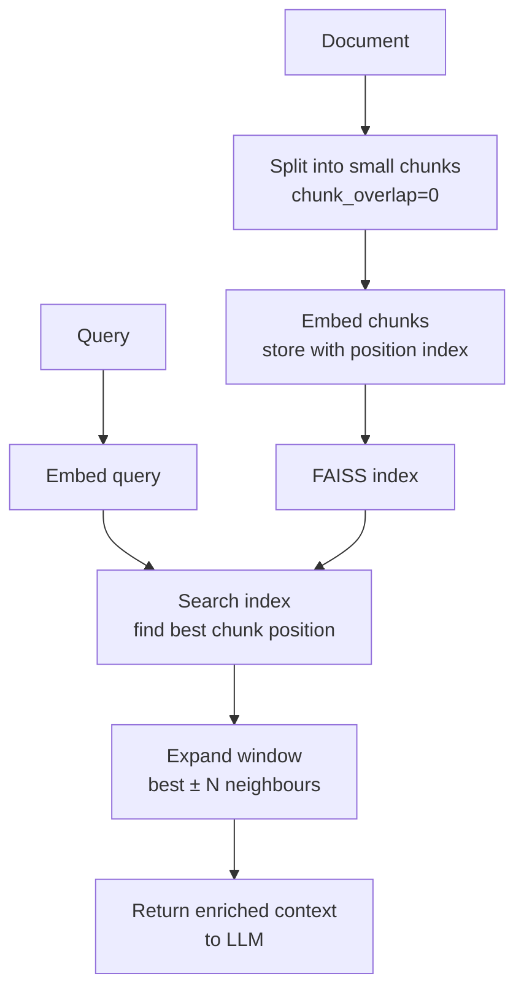

# Context Enrichment Window

## The Simple Idea (Feynman Explanation)

Small chunks are precise for retrieval — the right sentence is found. But a single sentence often lacks the context needed to answer well. The sentence before it sets up the topic; the sentence after it provides the follow-up detail.

Context enrichment window solves this by searching with small chunks but returning a wider window. When a chunk matches, you also return its immediate neighbours — the chunks before and after it in the original document.

Think of it like finding the right page in a book. You search the index and find "page 47". But you don't just read one sentence on page 47 — you read the paragraph around it for context.

```
Chunks (chunk_size=120):
  [4] Direct sales grew 14 percent...
  [5] Nike is committed to reducing its carbon footprint by 70% by 2025.  ← matched
  [6] The Move to Zero initiative targets zero carbon and zero waste...

Query: "What is Nike's carbon reduction commitment?"
  → chunk 5 matches (score=0.89)
  → return chunks [4, 5, 6] with window=1
```



---

## Algorithm

### Step 1 — Index small chunks with position metadata

```python
splitter = RecursiveCharacterTextSplitter(chunk_size=120, chunk_overlap=0)
chunks = splitter.split_text(document)
# chunk_overlap=0 is intentional — neighbours should not overlap
```

### Step 2 — Retrieve the best matching chunk

```python
_, top_idx = index.search(q_emb, 1)
best = top_idx[0][0]
```

### Step 3 — Expand to neighbouring chunks

```python
WINDOW = 1
start = max(0, best - WINDOW)
end = min(len(chunks), best + WINDOW + 1)
enriched = " ".join(chunks[start:end])
```

---

## Worked Example

**Query:** `"What is Nike's carbon reduction commitment?"`

**Matched chunk (index 5, 74 chars):**
```
Nike is committed to reducing its carbon footprint by 70 percent by 2025.
```

**Standard result (74 chars):**
```
Nike is committed to reducing its carbon footprint by 70 percent by 2025.
```

**Enriched result with window=1 (189 chars):**
```
Direct sales grew 14 percent, reflecting momentum in digital and owned-store channels.
Nike is committed to reducing its carbon footprint by 70 percent by 2025.
The Move to Zero initiative targets zero carbon and zero waste across operations.
```

The enriched window adds the Move to Zero initiative (chunk 6) — directly relevant follow-up information that the matched chunk alone doesn't contain.

---

## Mermaid Diagram



---

## Context Enrichment vs Parent-Child Chunking

| | Context Enrichment Window | Parent-Child Chunking |
|---|---|---|
| How | Fetch adjacent chunks by position | Index children, store parents separately |
| Setup | Simple — no extra index | Complex — two indexes + docstore |
| Flexibility | Fixed window size | Parent can be any size |
| Best for | Sequential documents | Hierarchical documents |

---

## Key Findings

- **`chunk_overlap=0` is intentional.** With overlap, neighbouring chunks already share content — the window would return redundant text. Use zero overlap so neighbours are truly adjacent.
- **Simpler than parent-child indexing.** No separate parent index or docstore needed — just fetch adjacent chunks by position at retrieval time.
- **Window=1 or window=2 is usually sufficient.** Larger windows reintroduce irrelevant content from distant parts of the document.
- **Works best on sequential documents** (reports, manuals, articles) where adjacent chunks are topically related. Less useful for documents where sections are independent.

---

## Pros, Cons & When to Use

| | |
|---|---|
| ✅ **Simple implementation** | No extra index — just fetch neighbours by position. |
| ✅ **Preserves narrative flow** | Contiguous window keeps the natural reading order. |
| ✅ **Better context than single chunk** | Adjacent sentences often contain the setup and follow-up. |
| ❌ **Fixed window size** | Cannot adapt to topic boundaries — may include irrelevant neighbours. |
| ❌ **Requires position metadata** | Chunks must store their position in the original document. |

**Suitable for:** Sequential documents — reports, manuals, articles, books — where adjacent chunks are topically related.

**Not suitable for:** Documents where sections are independent (FAQ, structured JSON) — neighbours may be completely unrelated.
