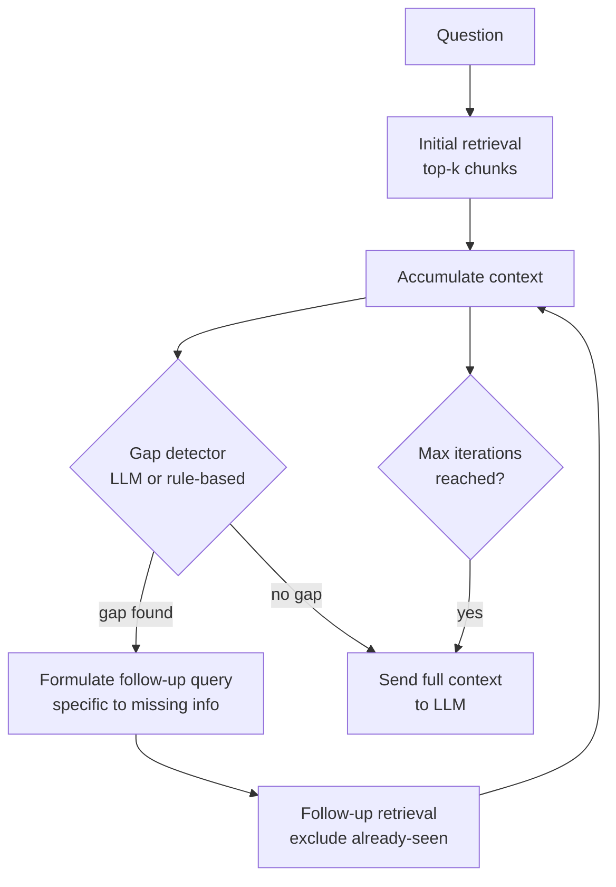

# Retrieval Feedback Loop

## The Simple Idea (Feynman Explanation)

A single retrieval pass answers simple questions well. But complex questions — "What made Marie Curie's achievements unique and how did she die?" — require information from multiple parts of the knowledge base. A single query can't surface everything at once.

A feedback loop uses the first retrieval result to decide what to retrieve next. After each pass, the system asks: "What is still missing from the context?" If there's a gap, it formulates a follow-up query and retrieves again. This continues until the context is complete or a maximum iteration limit is reached.

Think of it like a detective building a case. The first clue leads to a second clue, which leads to a third. Each discovery shapes the next question.

```
Question: "What made Marie Curie's achievements unique and how did she die?"

Iteration 1: retrieve → get prize years (1903, 1911)
  → gap detected: "unique achievement" not yet in context
  → follow-up: "Marie Curie unique achievement two sciences"

Iteration 2: retrieve → get "only person to win in two sciences"
  → gap detected: "cause of death" not yet in context
  → follow-up: "Marie Curie cause of death"

Iteration 3: retrieve → get "died from aplastic anaemia"
  → no gap detected → stop
```



---

## Algorithm

### Step 1 — Initial retrieval

```python
results = retrieve(original_question, k=2)
all_context.extend(results)
```

### Step 2 — Detect gaps in current context

```python
# Rule-based (fast):
def detect_gap(context, question):
    combined = " ".join(all_docs).lower()
    if "unique" in question and "only person" not in combined:
        return True, "Marie Curie unique achievement two sciences"
    if "die" in question and "died" not in combined:
        return True, "Marie Curie cause of death"
    return False, ""

# Production: use an LLM:
# "Given this context and question, what information is still missing?"
```

### Step 3 — Follow-up retrieval with gap-specific query

```python
for iteration in range(MAX_ITERATIONS):
    gap, follow_up = detect_gap(all_context, question)
    if not gap:
        break
    new_results = retrieve(follow_up, k=2, exclude=seen_idx)
    all_context.extend(new_results)
```

Always cap iterations (`MAX_ITERATIONS=3`) to prevent infinite loops.

---

## Worked Example

**Question:** `"What made Marie Curie's Nobel Prize achievements unique and how did she die?"`

```
Iteration 1 — query: original question
  [0.712] Marie Curie won the Nobel Prize in Physics in 1903.
  [0.689] Marie Curie won the Nobel Prize in Chemistry in 1911.
  → Gap: "unique achievement" missing → follow-up: "Marie Curie unique achievement two sciences"

Iteration 2 — query: "Marie Curie unique achievement two sciences"
  [0.823] Marie Curie is the only person to win Nobel Prizes in two different sciences.
  [0.756] Marie Curie was the first woman to win a Nobel Prize.
  → Gap: "cause of death" missing → follow-up: "Marie Curie cause of death"

Iteration 3 — query: "Marie Curie cause of death"
  [0.891] Marie Curie died in 1934 from aplastic anaemia caused by radiation exposure.
  [0.634] Marie Curie was born in Warsaw, Poland in 1867.
  → No gap → stop

Final context: 6 documents covering all aspects of the question.
```

A single retrieval pass would return only 2 documents — not enough to answer the full question.

---

## Mermaid Diagram



---

## Key Findings

- **Single-pass retrieval fails on multi-hop questions.** Questions requiring information from multiple parts of the knowledge base need multiple retrieval passes.
- **The gap detector is the critical component.** Rule-based detectors (as in the code) are brittle. In production, use an LLM: "Given this context and question, what information is still missing?"
- **Always cap iterations.** Without `MAX_ITERATIONS`, a bad gap detector can loop forever. 3 iterations is usually sufficient.
- **Each follow-up query must be specific.** "Tell me more about Marie Curie" is too vague. "Marie Curie cause of death" is specific and retrieves the right document.
- **Exclude already-seen documents.** Without deduplication, the same documents are retrieved repeatedly.

---

## Pros, Cons & When to Use

| | |
|---|---|
| ✅ **Handles multi-hop questions** | Surfaces information from multiple parts of the knowledge base. |
| ✅ **Adaptive** | Each iteration is guided by what's actually missing, not a fixed query plan. |
| ❌ **Multiple retrieval calls** | Each iteration adds latency. 3 iterations = 3× retrieval time. |
| ❌ **Gap detector complexity** | Rule-based is brittle; LLM-based adds cost. |
| ❌ **Risk of infinite loops** | Must cap iterations explicitly. |

**Suitable for:** Complex multi-part questions, research assistants, questions that require combining information from multiple sources.

**Not suitable for:** Simple factual lookups where a single retrieval pass is sufficient. The overhead is not justified.
