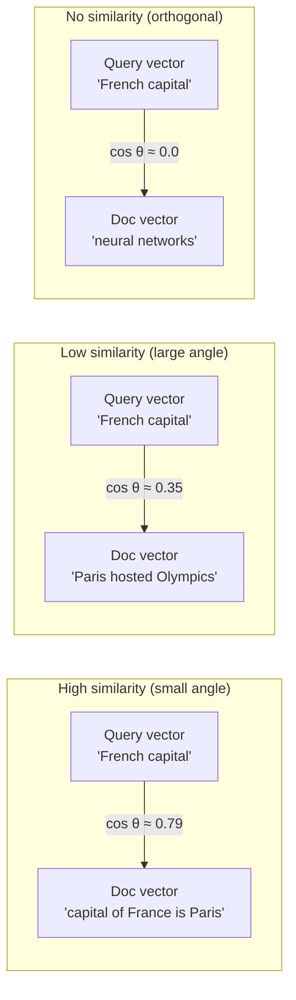
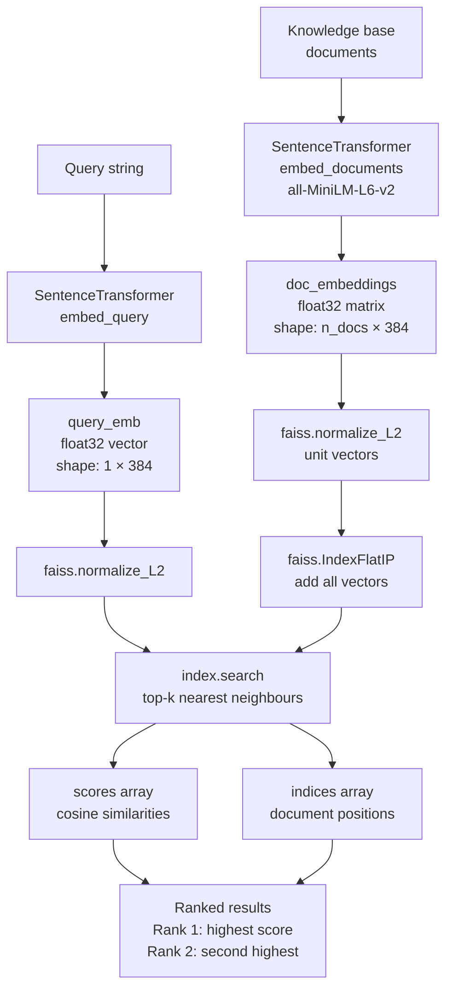
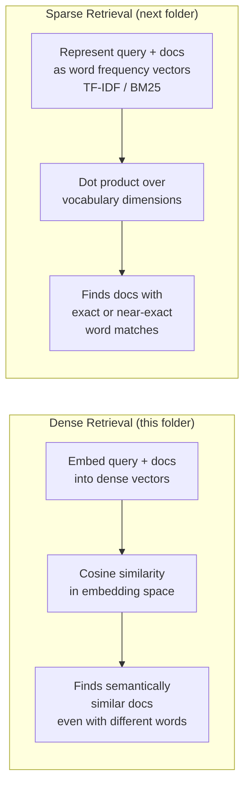

# Dense Retrieval

## The Simple Idea (Feynman Explanation)

Imagine you have a library of documents and a question. A keyword search would look for documents that contain the exact words in your question. But what if the document says "French capital" and your question asks about "Paris"? Keyword search fails — the words don't match.

Dense retrieval solves this by converting both the question and every document into a **vector** — a list of numbers that captures *meaning*, not just words. Documents about similar topics end up as vectors pointing in similar directions in a high-dimensional space. Finding the most relevant document becomes a geometry problem: find the vector closest to the query vector.

Think of it like a map where every document is a pin. Similar topics cluster together. When you ask a question, you drop your own pin and find the nearest neighbours — regardless of whether they share any words with your question.

```
Query:    "Which city is the French capital?"
          ↓ embed
          [0.12, -0.45, 0.33, ...]   ← 384-dimensional vector

Document: "The capital of France is Paris, a city on the Seine river."
          ↓ embed
          [0.11, -0.43, 0.31, ...]   ← similar direction → high similarity

Document: "Neural networks are inspired by the human brain."
          ↓ embed
          [-0.31, 0.56, -0.12, ...]  ← different direction → low similarity
```

---

## How It Works

### Step 1 — Embed the knowledge base

Every document is passed through a sentence embedding model. The model outputs a fixed-size dense vector (384 dimensions for `all-MiniLM-L6-v2`) that encodes the semantic meaning of the text.

```python
model = SentenceTransformer("all-MiniLM-L6-v2")
doc_embeddings = model.encode(documents).astype("float32")
```

### Step 2 — Normalize and index with FAISS

Vectors are L2-normalized so that inner product equals cosine similarity. FAISS (`IndexFlatIP`) stores all vectors and enables exact nearest-neighbour search.

```python
faiss.normalize_L2(doc_embeddings)
index = faiss.IndexFlatIP(dim)   # Inner Product = cosine similarity after L2 norm
index.add(doc_embeddings)
```

### Step 3 — Embed the query and search

The query is embedded with the same model, normalized, and searched against the index. FAISS returns the top-k most similar document indices and their scores.

```python
query_emb = model.encode([query]).astype("float32")
faiss.normalize_L2(query_emb)
scores, indices = index.search(query_emb, k=2)
```

### Step 4 — Return ranked results

Documents are ranked by cosine similarity score (1.0 = identical direction, 0.0 = orthogonal, -1.0 = opposite).

---

## Cosine Similarity Explained

After L2 normalization, the inner product between two vectors equals their cosine similarity:

```
cosine_similarity(A, B) = (A · B) / (|A| × |B|)

After normalization: |A| = |B| = 1
→ cosine_similarity(A, B) = A · B   (just the dot product)
```

Cosine similarity measures the **angle** between two vectors, not their magnitude. Two documents can use completely different words but still have a high cosine similarity if they encode the same meaning.



---

## Full Pipeline



---

## Worked Example

**Knowledge base:**
```
Doc 0: "Python is a high-level programming language known for readability."
Doc 1: "Neural networks are inspired by the human brain structure."
Doc 2: "The capital of France is Paris, a city on the Seine river."
Doc 3: "Machine learning enables systems to learn patterns from data."
Doc 4: "Paris hosted the 1900 and 1924 Olympic Games."
```

**Query:** `"Which city is the French capital?"`

**Embedding space (conceptual):**
```
Doc 2 ──── Doc 4          ← both about Paris/France, cluster together
    \
     \  ← query lands here, closest to Doc 2
      Query

Doc 0 ── Doc 3 ── Doc 1   ← programming/ML cluster, far from query
```

**Output:**
```
Query: 'Which city is the French capital?'

Rank 1 [score=0.789]: The capital of France is Paris, a city on the Seine river.
Rank 2 [score=0.346]: Paris hosted the 1900 and 1924 Olympic Games.
```

Rank 1 shares no exact words with the query ("French capital" vs "capital of France") but the embedding model understands they mean the same thing. Rank 2 is retrieved because it also mentions Paris, even though it's about the Olympics — a weaker but non-zero semantic connection.

---

## FAISS Index Types

This implementation uses `IndexFlatIP` — exact brute-force search. For production with large corpora, approximate nearest-neighbour (ANN) indexes trade a small accuracy loss for massive speed gains:

| Index | Search type | Speed | Accuracy | Use case |
|---|---|---|---|---|
| `IndexFlatIP` | Exact | Slow (O(n)) | 100% | Small corpora, prototyping |
| `IndexIVFFlat` | Approximate (inverted file) | Fast | ~99% | Medium corpora (100k–10M) |
| `IndexHNSWFlat` | Approximate (graph) | Very fast | ~99% | Low-latency production |
| `IndexIVFPQ` | Approximate + compressed | Fastest | ~95% | Billion-scale, memory-constrained |

---

## Dense vs Sparse Retrieval



| Property | Dense | Sparse |
|---|---|---|
| Handles synonyms | ✅ Yes | ❌ No |
| Handles exact terms | Partially | ✅ Yes |
| Requires embedding model | ✅ Yes | ❌ No |
| Index size | Compact (fixed dim) | Large (vocabulary size) |
| Best for | Semantic Q&A | Keyword / technical search |

---

## Key Findings

- **Semantic matching works without shared words**: the query "French capital" retrieves "capital of France is Paris" with score 0.789 — zero word overlap, high semantic overlap.
- **L2 normalization is required** before `IndexFlatIP` to make inner product equal cosine similarity. Without it, longer documents (larger magnitude vectors) would be unfairly ranked higher.
- **`all-MiniLM-L6-v2` is a strong baseline**: 384 dimensions, fast inference, good quality. For higher accuracy use `all-mpnet-base-v2` (768 dim) or `text-embedding-3-small` (OpenAI).
- **FAISS `IndexFlatIP` is exact but O(n)**: fine for hundreds or thousands of documents. Switch to `IndexIVFFlat` or `IndexHNSWFlat` for millions.
- **Score threshold matters**: Rank 2 (score=0.346) is a weak match — it mentions Paris but is about the Olympics, not the capital. In production, apply a minimum score threshold to filter low-confidence results.

---

## Pros, Cons & When to Use

| | |
|---|---|
| ✅ **Semantic understanding** | Retrieves relevant documents even when query and document share no words. |
| ✅ **Language-agnostic** | Multilingual embedding models (e.g., `paraphrase-multilingual-MiniLM-L12-v2`) work across languages. |
| ✅ **Scalable with ANN indexes** | FAISS ANN indexes handle billion-scale corpora with sub-millisecond latency. |
| ❌ **Misses exact matches** | A query for a specific product code or rare proper noun may score lower than a semantically similar but wrong document. |
| ❌ **Embedding model dependency** | Quality depends entirely on the embedding model. A weak model produces poor retrieval regardless of the index. |
| ❌ **Index must be rebuilt on updates** | Adding new documents requires re-embedding and re-indexing (or incremental index updates). |

**Suitable for:**
- General Q&A over natural language documents where queries are phrased differently from the source text.
- Multilingual retrieval where keyword matching across languages is impractical.
- Any RAG pipeline as the primary retrieval mechanism.

**Not suitable for:**
- Retrieval of exact identifiers, codes, or rare technical terms — combine with sparse retrieval (hybrid search) instead.
- Real-time indexing of rapidly changing corpora where re-embedding cost is prohibitive.
