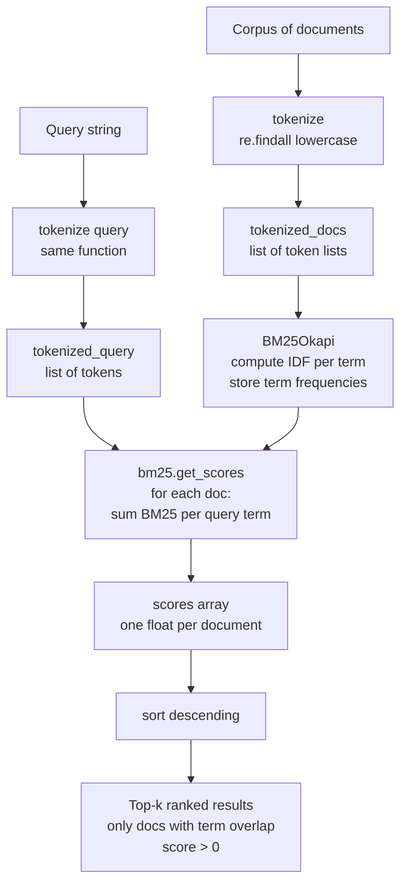
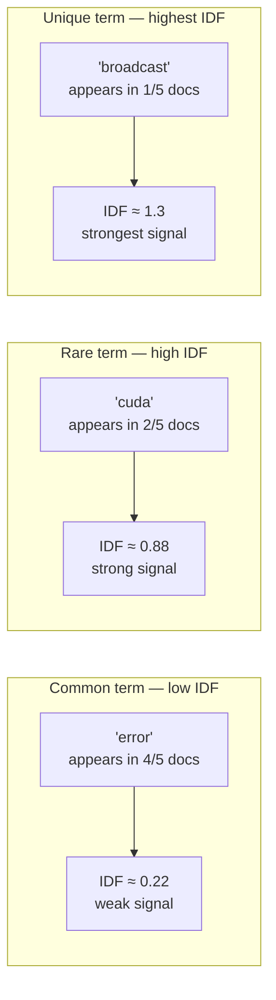

# Sparse Retrieval

## The Simple Idea (Feynman Explanation)

Dense retrieval understands *meaning* but can miss exact words. Sparse retrieval is the opposite: it is a precision word-matching machine.

Imagine a search engine for error logs. A developer types `"CUDA out of memory"`. Dense retrieval might return a document about "GPU memory management best practices" — semantically related but not the exact error. Sparse retrieval returns the document that contains the exact tokens `CUDA`, `out`, `memory` — ranked by how rare and frequent those words are across the corpus.

The name "sparse" comes from the representation: each document becomes a vector with one dimension per vocabulary word. Most dimensions are zero (the word doesn't appear). Only a handful are non-zero. A 10,000-word vocabulary produces a 10,000-dimensional vector where maybe 20 entries are non-zero — that's sparse.

```
Vocabulary:  [cuda, out, of, memory, error, python, neural, ...]
Doc 0 vector: [2,    1,  1,  1,      1,     0,      0,      ...]  ← "CUDA out of memory"
Doc 4 vector: [0,    0,  0,  1,      1,     0,      0,      ...]  ← "Memory error solutions"
Query vector: [1,    1,  1,  1,      1,     0,      0,      ...]  ← "CUDA out of memory error"
```

BM25 (Best Match 25) is the standard sparse retrieval algorithm. It improves on raw word counts by rewarding **rare words** (IDF) and **penalising very long documents** (length normalisation).

---

## BM25 Formula

BM25 scores a document `d` against a query `q` as:

```
BM25(d, q) = Σ  IDF(t) × [ f(t,d) × (k1 + 1) ]
              t              [ f(t,d) + k1 × (1 - b + b × |d|/avgdl) ]

Where:
  t       = each query term
  f(t, d) = frequency of term t in document d
  |d|     = length of document d (in tokens)
  avgdl   = average document length across the corpus
  IDF(t)  = log( (N - n(t) + 0.5) / (n(t) + 0.5) + 1 )
  N       = total number of documents
  n(t)    = number of documents containing term t
  k1      = term frequency saturation (default 1.5)
  b       = length normalisation factor (default 0.75)
```

**IDF (Inverse Document Frequency):** A term that appears in every document (like "the") gets a near-zero IDF — it carries no discriminating power. A term that appears in only one document (like "CUDA") gets a high IDF — it's a strong signal.

**TF saturation (k1):** Raw term frequency has diminishing returns. Mentioning "CUDA" 10 times is not 10× more relevant than mentioning it once. The `k1` parameter controls how quickly the score saturates.

**Length normalisation (b):** A long document naturally contains more word occurrences. The `b` parameter penalises long documents so they don't unfairly dominate.

---

## Algorithm

### Step 1 — Tokenize the corpus

```python
def tokenize(text: str) -> list[str]:
    return re.findall(r'\w+', text.lower())

tokenized_docs = [tokenize(doc) for doc in documents]
```

Each document becomes a list of lowercase tokens. Punctuation is stripped. This is the only preprocessing step — no embeddings, no model loading.

### Step 2 — Build the BM25 index

```python
bm25 = BM25Okapi(tokenized_docs)
```

`BM25Okapi` computes IDF for every term in the vocabulary and stores document term frequencies. The index is built entirely from token counts — no vectors, no GPU.

### Step 3 — Score and rank

```python
tokenized_query = tokenize(query)
scores = bm25.get_scores(tokenized_query)
ranked = sorted(zip(scores, documents), reverse=True)
```

Each document receives a BM25 score. Documents are ranked highest-to-lowest. Documents with zero query term overlap score exactly 0.0.

---

## Worked Example

**Knowledge base** (error log corpus):
```
Doc 0: "RuntimeError: CUDA out of memory. Tried to allocate 2.00 GiB"
Doc 1: "ValueError: operands could not be broadcast together with shapes (3,) (4,)"
Doc 2: "TypeError: unsupported operand type(s) for +: int and str"
Doc 3: "Fix for CUDA OOM: reduce batch size or use gradient checkpointing"
Doc 4: "Memory error solutions: torch.cuda.empty_cache() clears GPU memory"
```

**Query:** `"CUDA out of memory error fix"`
**Tokenized query:** `["cuda", "out", "of", "memory", "error", "fix"]`

**BM25 scoring trace:**

```
Term "cuda":
  Appears in Doc 0 and Doc 3 → n(t)=2, N=5
  IDF = log((5 - 2 + 0.5) / (2 + 0.5) + 1) = log(2.4) ≈ 0.875
  Doc 0 has f("cuda",d)=1 → contributes ~0.875 × TF_factor
  Doc 3 has f("cuda",d)=1 → same contribution

Term "memory":
  Appears in Doc 0, Doc 4 → n(t)=2
  IDF ≈ 0.875 (same rarity)
  Doc 0 has f("memory",d)=1
  Doc 4 has f("memory",d)=2 → higher TF, but saturated by k1

Term "fix":
  Appears only in Doc 3 → n(t)=1, N=5
  IDF = log((5 - 1 + 0.5) / (1 + 0.5) + 1) = log(3.67) ≈ 1.3
  Rare term → high IDF → boosts Doc 3

Doc 1, Doc 2: zero overlap with query → score = 0.0
```

**Output:**
```
Query: 'CUDA out of memory error fix'

Score 2.697: RuntimeError: CUDA out of memory. Tried to allocate 2.00 GiB
Score 1.933: Memory error solutions: torch.cuda.empty_cache() clears GPU memory
Score 1.311: Fix for CUDA OOM: reduce batch size or use gradient checkpointing
```

Doc 0 wins because it contains the most query terms (`cuda`, `out`, `of`, `memory`) with high IDF. Doc 3 scores third despite containing `cuda` and `fix` because `OOM` is not in the query — BM25 only rewards exact token matches.

---

## Mermaid Diagram



---

## IDF Intuition



---

## BM25 vs TF-IDF

BM25 is the modern successor to TF-IDF. The key differences:

| Property | TF-IDF | BM25 |
|---|---|---|
| Term frequency | Linear — 10 occurrences = 10× score | Saturated — 10 occurrences ≈ 2–3× score |
| Document length | No normalisation | Penalises long documents via `b` parameter |
| Tunable | No | Yes — `k1` and `b` are adjustable |
| Standard in IR | Older baseline | Current industry standard (Elasticsearch, Lucene) |

---

## Sparse vs Dense Retrieval

| Property | Sparse (BM25) | Dense (FAISS + embeddings) |
|---|---|---|
| Matches | Exact token overlap | Semantic similarity |
| Handles synonyms | ❌ "car" ≠ "automobile" | ✅ Both map to similar vectors |
| Handles exact codes | ✅ `RuntimeError`, `CUDA` | ❌ May miss rare tokens |
| Requires model | ❌ None | ✅ Embedding model |
| Index build time | Milliseconds | Seconds to minutes |
| Explainability | ✅ Score = sum of IDF × TF | ❌ Black box similarity |
| Best for | Error logs, code, IDs, technical terms | Natural language Q&A |

**Hybrid search** combines both: BM25 for exact-match recall + dense for semantic recall, then fuse the ranked lists (e.g., Reciprocal Rank Fusion). This is what Contextual RankFusion (from the chunking README) does.

---

## Key Findings

- **Exact token matching is the strength**: `"CUDA out of memory"` retrieves the exact error message with score 2.697. A dense model might retrieve a semantically related but different error.
- **Zero score for non-overlapping docs**: Doc 1 and Doc 2 score 0.0 — they share no tokens with the query. BM25 makes a hard binary decision on term presence.
- **Rare terms dominate**: `"fix"` has higher IDF than `"error"` because it appears in fewer documents. A query with rare technical terms gets very precise results.
- **Tokenization is the only preprocessing**: no model, no GPU, no embeddings. BM25 can index millions of documents in seconds.
- **`rank_bm25` uses Okapi BM25**: the standard variant with `k1=1.5`, `b=0.75` defaults. These work well for most corpora without tuning.

---

## Pros, Cons & When to Use

| | |
|---|---|
| ✅ **Exact match precision** | Retrieves documents containing the precise tokens in the query — critical for error codes, IDs, and technical terms. |
| ✅ **No model required** | Zero inference cost. Index builds in milliseconds. Runs on CPU with no dependencies beyond `rank_bm25`. |
| ✅ **Fully explainable** | Every score is a sum of IDF × TF contributions — you can trace exactly why a document ranked where it did. |
| ✅ **Handles out-of-vocabulary terms** | New technical terms, product codes, or proper nouns are indexed as-is without needing to retrain anything. |
| ❌ **No semantic understanding** | "automobile" and "car" are completely unrelated to BM25. Synonyms, paraphrases, and cross-lingual queries all fail. |
| ❌ **Vocabulary mismatch** | If the query uses different words than the document, score is 0 — even if they mean the same thing. |
| ❌ **No ranking between zero-score docs** | All documents with no term overlap are tied at 0.0 — BM25 cannot distinguish between them. |

**Suitable for:**
- Error logs, stack traces, and technical documentation where exact token matching is critical.
- Code search where function names, variable names, and error codes must match exactly.
- Legal and medical documents where precise terminology matters more than paraphrase.
- First-stage retrieval in a hybrid pipeline (BM25 for recall, dense reranker for precision).

**Not suitable for:**
- Natural language Q&A where queries are phrased differently from the source text.
- Multilingual retrieval — BM25 is language-specific and cannot match across languages.
- Conversational or exploratory search where the user doesn't know the exact terminology.
