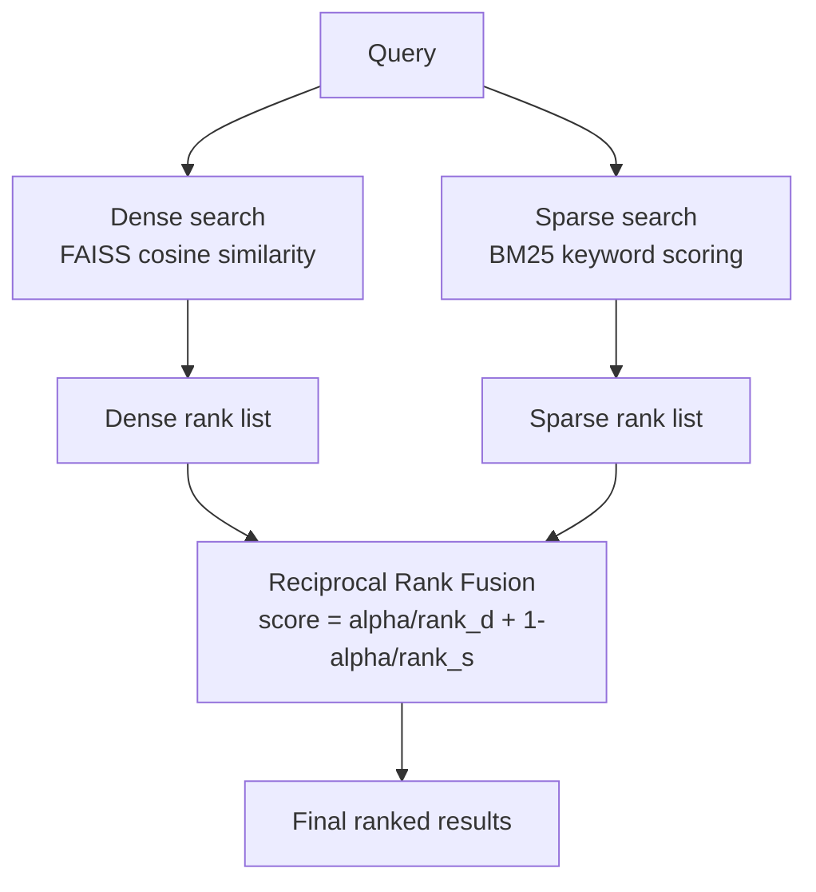

# Hybrid Retrieval

## The Simple Idea (Feynman Explanation)

Dense retrieval understands *meaning* — it finds documents about the same topic even when they use different words. Sparse retrieval (BM25) understands *exact words* — it finds documents that contain the precise tokens in your query.

Neither is perfect alone. A developer searching for `"RuntimeError: CUDA out of memory"` needs exact token matching — dense retrieval might return vaguely related GPU docs. A user asking `"Which city is the French capital?"` needs semantic matching — BM25 scores zero because "French capital" shares no words with "capital of France".

Hybrid retrieval runs both, then merges the ranked lists using **Reciprocal Rank Fusion (RRF)**. Each document gets a score based on its rank position in each list, not its raw score. This avoids the problem of dense and sparse scores being on completely different scales.

```
Query: "CUDA out of memory error fix"

Dense rank:   [CUDA error doc=1, Fix doc=3, Python doc=5, ...]
Sparse rank:  [CUDA error doc=1, Fix doc=2, Python doc=8, ...]

RRF score = alpha × 1/(dense_rank+60) + (1-alpha) × 1/(sparse_rank+60)
→ CUDA error doc wins both lists → highest combined score
```


---

## Algorithm

### Step 1 — Build both indexes

```python
# Dense: sentence embeddings + FAISS
doc_embs = model.encode(documents).astype("float32")
faiss.normalize_L2(doc_embs)
dense_index = faiss.IndexFlatIP(doc_embs.shape[1])
dense_index.add(doc_embs)

# Sparse: BM25 on tokenized documents
tokenized = [re.findall(r"\w+", d.lower()) for d in documents]
bm25 = BM25Okapi(tokenized)
```

### Step 2 — Retrieve ranked lists from both

```python
# Dense: cosine similarity scores → rank positions
dense_scores, dense_idx = dense_index.search(q_emb, len(documents))
dense_ranks = {int(idx): rank for rank, idx in enumerate(dense_idx[0])}

# Sparse: BM25 scores → rank positions
bm25_scores = bm25.get_scores(query_tokens)
sparse_ranks = {idx: rank for rank, idx in enumerate(np.argsort(bm25_scores)[::-1])}
```

### Step 3 — Reciprocal Rank Fusion

```python
for idx in range(len(documents)):
    d_rank = dense_ranks.get(idx, len(documents))
    s_rank = sparse_ranks.get(idx, len(documents))
    rrf_scores[idx] = alpha * (1/(d_rank+60)) + (1-alpha) * (1/(s_rank+60))
```

The constant `60` dampens the effect of very high ranks. `alpha` controls the balance: `1.0` = pure dense, `0.0` = pure sparse.

---

## Worked Example

**Query:** `"CUDA out of memory error fix"` (exact-term query)

| Rank | Document | RRF score |
|---|---|---|
| 1 | RuntimeError: CUDA out of memory. Tried to allocate 2.00 GiB. | 0.0167 |
| 2 | Fix for CUDA OOM: reduce batch size or use gradient checkpointing. | 0.0164 |
| 3 | ValueError: operands could not be broadcast with shapes (3,) (4,). | 0.0158 |

**Query:** `"Which city is the French capital?"` (semantic query)

| Rank | Document | RRF score |
|---|---|---|
| 1 | The capital of France is Paris, a city on the Seine river. | 0.0167 |
| 2 | Paris hosted the 1900 and 1924 Olympic Games. | 0.0163 |
| 3 | Python is a high-level programming language known for readability. | 0.0161 |

Both query types are handled correctly by the same pipeline.

---

## Mermaid Diagram



---

## Key Findings

- **RRF avoids score normalisation.** Dense scores (cosine, 0–1) and BM25 scores (unbounded) cannot be directly added. RRF uses only rank positions, making it scale-invariant.
- **The constant 60 in RRF matters.** It prevents rank-1 from dominating too heavily. Values between 10 and 100 are common; 60 is the standard default.
- **alpha tunes the balance.** For technical corpora with error codes and IDs, use `alpha=0.3` (more BM25). For natural language Q&A, use `alpha=0.7` (more dense).
- **Hybrid is the production default.** It handles paraphrases, acronyms, product codes, error messages, and names better than either method alone.

---

## Pros, Cons & When to Use

| | |
|---|---|
| ✅ **Best of both worlds** | Handles semantic queries and exact-term queries in one pipeline. |
| ✅ **No score normalisation needed** | RRF uses rank positions, not raw scores. |
| ✅ **Strong production default** | Outperforms either method alone on most real-world query distributions. |
| ❌ **Two indexes to maintain** | Requires both a vector store and a BM25 index. |
| ❌ **alpha requires tuning** | The right balance depends on the corpus and query distribution. |

**Suitable for:** Any production RAG system with mixed query types — natural language questions and exact identifier lookups.

**Not suitable for:** Pure semantic corpora where all queries are conceptual and no exact terms matter — dense alone is simpler.
