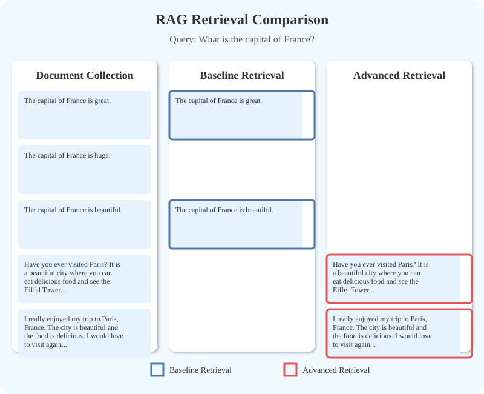
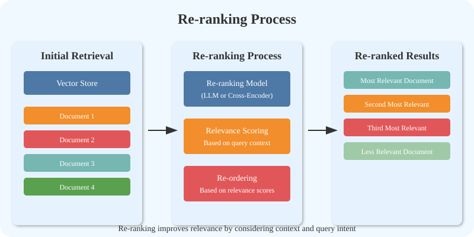
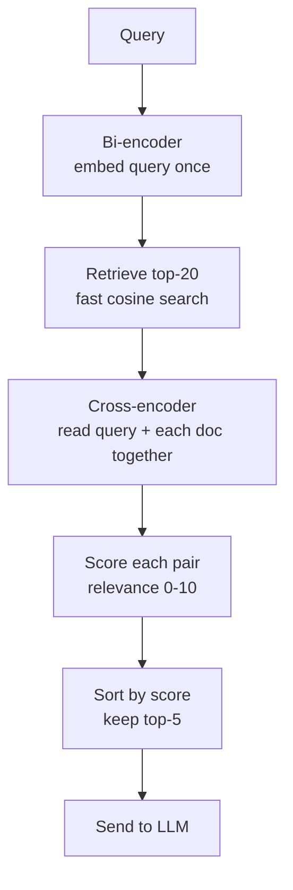

# Reranking

## The Simple Idea (Feynman Explanation)

A retriever is like a librarian who quickly scans thousands of books and hands you a stack of 20 that might be relevant. They work fast but sometimes the order is off — the third book is actually the best one.

A reranker is a second, slower expert who reads each of those 20 books carefully alongside your question and puts them in the right order. They are too slow to read all 10,000 books, but they are very good at ranking the 20 the librarian already selected.

This two-stage approach gives you the speed of a fast retriever and the precision of a careful ranker.

```
Stage 1 — Bi-encoder (fast):
  Embed query once, embed all docs once, compare with dot product.
  Returns top-20 candidates in milliseconds.

Stage 2 — Cross-encoder (slow, precise):
  Reads query + each candidate together as one input.
  Scores each pair individually. Returns top-5 in correct order.
```




---

## Algorithm

### Stage 1 — Bi-encoder retrieval

```python
bi_encoder = SentenceTransformer("all-MiniLM-L6-v2")
# Embed query and all docs independently, compare with cosine similarity
scores, candidate_idx = index.search(q_emb, k=6)   # retrieve top-6
```

### Stage 2 — Cross-encoder reranking

```python
cross_encoder = CrossEncoder("cross-encoder/ms-marco-MiniLM-L-6-v2")
pairs = [[query, doc] for doc in candidates]
ce_scores = cross_encoder.predict(pairs)   # reads query+doc together
reranked = sorted(zip(ce_scores, candidates), reverse=True)
```

The cross-encoder reads the query and document as a single concatenated input, allowing it to capture fine-grained relevance that the bi-encoder misses.

---

## Worked Example

**Query:** `"What is the capital city of France?"`

**After bi-encoder (initial order):**
```
1. The capital of France is Paris, a city on the Seine river.
2. France is a country in Western Europe with a population of 68 million.
3. Paris hosted the 1900 and 1924 Olympic Games.
4. The Eiffel Tower is located in Paris and was built in 1889.
5. Python is a high-level programming language known for readability.
6. Machine learning enables systems to learn patterns from data.
```

**After cross-encoder reranking (top-3):**
```
1 [score=9.234]: The capital of France is Paris, a city on the Seine river.
2 [score=4.112]: France is a country in Western Europe with a population of 68 million.
3 [score=2.891]: The Eiffel Tower is located in Paris and was built in 1889.
```

The bi-encoder already ranked the correct answer first here, but the cross-encoder creates a much larger score gap (9.2 vs 4.1), making the top result more confidently separated.

---

## Mermaid Diagram



---

## Reranker Types

| Type | How it scores | Speed | Quality |
|---|---|---|---|
| Cross-encoder | Reads query + doc together | Slow | Highest |
| LLM judge | Asks LLM to rate relevance | Slowest | Flexible |
| Lightweight heuristic | Metadata, recency, source | Fastest | Domain-specific |

---

## Key Findings

- **Cross-encoders are 10–50× slower than bi-encoders** but significantly more accurate. Apply only to the top-k candidates, never the full corpus.
- **Typical pipeline:** retrieve top-20 with bi-encoder, rerank to top-5 with cross-encoder, send top-5 to LLM.
- **Reranking is the single highest-leverage retrieval improvement** in most RAG systems (confirmed by the Contextual Retrieval paper — see `1_Chunking_Techniques/README.md`).
- **`ms-marco-MiniLM-L-6-v2`** is a strong, fast cross-encoder trained on MS MARCO passage ranking. For multilingual use, try `jina-reranker-v2-base-multilingual`.

---

## Pros, Cons & When to Use

| | |
|---|---|
| ✅ **Highest precision** | Cross-encoders capture fine-grained relevance that bi-encoders miss. |
| ✅ **Improves any retriever** | Works on top of dense, sparse, or hybrid retrieval. |
| ✅ **Reduces irrelevant context** | Fewer irrelevant chunks reach the LLM, reducing hallucination. |
| ❌ **Adds latency** | One cross-encoder inference per candidate. Top-20 → ~200ms extra. |
| ❌ **Not scalable to full corpus** | Must be applied after an initial fast retrieval stage. |

**Suitable for:** Any production RAG system where retrieval precision matters. Especially valuable when the bi-encoder retrieves many partially-relevant results.

**Not suitable for:** Real-time systems with strict sub-50ms latency requirements where the extra cross-encoder inference is unacceptable.
