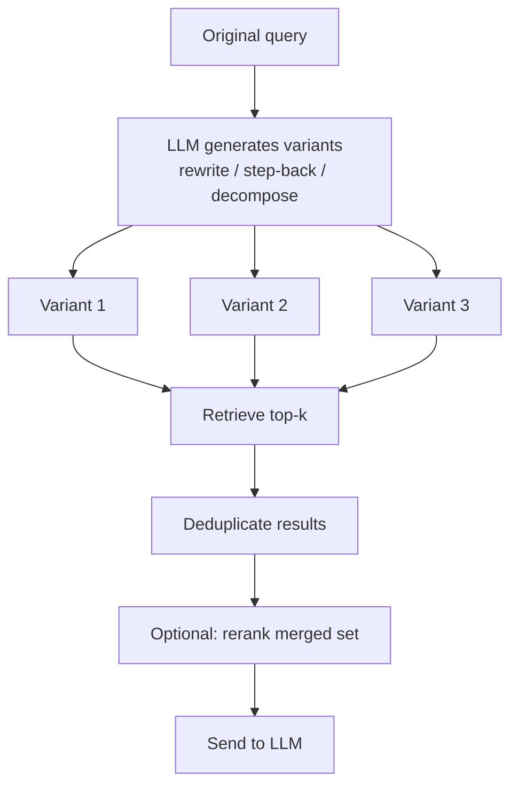

# Multi-Query Retrieval

## The Simple Idea (Feynman Explanation)

A user types one question, but the answer might be phrased completely differently in the documents. Multi-query retrieval solves this by rewriting the question into several versions before searching.

Think of it like searching a library. If you only ask "Python programming language", you might miss the book about "Guido van Rossum's creation" or the one about "CPython limitations". If you ask all three versions, you find everything relevant.

```
Original: "Tell me about Python programming language"
         ↓ generate variants
Variant 1: "Tell me about Python programming language"   (original)
Variant 2: "Who created Python and when was it released?" (history)
Variant 3: "What is Python used for?"                    (use cases)
Variant 4: "What are the limitations of Python?"         (weaknesses)
         ↓ retrieve for each, deduplicate
7 unique documents covering all aspects
```

---

## Algorithm

### Step 1 — Generate query variants

In production, use an LLM with a prompt like:
```
Generate 3 different versions of this query for document retrieval.
Include: a rewrite, a step-back (broader), and a decomposition (narrower).
Query: {original_query}
```

### Step 2 — Retrieve for each variant

```python
for variant in query_variants:
    results = retrieve(variant, k=2)
    # collect all results
```

### Step 3 — Deduplicate and merge

```python
seen = set()
merged = []
for variant in query_variants:
    for idx in retrieve(variant, k=2):
        if idx not in seen:
            seen.add(idx)
            merged.append(idx)
```

Deduplication is essential — without it, the same document appears multiple times and wastes LLM context tokens.

---

## Worked Example

**Original query:** `"Tell me about Python programming language"`

**Single-query retrieval (k=2):**
```
1. Python supports object-oriented, functional, and procedural programming.
2. Python is widely used in data science, web development, and automation.
```

**Multi-query retrieval (4 variants, deduplicated):**
```
1. Python supports object-oriented, functional, and procedural programming.
2. Python is widely used in data science, web development, and automation.
3. Python was created by Guido van Rossum and first released in 1991.
4. Python uses indentation to define code blocks instead of braces.
5. Python's package manager pip installs libraries from PyPI.
6. The GIL (Global Interpreter Lock) limits true multi-threading in CPython.
7. Python 3.12 introduced improved error messages and faster startup times.
```

The "limitations" variant specifically surfaces the GIL document — which the original broad query would never retrieve.

---

## Mermaid Diagram



---

## Query Variant Types

| Variant | Purpose | Example |
|---|---|---|
| Rewrite | Clarify vague wording | "Python lang" → "Python programming language features" |
| Step-back | Retrieve broader context | "Python GIL" → "Python concurrency model" |
| Decompose | Split complex question | "Python history and uses" → ["Who created Python?", "What is Python used for?"] |
| Narrow | Retrieve specific evidence | "Python" → "Python 3.12 new features" |

---

## Key Findings

- **Recall improvement is the main benefit.** Single-query retrieval misses documents that use different vocabulary. Multiple variants cover more of the semantic space.
- **Deduplication is mandatory.** Without it, the same document appears multiple times and the LLM receives redundant context.
- **Reranking after merging improves precision.** The merged set may contain weakly relevant documents from some variants. A reranker (see `4_reranking`) can re-order the merged set.
- **LLM variant generation adds latency.** One LLM call per query to generate variants. Cache variants for repeated queries.

---

## Pros, Cons & When to Use

| | |
|---|---|
| ✅ **Higher recall** | Finds documents that single-query retrieval misses due to vocabulary mismatch. |
| ✅ **Handles vague queries** | Decomposition and step-back variants surface context the user didn't know to ask for. |
| ❌ **LLM call overhead** | Generating variants requires one LLM call per query. |
| ❌ **Can add noise** | Weak variants retrieve irrelevant documents. Reranking mitigates this. |

**Suitable for:** Broad or exploratory queries where the user wants comprehensive coverage. Research assistants, knowledge base Q&A.

**Not suitable for:** Precise factual lookups where a single well-formed query is sufficient and latency is critical.
