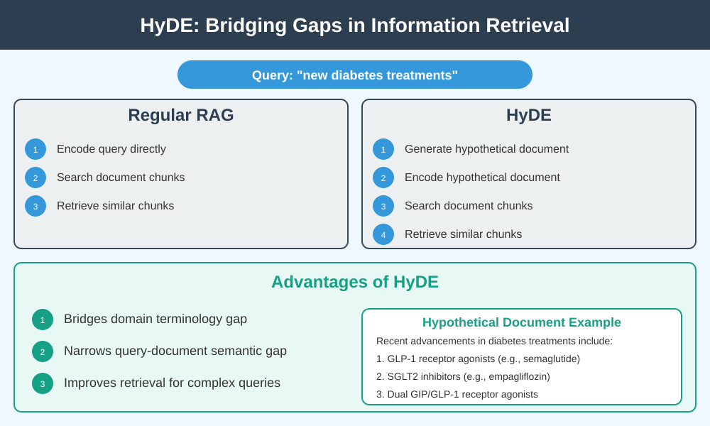
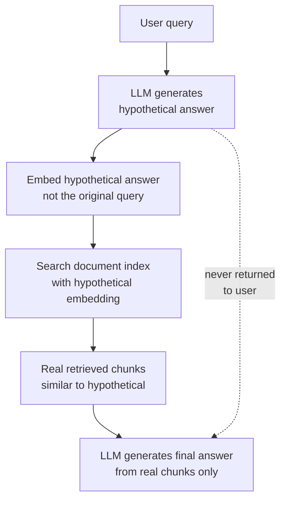

# HyDE: Hypothetical Document Embeddings

## The Simple Idea (Feynman Explanation)

A short user query like "How do plants make food?" uses everyday language. But the documents in your knowledge base use scientific vocabulary: "photosynthesis", "chlorophyll", "thylakoid", "Calvin cycle". The embedding of the short query points in a different direction than the embeddings of the scientific documents — even though they're about the same thing.

HyDE bridges this gap. Instead of embedding the short query, it asks an LLM to write a hypothetical answer — a fake document that *would* answer the question. That fake document uses the same vocabulary as the real documents. Its embedding points in the right direction.

```
Short query:          "How do plants make food?"
                       ↓ embed directly
Query vector:          [0.12, -0.31, ...]   ← points toward "food", "plants"

Hypothetical answer:  "Plants make food through photosynthesis. They use
                       chlorophyll to absorb sunlight, CO2, and water..."
                       ↓ embed
Hypothetical vector:   [0.71, -0.82, ...]   ← points toward "photosynthesis",
                                               "chlorophyll" — same as real docs
```




---

## Algorithm

### Step 1 — Generate a hypothetical answer

```python
# In production, call an LLM:
hypothetical_answer = llm.generate(
    f"Write a detailed answer to: {query}"
)
```

### Step 2 — Embed the hypothetical answer (not the query)

```python
h_emb = model.encode([hypothetical_answer]).astype("float32")
faiss.normalize_L2(h_emb)
```

### Step 3 — Search the document index with the hypothetical embedding

```python
scores, idx = index.search(h_emb, k)
# Returns real documents similar to the hypothetical answer
```

The retrieved documents are real — the hypothetical answer is only used as a search probe, never returned to the user.

---

## Worked Example

**Query:** `"How do plants make food?"`

**Standard retrieval (embed query directly):**
```
[score=0.312] Photosynthesis is the process by which plants convert sunlight into glucose...
[score=0.289] Chlorophyll is the green pigment in plants that absorbs light energy...
[score=0.241] Cellular respiration breaks down glucose to release ATP energy...  ← WRONG
```

**HyDE retrieval (embed hypothetical answer):**
```
[score=0.812] Photosynthesis is the process by which plants convert sunlight into glucose...
[score=0.756] Chlorophyll is the green pigment in plants that absorbs light energy...
[score=0.701] The light-dependent reactions of photosynthesis occur in the thylakoid membranes.
```

HyDE scores are dramatically higher (0.81 vs 0.31) and rank-3 changes from "cellular respiration" (wrong topic) to "light-dependent reactions" (correct topic).

---

## Mermaid Diagram



---

## Key Findings

- **Score improvement is dramatic** when the query uses different vocabulary than the documents. In the example, scores jump from 0.31 to 0.81.
- **Rank-3 changes** from an incorrect topic (cellular respiration) to a correct one (light-dependent reactions) — showing that HyDE improves not just scores but actual retrieval quality.
- **The hypothetical answer is a search probe only.** The final answer must be grounded in the real retrieved documents, not in the generated hypothesis.
- **Hallucination risk:** if the LLM generates a wrong hypothetical answer, retrieval drifts toward incorrect documents. Always follow with faithfulness checks.
- **Works best** when the query vocabulary is far from the document vocabulary — scientific, legal, or technical domains.

---

## Pros, Cons & When to Use

| | |
|---|---|
| ✅ **Bridges vocabulary gap** | Dramatically improves retrieval when query and document use different words. |
| ✅ **No index changes needed** | Works on top of any existing vector index. |
| ❌ **LLM call per query** | Adds latency and cost at query time. |
| ❌ **Hallucination drift** | A wrong hypothetical answer retrieves wrong documents. |

**Suitable for:** Scientific, medical, legal, or technical Q&A where user queries use plain language but documents use domain vocabulary.

**Not suitable for:** Exact-term queries (error codes, IDs) where the query vocabulary already matches the documents. Use sparse or hybrid retrieval instead.
