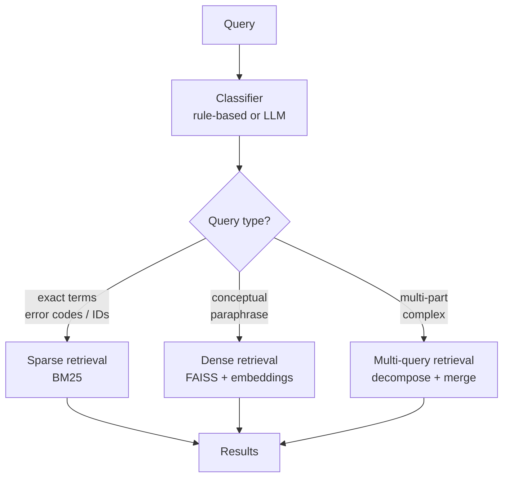

# Adaptive Retrieval

## The Simple Idea (Feynman Explanation)

Not every question deserves the same retrieval pipeline. A developer searching for `"RuntimeError: CUDA out of memory"` needs exact token matching — BM25. A user asking `"How does machine learning work?"` needs semantic understanding — dense retrieval. Routing both through the same pipeline wastes resources and hurts quality.

Adaptive retrieval classifies the query first, then picks the right retrieval strategy. Think of it like a hospital triage system: a broken arm goes to orthopaedics, a fever goes to general medicine. The triage nurse doesn't send everyone to the same specialist.

```
Query: "CUDA out of memory RuntimeError fix"
  → classifier detects error token → route to BM25
  → BM25 finds exact error message → score=6.4

Query: "How does machine learning work?"
  → classifier detects conceptual question → route to dense
  → dense finds semantically similar docs → score=0.71
```


---

## Algorithm

### Step 1 — Classify the query

```python
# Rule-based (fast, no LLM needed):
EXACT_SIGNALS = {"error", "exception", "runtimeerror", "valueerror", "cuda", "oom", ...}

def classify_query(query: str) -> str:
    tokens = set(re.findall(r"\w+", query.lower()))
    if tokens & EXACT_SIGNALS:
        return "exact"    # → BM25
    return "semantic"     # → dense
```

In production, replace with an LLM classifier for more nuanced routing:
```
Classify this query: Factual | Analytical | Exact | Contextual
Query: {query}
```

### Step 2 — Route to the appropriate retriever

```python
if qtype == "exact":
    scores = bm25.get_scores(query_tokens)
    top_idx = np.argsort(scores)[::-1][:k]
else:
    scores, idx = dense_index.search(q_emb, k)
```

---

## Worked Example

| Query | Classified as | Retriever | Top result |
|---|---|---|---|
| `"CUDA out of memory RuntimeError fix"` | exact | BM25 | RuntimeError: CUDA out of memory... [score=6.4] |
| `"Which city is the French capital?"` | semantic | Dense | The capital of France is Paris... [score=0.79] |
| `"ValueError broadcast shapes"` | exact | BM25 | ValueError: operands could not be broadcast... [score=2.9] |
| `"How does machine learning work?"` | semantic | Dense | Machine learning enables systems to learn... [score=0.71] |

---

## Mermaid Diagram



---

## Routing Signals

| Signal | Likely route |
|---|---|
| Error code, exception name, SKU, ID | Sparse / BM25 |
| Paraphrased conceptual question | Dense |
| Multi-part question with "and" / "also" | Multi-query decomposition |
| Ambiguous or vague query | Multi-query with step-back |

---

## Key Findings

- **The classifier is the weakest link.** A wrong route hides good documents. Evaluate the classifier separately from the retriever.
- **Rule-based classifiers are fast but brittle.** They fail on edge cases. LLM classifiers are more robust but add latency.
- **Adaptive retrieval prevents overusing expensive pipelines.** Not every query needs multi-query decomposition or HyDE — routing avoids unnecessary LLM calls.
- **BM25 scores are unbounded** (6.4 in the example) while dense scores are cosine similarities (0–1). Never compare scores across routes.

---

## Pros, Cons & When to Use

| | |
|---|---|
| ✅ **Right tool for each query** | Exact queries get BM25, semantic queries get dense — both get better results. |
| ✅ **Cost-efficient** | Avoids expensive pipelines (HyDE, multi-query) for simple queries. |
| ❌ **Classifier adds complexity** | One more component to build, test, and maintain. |
| ❌ **Wrong route is silent** | A misclassified query gets bad results with no error message. |

**Suitable for:** Production systems with mixed query types — technical support (exact errors) + general Q&A (semantic).

**Not suitable for:** Simple corpora where all queries are the same type — just use dense or BM25 directly.
