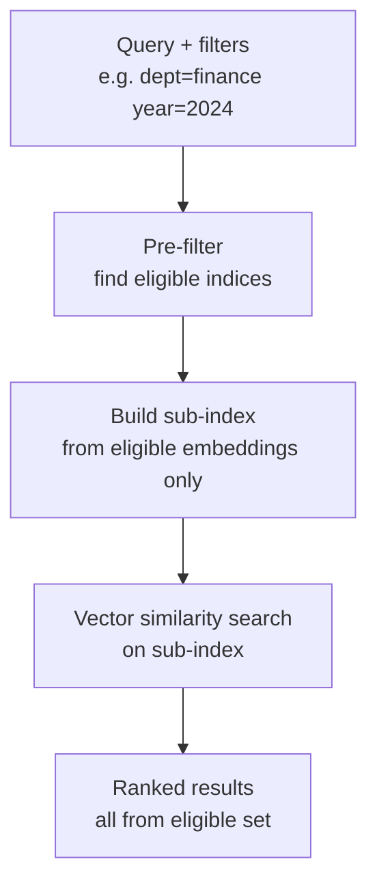

# Metadata Filtering

## The Simple Idea (Feynman Explanation)

Imagine searching a company's document archive for "revenue targets". Without filtering, you get results from every department, every year, and every product line — most of which are irrelevant. With metadata filtering, you say "only search Finance documents from 2024" and the search space shrinks from 10,000 documents to 50.

Metadata filtering uses structured fields attached to each chunk — department, year, source, author, product, tenant — to restrict the search space before or after vector similarity search. It is the difference between searching a library and searching the right shelf in the right room.

```
Without filter:
  Query: "revenue targets"
  Searches: all 8 documents → returns finance + HR + Python docs

With filter (dept=finance, year=2024):
  Query: "revenue targets"
  Searches: only 2 documents → returns only 2024 finance docs
```

---

## Algorithm

### Step 1 — Store metadata alongside embeddings

```python
corpus = [
    {"text": "Q3 revenue grew 12%...", "dept": "finance", "year": 2024},
    {"text": "Remote work policy...", "dept": "hr",      "year": 2023},
    ...
]
```

### Step 2 — Pre-filter: find eligible indices before vector search

```python
eligible = [
    i for i, d in enumerate(corpus)
    if (dept is None or d["dept"] == dept)
    and (year is None or d["year"] == year)
]
```

### Step 3 — Search only the eligible subset

```python
sub_embs = embs[eligible]
sub_index = faiss.IndexFlatIP(sub_embs.shape[1])
sub_index.add(sub_embs)
scores, sub_idx = sub_index.search(q_emb, k)
# Map sub_idx back to original corpus indices via eligible[]
```

---

## Worked Example

**Query:** `"revenue and profit"` with `dept=finance, year=2024`

```
Eligible documents (2 of 8):
  - Q3 revenue grew 12% driven by cloud services.
  - Capital expenditure for 2024 is budgeted at $4.2 billion.

Results:
  [score=0.377] Q3 revenue grew 12% driven by cloud services.
  [score=0.204] Capital expenditure for 2024 is budgeted at $4.2 billion.
```

**Query:** `"employee policies"` with `dept=hr` (any year)

```
Eligible documents (4 of 8):
  - The new hire onboarding process takes three weeks.
  - Remote work policy allows flexible hours with core hours 10–3.
  - Annual bonus targets are tied to individual and team OKRs.
  - Employee satisfaction survey results show 78% engagement.

Results:
  [score=0.689] Remote work policy allows flexible hours...
  [score=0.612] Annual bonus targets are tied to individual and team OKRs.
  [score=0.534] The new hire onboarding process takes three weeks.
```

---

## Mermaid Diagram



---

## Filter Timing

| Timing | Meaning | Use case |
|---|---|---|
| Pre-filter | Remove ineligible docs before vector search | Hard constraints: tenant, date range, source |
| Post-filter | Search all, then remove mismatches | Soft constraints or stores with weak filter support |
| Hybrid | Hard pre-filter + soft post-filter | Production systems with multiple business rules |

---

## Key Findings

- **Pre-filtering improves both precision and safety.** Ineligible documents are never scored — no risk of cross-tenant data leakage.
- **Metadata is not decoration — it is retrieval control.** Store every useful attribute: source, date, author, department, product, tenant, language.
- **Bad metadata creates silent failures.** If a document has the wrong `dept` tag, it will never be retrieved for that department's queries — with no error.
- **Combine with semantic search, not replace it.** Metadata narrows the candidate set; embeddings rank within it.

---

## Pros, Cons & When to Use

| | |
|---|---|
| ✅ **Precision and safety** | Ineligible documents are never scored — prevents cross-tenant leakage. |
| ✅ **Faster search** | Smaller candidate set means faster vector search. |
| ✅ **Mandatory constraints** | Some filters (tenant isolation, date range) must be hard constraints, not soft preferences. |
| ❌ **Requires metadata at indexing time** | Documents without metadata cannot be filtered. |
| ❌ **Over-filtering** | Too strict a filter can exclude relevant documents. |

**Suitable for:** Multi-tenant systems, date-restricted search, department-scoped knowledge bases, product-specific documentation.

**Not suitable for:** Corpora where all documents are equally accessible and no access control or scoping is needed.
