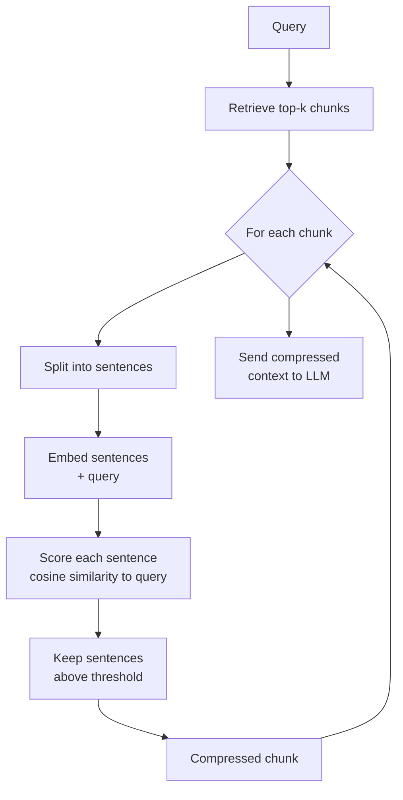

# Contextual Compression

## The Simple Idea (Feynman Explanation)

A retriever returns chunks. But a chunk is often a paragraph or more — and only two sentences in that paragraph actually answer the question. The rest is noise that fills the LLM's context window and can distract it.

Contextual compression keeps only the useful part. After retrieval, a compressor reads each chunk and extracts (or rewrites) only the sentences relevant to the query. The LLM receives a shorter, more focused context.

Think of it like a research assistant who highlights the relevant sentences in a long article before handing it to you. You still read the original source — just the important parts.

```
Retrieved chunk (359 chars):
  "Climate change poses significant risks to global supply chains.
   Nike is committed to reducing its carbon footprint by 70% by 2025.
   The company uses recycled materials in over 75% of its products.
   Nike's Move to Zero initiative targets zero carbon and zero waste.
   Renewable energy powers 96% of Nike-owned facilities."

Query: "What is Nike's carbon reduction target?"

Compressed (189 chars):
  "Nike is committed to reducing its carbon footprint by 70% by 2025.
   Nike's Move to Zero initiative targets zero carbon and zero waste."
```



---

## Algorithm

### Step 1 — Retrieve chunks normally

```python
scores, idx = index.search(q_emb, k=2)
candidates = [chunks[i] for i in idx[0]]
```

### Step 2 — Compress each chunk (extractive)

Split the chunk into sentences, embed each sentence, keep only those above a similarity threshold to the query:

```python
def extract_relevant_sentences(chunk, query, threshold=0.35):
    sentences = chunk.split(". ")
    sent_embs = model.encode(sentences)
    q_emb = model.encode([query])
    scores = (sent_embs @ q_emb.T).flatten()
    kept = [s for s, score in zip(sentences, scores) if score >= threshold]
    return " ".join(kept)
```

### Step 3 — Send compressed context to LLM

The LLM receives shorter, more focused context — fewer tokens, less noise.

---

## Worked Example

**Query:** `"What is Nike's carbon reduction target?"`

**Chunk 1 — original (359 chars):**
```
Climate change poses significant risks to global supply chains. Nike is committed
to reducing its carbon footprint by 70 percent by 2025. The company uses recycled
materials in over 75 percent of its products. Nike's Move to Zero initiative targets
zero carbon and zero waste across its operations. Renewable energy powers 96 percent
of Nike-owned facilities.
```

**Chunk 1 — compressed (189 chars):**
```
Nike is committed to reducing its carbon footprint by 70 percent by 2025.
Nike's Move to Zero initiative targets zero carbon and zero waste across its operations.
```

3 irrelevant sentences removed. The LLM receives only the 2 sentences that directly answer the query.

---

## Mermaid Diagram



---

## Compression Methods

| Method | Behaviour | Auditability |
|---|---|---|
| Extractive | Keep exact sentences above threshold | ✅ Every word from original |
| Abstractive | LLM rewrites the useful content | ❌ May introduce errors |
| Filter-only | Drop entire chunks below threshold | ✅ Binary keep/drop |

---

## Key Findings

- **Extractive compression is auditable.** Every word in the output came from the original chunk — no hallucination risk from the compressor itself.
- **The threshold controls aggressiveness.** Too high → empty output (all sentences dropped). Too low → no compression. Tune per domain; 0.3–0.4 is a common starting range.
- **Compression reduces prompt cost.** Fewer tokens sent to the LLM = lower API cost and faster generation.
- **Compression should not replace retrieval evaluation.** If the retriever returns irrelevant chunks, compression cannot fix that — it can only trim relevant chunks.

---

## Pros, Cons & When to Use

| | |
|---|---|
| ✅ **Reduces noise** | Removes irrelevant sentences before they reach the LLM. |
| ✅ **Lowers token cost** | Shorter context = fewer tokens = cheaper LLM calls. |
| ✅ **Extractive is safe** | No hallucination risk from the compressor. |
| ❌ **Threshold sensitivity** | Wrong threshold drops relevant sentences or keeps irrelevant ones. |
| ❌ **Adds latency** | One extra embedding pass per retrieved chunk. |

**Suitable for:** Long documents (legal, policy, manuals) where retrieved chunks contain a mix of relevant and irrelevant content.

**Not suitable for:** Short chunks where every sentence is relevant — compression adds overhead with no benefit.
