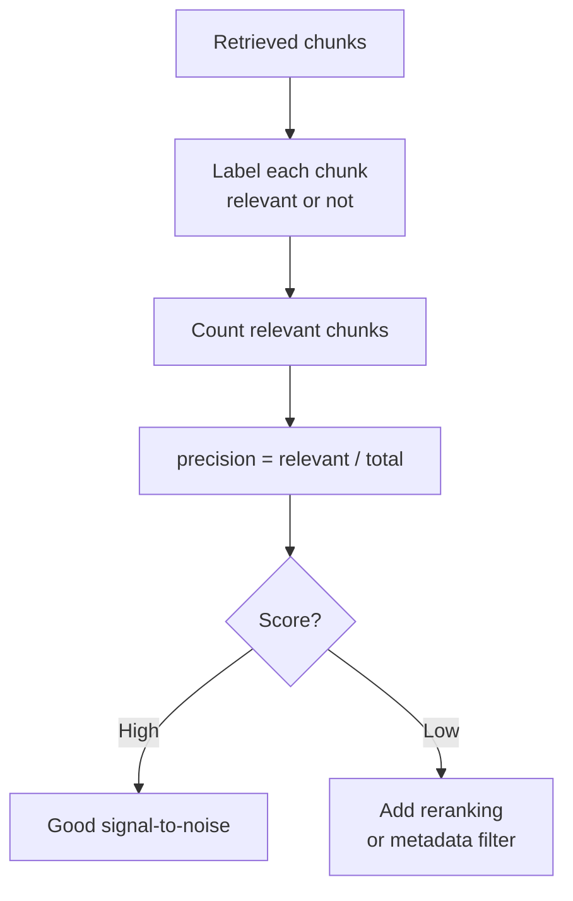

# Context Precision

## The Simple Idea (Feynman Explanation)

You ask a question and the retriever returns 5 chunks. Only 2 of them actually help answer the question. The other 3 are noise — they mention related topics but don't contain the answer.

Context precision measures the signal-to-noise ratio of the retrieved context. A precision of 0.40 means 40% of what the LLM receives is useful; 60% is distraction.

```
Retrieved: [chunk_A ✅, chunk_B ❌, chunk_C ✅, chunk_D ❌, chunk_E ❌]
Precision = 2 relevant / 5 total = 0.40
```

---

## Formula

```
context_precision = relevant_retrieved_chunks / total_retrieved_chunks
```

In practice, "relevant" means the chunk contains evidence that supports the correct answer. This requires ground truth labels.

---

## Implementation

```python
def context_precision(retrieved: list, relevant_ids: set) -> float:
    relevant_count = sum(1 for i in range(len(retrieved)) if i in relevant_ids)
    return relevant_count / len(retrieved)
```

---

## Worked Example

**Query:** `"When did Marie Curie win the Nobel Prize in Chemistry?"`

**Retrieved chunks:**
```
[0] Marie Curie won the Nobel Prize in Chemistry in 1911.  ✅ relevant
[1] Marie Curie won the Nobel Prize in Physics in 1903.    ✅ relevant
[2] Python is a high-level programming language.           ❌ irrelevant
[3] The Eiffel Tower is located in Paris.                  ❌ irrelevant
```

```
context_precision = 2 / 4 = 0.50
```

Half the context is noise. A reranker would push chunks 2 and 3 out of the top-k.

---

## Mermaid Diagram



---

## Key Findings

- **Low precision wastes LLM context tokens** on irrelevant content and can distract the model from the correct answer.
- **Reranking is the most effective fix.** A cross-encoder reranker re-orders the top-k by relevance, pushing irrelevant chunks out.
- **Metadata filtering prevents irrelevant chunks from being retrieved at all** — better than reranking them out after the fact.
- **Precision and recall trade off.** Increasing k improves recall but hurts precision. Find the right balance for your use case.

---

## Pros, Cons & When to Use

| | |
|---|---|
| ✅ **Simple to compute** | Just count relevant chunks in the retrieved set. |
| ✅ **Directly actionable** | Low precision → add reranking or filters. |
| ❌ **Requires ground truth labels** | You need to know which chunks are relevant for each query. |
| ❌ **Does not measure rank** | A relevant chunk at rank 5 counts the same as one at rank 1. |

**Suitable for:** Diagnosing noise in the retrieved context — especially when the LLM gives wrong answers despite the correct information being somewhere in the corpus.
