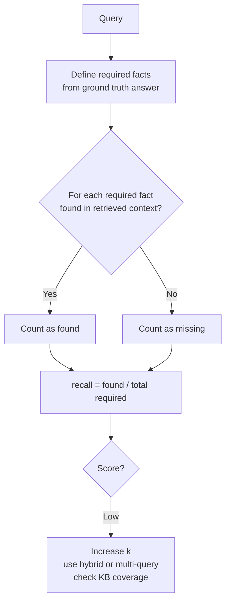

# Context Recall

## The Simple Idea (Feynman Explanation)

To answer a question correctly, the LLM needs certain facts. Context recall measures whether the retriever found all of them.

Imagine the correct answer requires 4 facts. The retriever found 3 of them. The 4th fact exists in the knowledge base but wasn't retrieved. No matter how good the LLM is, it cannot produce the complete answer — the evidence is missing.

```
Required facts: [fact_A, fact_B, fact_C, fact_D]
Retrieved:      [fact_A ✅, fact_B ✅, fact_C ✅, fact_D ❌ missing]
Recall = 3 found / 4 required = 0.75
```

---

## Formula

```
context_recall = required_facts_found_in_context / total_required_facts
```

A fact is "found" if any retrieved chunk contains it (measured by semantic similarity or exact match).

---

## Implementation

```python
def context_recall(retrieved: list, required_facts: list, threshold: float = 0.5) -> float:
    found = sum(
        1 for fact in required_facts
        if any(cosine(fact, chunk) >= threshold for chunk in retrieved)
    )
    return found / len(required_facts)
```

---

## Worked Example

**Query:** `"When did Marie Curie win the Nobel Prize in Chemistry?"`

**Required facts:**
```
[0] "Marie Curie won the Nobel Prize in Chemistry in 1911."
[1] "The prize was awarded for discovering radium and polonium."
```

**Retrieved chunks:**
```
Marie Curie won the Nobel Prize in Chemistry in 1911.  → fact [0] found ✅
Marie Curie won the Nobel Prize in Physics in 1903.    → fact [1] not found ❌
```

```
context_recall = 1 / 2 = 0.50
```

The second fact (radium/polonium) is not in the retrieved chunks. This could be a knowledge base gap (the fact doesn't exist) or a retrieval gap (the fact exists but wasn't retrieved).

---

## Mermaid Diagram



---

## Key Findings

- **Low recall cannot be fixed by a better prompt.** If the evidence is not in the retrieved context, the LLM cannot produce the correct answer.
- **Two causes of low recall:** (1) the fact doesn't exist in the knowledge base — a data gap; (2) the fact exists but wasn't retrieved — a retrieval gap. Diagnose which before fixing.
- **Increasing k improves recall** but hurts precision. Use reranking to recover precision after increasing k.
- **Multi-query retrieval and hybrid search** are the most effective retrieval-side fixes for low recall.

---

## Pros, Cons & When to Use

| | |
|---|---|
| ✅ **Identifies missing evidence** | Shows exactly which required facts were not retrieved. |
| ✅ **Directly actionable** | Low recall → increase k, use hybrid search, check KB coverage. |
| ❌ **Requires ground truth** | You need to know which facts are required for each query. |
| ❌ **Threshold sensitivity** | The similarity threshold for "found" affects the score. |

**Suitable for:** Diagnosing incomplete answers — especially when the LLM says "I don't have enough information" or gives partial answers.
