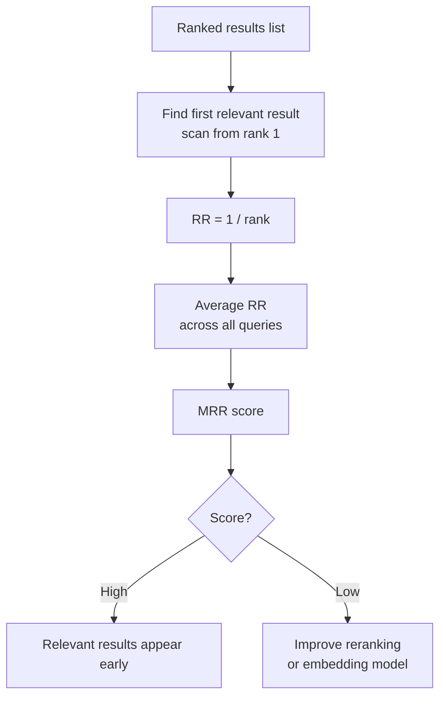

# Mean Reciprocal Rank (MRR)

## The Simple Idea (Feynman Explanation)

Precision and recall don't care about order — a relevant chunk at rank 1 and a relevant chunk at rank 10 count the same. But in practice, the LLM prompt usually includes only the top 3–5 chunks. A relevant chunk buried at rank 8 might as well not exist.

MRR measures how early the first relevant result appears. If the first relevant chunk is at rank 1, the score is 1.0. At rank 2, it's 0.5. At rank 4, it's 0.25. The score is averaged across all queries.

```
Query 1: [✅, ❌, ❌, ❌]  → rank 1 → RR = 1/1 = 1.000
Query 2: [❌, ✅, ❌, ❌]  → rank 2 → RR = 1/2 = 0.500
Query 3: [❌, ❌, ✅, ❌]  → rank 3 → RR = 1/3 = 0.333

MRR = (1.000 + 0.500 + 0.333) / 3 = 0.611
```

---

## Formula

```
Reciprocal Rank (RR) = 1 / rank_of_first_relevant_result
Mean Reciprocal Rank (MRR) = average(RR) across all queries
```

If no relevant result is found, RR = 0.

---

## Implementation

```python
def reciprocal_rank(ranked_relevance: list[bool]) -> float:
    for rank, is_relevant in enumerate(ranked_relevance, start=1):
        if is_relevant:
            return 1.0 / rank
    return 0.0

def mean_reciprocal_rank(queries: list[list[bool]]) -> float:
    return sum(reciprocal_rank(r) for r in queries) / len(queries)
```

---

## Worked Example

**Three queries, 4 results each:**

| Query | Rank 1 | Rank 2 | Rank 3 | Rank 4 | RR |
|---|---|---|---|---|---|
| "When did Marie Curie win Chemistry Nobel?" | ✅ | ❌ | ❌ | ❌ | 1.000 |
| "What did Marie Curie discover?" | ❌ | ✅ | ❌ | ❌ | 0.500 |
| "Where was Marie Curie born?" | ❌ | ❌ | ✅ | ❌ | 0.333 |

```
MRR = (1.000 + 0.500 + 0.333) / 3 = 0.611
```

---

## Mermaid Diagram



---

## Key Findings

- **MRR penalises late relevant results heavily.** Rank 1 = 1.0, rank 2 = 0.5, rank 4 = 0.25. A relevant result at rank 5 contributes only 0.2 to the score.
- **MRR only measures the first relevant result.** For questions that need multiple pieces of evidence, use recall instead.
- **Reranking is the most effective fix for low MRR.** A cross-encoder reranker re-orders the top-k, pushing the most relevant result to rank 1.
- **MRR = 0.611 in the demo** — the first query gets a perfect score (rank 1), but the other two have relevant results at ranks 2 and 3.

---

## Pros, Cons & When to Use

| | |
|---|---|
| ✅ **Rank-aware** | Rewards systems that put the best result first. |
| ✅ **Simple to interpret** | MRR of 0.5 means the first relevant result is typically at rank 2. |
| ❌ **Only measures first relevant result** | Ignores whether all required evidence was retrieved. |
| ❌ **Requires relevance labels** | You need to know which results are relevant for each query. |

**Suitable for:** Systems where the LLM uses only the top 1–3 results, or where a single correct answer is sufficient (factoid Q&A, search).

**Not suitable for:** Multi-fact questions where multiple relevant chunks are needed — use recall instead.
