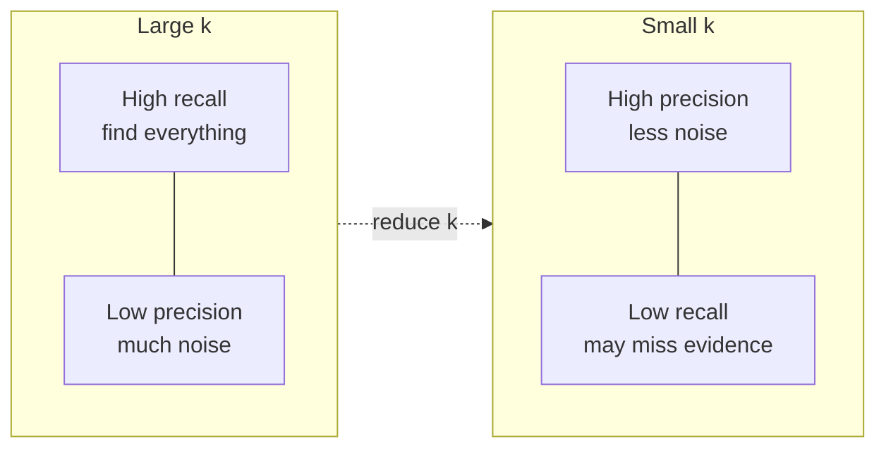

# Retrieval Metrics

## The Simple Idea (Feynman Explanation)

Retrieval metrics measure the search layer before the LLM ever sees the context. They answer: **did the retriever find the right evidence?**

Three things can go wrong independently:
- The retriever returns mostly irrelevant chunks → low **precision**
- The retriever misses important evidence → low **recall**
- The right chunk is buried at rank 10 instead of rank 1 → low **MRR**

Each metric diagnoses a different failure and points to a different fix.

---

## Metrics in This Module

| Metric | Question | Fix when low |
|---|---|---|
| [Context Precision](1_context_precision/README.md) | Are the retrieved chunks mostly useful? | Reranking, metadata filters |
| [Context Recall](2_context_recall/README.md) | Did retrieval find all required evidence? | Increase k, hybrid/multi-query |
| [Mean Reciprocal Rank](3_mean_reciprocal_rank/README.md) | How early did the first relevant result appear? | Better reranking, embedding model |

---

## Precision vs Recall Trade-off

---

## Key Takeaways

- Measure retrieval metrics before generation metrics — if retrieval is broken, generation metrics are meaningless.
- Precision and recall require ground truth labels. Build a small labelled evaluation set with real queries.
- MRR is useful when only one good result is needed. For multi-fact questions, use recall.
