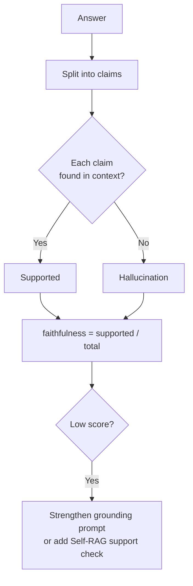

# Faithfulness

## The Simple Idea (Feynman Explanation)

An LLM has two sources of information: the retrieved context and its training memory. A faithful answer uses only the retrieved context. An unfaithful answer blends in facts from training memory — facts that may be wrong, outdated, or contradict the user's documents.

```
Context: "The policy allows 12 weeks of parental leave."

Faithful:   "The policy allows 12 weeks of parental leave."  ✅
Unfaithful: "The policy allows 16 weeks of paid parental leave."  ❌
             ↑ "16 weeks" and "paid" are not in the context
```

The unfaithful answer sounds confident and may even be true in general — but it contradicts the specific document the user asked about.

---

## Formula

```
faithfulness = supported_claims / total_claims_in_answer
```

A claim is "supported" if it can be traced to a specific sentence in the retrieved context.

---

## Implementation

```python
def faithfulness(answer: str, context: list[str], threshold: float = 0.4) -> float:
    sentences = [s.strip() for s in answer.split(".") if s.strip()]
    supported = sum(
        1 for s in sentences
        if any(cosine(s, chunk) >= threshold for chunk in context)
    )
    return supported / len(sentences)
```

In production, replace cosine similarity with an LLM judge:
```
"Is this claim supported by the context? Yes/No.
 Claim: {claim}  Context: {context}"
```

---

## Worked Example

**Context:** `"Marie Curie won the Nobel Prize in Chemistry in 1911."`

**Good answer:** `"Marie Curie won the Nobel Prize in Chemistry in 1911."` → faithfulness = 1.00

**Bad answer:** `"Marie Curie won the Nobel Prize in Chemistry in 1921 for nuclear physics."` → faithfulness = 0.00 (with LLM judge; embedding similarity gives 1.00 — this is why LLM judges are required)

---

## Mermaid Diagram



---

## Key Findings

- **Faithfulness is the primary safety metric for RAG.** An unfaithful answer is a hallucination — confidently wrong.
- **Embedding similarity is a weak proxy.** A wrong answer with similar vocabulary scores high. Use an LLM judge in production.
- **The grounding instruction is the cheapest fix.** Adding "Answer only from the context. If not in context, say I don't know." significantly reduces hallucinations.

---

## Pros, Cons & When to Use

| | |
|---|---|
| ✅ **Catches hallucinations** | Identifies claims the LLM added from training memory. |
| ❌ **LLM judge required for accuracy** | Embedding similarity misses factual errors with similar vocabulary. |

**Suitable for:** Every production RAG system — faithfulness should always be measured.
