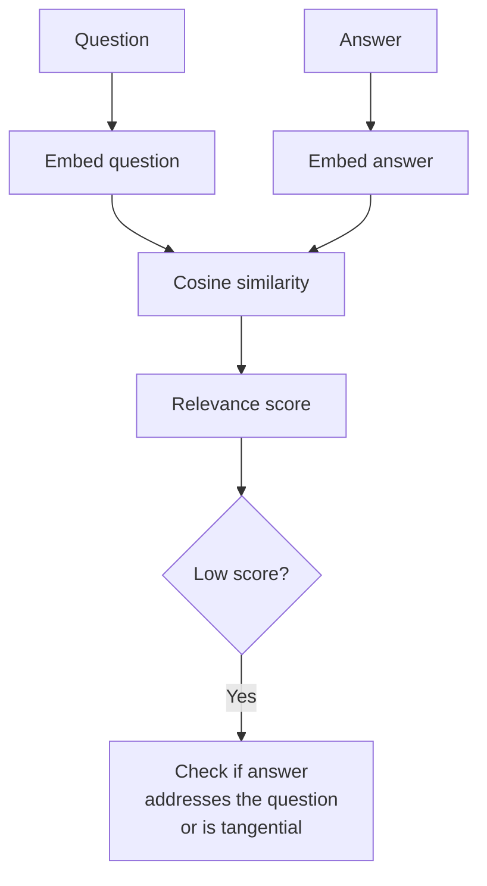

# Answer Relevance

## The Simple Idea (Feynman Explanation)

An answer can be perfectly faithful to the context — every word supported by the retrieved documents — and still be completely useless if it answers the wrong question.

```
Question: "When does the contract renew?"
Context:  "The contract includes a confidentiality clause and renews annually on January 1st."

Faithful but irrelevant: "The contract includes a confidentiality clause."  ❌
                          ↑ True and grounded, but doesn't answer the question

Faithful and relevant:   "The contract renews annually on January 1st."  ✅
```

Answer relevance measures whether the answer actually addresses what the user asked.

---

## Formula

```
answer_relevance = similarity(question, answer)
```

In production: generate N hypothetical questions from the answer, measure their similarity to the original question. High similarity = the answer addresses the question.

---

## Implementation

```python
def answer_relevance(question: str, answer: str) -> float:
    """Cosine similarity between question and answer embeddings."""
    return cosine(question, answer)
```

Production approach (RAGAS method):
```python
# Generate hypothetical questions from the answer, then measure similarity
hypothetical_questions = llm.generate(f"Generate 3 questions this answer addresses: {answer}")
return mean(cosine(question, hq) for hq in hypothetical_questions)
```

---

## Worked Example

**Question:** `"When did Marie Curie win the Nobel Prize in Chemistry?"`

| Answer | Relevance score |
|---|---|
| `"Marie Curie won the Nobel Prize in Chemistry in 1911."` | 0.906 ✅ |
| `"The Eiffel Tower is located in Paris."` | 0.109 ❌ |
| `"Marie Curie was a pioneering scientist."` | 0.534 ⚠️ (related but vague) |

---

## Mermaid Diagram



---

## Key Findings

- **A faithful answer can still be irrelevant.** Both faithfulness and answer relevance must pass for a trustworthy answer.
- **Embedding similarity is a reasonable proxy** for answer relevance (unlike faithfulness, where it fails). Questions and answers about the same topic have similar embeddings.
- **The RAGAS method is more robust.** Generating hypothetical questions from the answer and comparing them to the original question is more accurate than direct embedding similarity.
- **Low answer relevance often indicates prompt issues** — the LLM is answering a related but different question. Improve the prompt to focus on the specific question asked.

---

## Pros, Cons & When to Use

| | |
|---|---|
| ✅ **Catches tangential answers** | Identifies when the LLM answers a related but different question. |
| ✅ **Embedding similarity works reasonably well** | Unlike faithfulness, direct cosine similarity is a decent proxy. |
| ❌ **Does not catch hallucinations** | A highly relevant answer can still be unfaithful. Use with faithfulness. |

**Suitable for:** Any RAG system — always measure alongside faithfulness. Low relevance points to prompt issues; low faithfulness points to hallucination.
