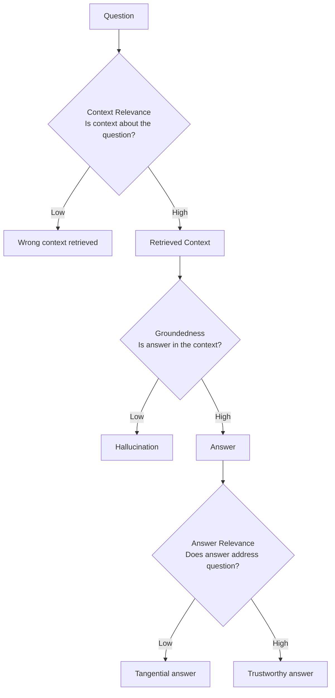

# RAG Triad

## The Simple Idea (Feynman Explanation)

A RAG pipeline has three links that can each break independently. The RAG Triad evaluates all three at once:

1. **Context Relevance** — is the retrieved context actually about the question?
2. **Groundedness** — is the answer supported by the retrieved context? (= faithfulness)
3. **Answer Relevance** — does the answer address the question?

Think of it like a chain. All three links must hold. A strong answer with weak context relevance means the LLM got lucky. Strong context with a weak answer means the LLM failed to use the evidence.

```
Question → [Context Relevance] → Context → [Groundedness] → Answer → [Answer Relevance] → User
```

If any link breaks, the answer is untrustworthy — even if the other two links are strong.

---

## The Three Links



---

## Implementation

```python
def rag_triad(question: str, context: list[str], answer: str) -> dict:
    ctx_text = " ".join(context)
    return {
        "context_relevance": cosine(question, ctx_text),
        "groundedness":      faithfulness(answer, context),
        "answer_relevance":  answer_relevance(question, answer),
    }
```

---

## Worked Example

**Question:** `"When did Marie Curie win the Nobel Prize in Chemistry?"`

**Context:** `["Marie Curie won the Nobel Prize in Chemistry in 1911.", "Marie Curie won the Nobel Prize in Physics in 1903."]`

**Answer:** `"Marie Curie won the Nobel Prize in Chemistry in 1911."`

```
RAG Triad:
  context_relevance : 0.881  ✅ context is about the question
  groundedness      : 1.000  ✅ answer is fully supported by context
  answer_relevance  : 0.906  ✅ answer addresses the question
```

All three links hold → trustworthy answer.

---

## Failure Mode Diagnosis

| context_relevance | groundedness | answer_relevance | Diagnosis |
|---|---|---|---|
| Low | Any | Any | Wrong context retrieved — fix retrieval |
| High | Low | Any | Hallucination — strengthen grounding prompt |
| High | High | Low | Tangential answer — fix prompt focus |
| High | High | High | ✅ Trustworthy |

---

## Key Findings

- **The triad exposes which link broke.** Without it, a wrong answer is just "wrong" — with it, you know whether to fix retrieval, the prompt, or the LLM.
- **Context relevance is the retrieval-side check.** It overlaps with context precision but is measured at the answer level, not the chunk level.
- **All three scores must be high.** A score of 1.0 on two metrics and 0.2 on one is still a failure.
- **In production, use an LLM judge for groundedness.** Embedding similarity misses factual errors with similar vocabulary.

---

## Pros, Cons & When to Use

| | |
|---|---|
| ✅ **End-to-end diagnosis** | Identifies which of the three pipeline links failed. |
| ✅ **Single evaluation call** | Compute all three metrics together for efficiency. |
| ❌ **Three LLM calls in production** | One per metric if using LLM judges. |

**Suitable for:** Any production RAG system as the primary evaluation framework. Run the triad on a representative sample of queries to identify the weakest link in the pipeline.
