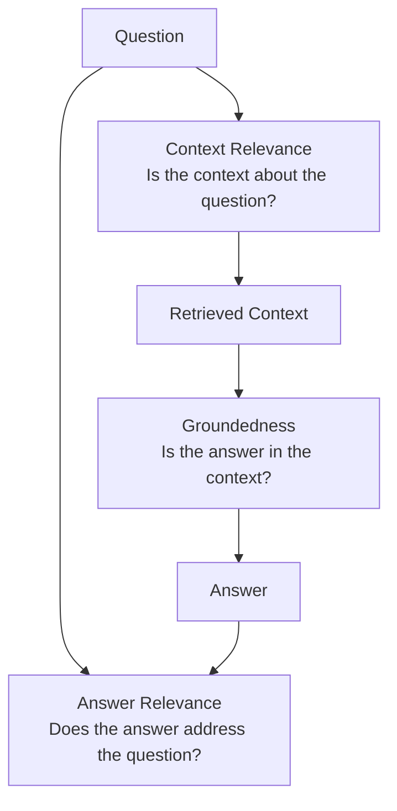

# Generation Quality Metrics

## The Simple Idea (Feynman Explanation)

Even with perfect retrieval, the LLM can still fail. It might ignore the retrieved context and answer from training memory. It might answer a different question than the one asked. It might add facts that aren't in the context.

Generation metrics measure the answer layer after retrieval. They answer: **did the LLM use the evidence correctly?**

---

## Metrics in This Module

| Metric | Question | Failure mode caught |
|---|---|---|
| [Faithfulness](1_faithfulness/README.md) | Is the answer supported by the retrieved context? | Hallucination — LLM adds unsupported facts |
| [Answer Relevance](2_answer_relevance/README.md) | Does the answer address the question? | Tangential answer — LLM answers the wrong question |
| [RAG Triad](3_rag_triad/README.md) | Do all three links hold together? | End-to-end pipeline failure |

---

## The Three Links

All three links must hold for a trustworthy answer:
- **Context relevance** — retrieval found the right evidence
- **Groundedness** — the answer stays within the evidence (= faithfulness)
- **Answer relevance** — the answer addresses what was asked

---

## Key Takeaways

- **Faithfulness is the most critical metric.** An unfaithful answer is a hallucination — the most dangerous failure mode in production.
- **Embedding-based metrics are fast but imprecise.** For production, use an LLM judge for faithfulness and answer relevance.
- **A faithful answer can still be irrelevant.** The LLM might accurately quote the context but answer a different question. Both metrics must pass.
