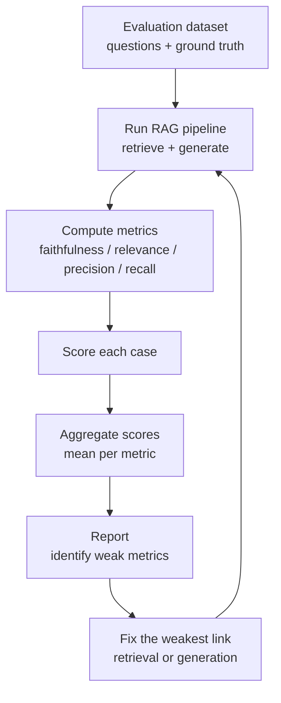

# Evaluation Frameworks Overview

## The Simple Idea (Feynman Explanation)

Computing evaluation metrics by hand works for 10 queries. For 1,000 queries, you need automation. Evaluation frameworks provide:

- Pre-built metric implementations (faithfulness, relevance, precision, recall)
- LLM-as-judge pipelines for metrics that need semantic understanding
- Dataset management for storing questions, contexts, answers, and scores
- Reporting and regression tracking

Think of them like a test suite for your RAG pipeline — the same way unit tests catch code regressions, evaluation frameworks catch quality regressions when you change your chunking, retrieval, or prompt.

---

## Frameworks Compared

| Framework | Best for | Key metrics | Notes |
|---|---|---|---|
| **RAGAS** | End-to-end RAG evaluation | Faithfulness, Answer Relevance, Context Precision, Context Recall | Most widely used; integrates with LangChain |
| **DeepEval** | Unit-test style evaluation | Faithfulness, Hallucination, Answer Relevance, Bias | pytest-style test cases; CI/CD friendly |
| **GroUSE** | Structured answer grounding | Groundedness, Utilisation, Completeness | Focused on grounding quality |
| **TruLens** | RAG Triad evaluation | Context Relevance, Groundedness, Answer Relevance | Built around the RAG Triad |

---

## Evaluation Dataset Shape

Every evaluation case needs:

```python
{
    "question":          "When did Marie Curie win the Nobel Prize in Chemistry?",
    "ground_truth":      "Marie Curie won the Nobel Prize in Chemistry in 1911.",
    "retrieved_context": ["Marie Curie won the Nobel Prize in Chemistry in 1911.",
                          "Marie Curie won the Nobel Prize in Physics in 1903."],
    "answer":            "Marie Curie won the Nobel Prize in Chemistry in 1911.",
    # Computed metrics:
    "faithfulness":      1.00,
    "answer_relevance":  0.906,
    "context_precision": 1.00,
    "context_recall":    0.50,
}
```

---

## Evaluation Pipeline



---

## RAGAS Quick Start

```python
from ragas import evaluate
from ragas.metrics import faithfulness, answer_relevance, context_precision, context_recall
from datasets import Dataset

data = {
    "question":   ["When did Marie Curie win the Chemistry Nobel?"],
    "answer":     ["Marie Curie won the Nobel Prize in Chemistry in 1911."],
    "contexts":   [["Marie Curie won the Nobel Prize in Chemistry in 1911."]],
    "ground_truth": ["Marie Curie won the Nobel Prize in Chemistry in 1911."],
}

result = evaluate(
    Dataset.from_dict(data),
    metrics=[faithfulness, answer_relevance, context_precision, context_recall],
)
print(result)
```

---

## Building a Minimal Evaluation Set

You don't need 1,000 questions. A well-designed set of 50–100 covers:

| Category | Examples | Why |
|---|---|---|
| Factual lookups | "When did X happen?" | Tests basic retrieval |
| Multi-fact questions | "What did X do and when?" | Tests recall |
| Out-of-scope questions | "What is the weather today?" | Tests abstention |
| Adversarial questions | Questions with misleading phrasing | Tests faithfulness |
| Edge cases | Very short answers, very long answers | Tests robustness |

---

## Key Findings

- **Frameworks do not replace judgment.** They standardise measurement. A framework score of 0.8 on faithfulness still requires human review of the failing 20%.
- **Keep a small hand-reviewed regression set.** 20–30 carefully labelled cases catch most regressions when you change chunking, retrieval, or prompts.
- **Track retrieval and generation metrics separately.** A drop in faithfulness points to the LLM; a drop in recall points to the retriever.
- **LLM-as-judge is expensive but necessary for faithfulness.** Embedding similarity misses factual errors. Budget for LLM judge calls in your evaluation pipeline.
- **Evaluate after every significant change** — new chunking strategy, new embedding model, new prompt, new retriever. Treat evaluation as a regression test.
