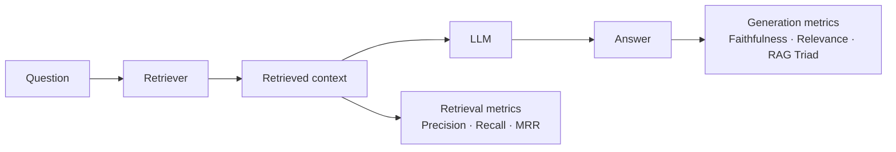

# Evaluation Techniques

## The Simple Idea (Feynman Explanation)

Building a RAG system is easy. Knowing whether it actually works is hard.

A RAG pipeline has two stages that can fail independently:

1. **Retrieval** — did the system find the right evidence?
2. **Generation** — did the LLM use that evidence correctly?

If the answer is wrong, you need to know *which stage failed*. A bad answer could mean the retriever returned irrelevant chunks (retrieval failure) or the LLM ignored the context and hallucinated (generation failure). The fix is completely different in each case.

Evaluation gives you the instruments to tell them apart.

---

## What This Module Covers

| Area | Metrics | Question answered |
|---|---|---|
| [Retrieval metrics](1_retrieval_metrics/README.md) | Context Precision, Context Recall, MRR | Did the retriever find the right evidence? |
| [Generation metrics](2_generation_quality_metrics/README.md) | Faithfulness, Answer Relevance, RAG Triad | Did the LLM use the evidence correctly? |
| [Frameworks overview](3_frameworks_overview/README.md) | RAGAS, DeepEval, GroUSE | How to automate evaluation at scale? |

All six metrics are implemented in [`1_evaluation_metrics.py`](1_evaluation_metrics.py).

---

## Key Takeaways

- **Measure retrieval and generation separately.** A bad answer could come from either stage. Measuring only the final answer hides which stage to fix.
- **Precision and recall trade off.** Retrieving more chunks improves recall but hurts precision. The right balance depends on your use case.
- **Faithfulness is the most important generation metric.** An answer that contradicts the retrieved context is a hallucination — the most dangerous failure mode.
- **Embedding-based metrics are fast but imprecise.** For production evaluation, use an LLM judge for faithfulness and answer relevance.
