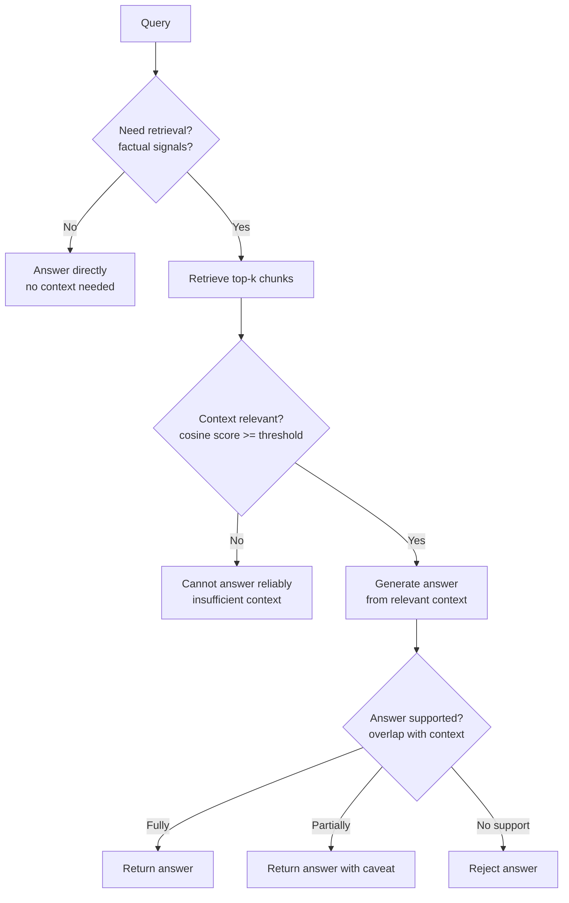

# Self-RAG

## The Simple Idea (Feynman Explanation)

Standard RAG always retrieves, always generates, and never checks its own work. Self-RAG adds three checkpoints:

1. **Should I retrieve?** — Not every question needs external context. "What is 2+2?" doesn't need a knowledge base.
2. **Is the retrieved context useful?** — The retriever might return irrelevant documents. Check before using them.
3. **Is my answer supported by the context?** — The LLM might add facts from its training memory. Check that the answer stays grounded.

Think of it like a careful student who first decides whether to open the textbook, then checks if the right chapter was found, then verifies their answer against what they read.



---

## Algorithm



---

## The Three Decision Points

| Decision | Question | In production | In this demo |
|---|---|---|---|
| Retrieve? | Does this query need external context? | LLM: "Output Yes or No" | Rule: check for factual signal words |
| Relevant? | Is the retrieved context useful? | LLM: "Output Relevant or Irrelevant" | Cosine similarity threshold |
| Supported? | Is the answer grounded in context? | LLM: "Output Fully/Partially/No support" | Token overlap ratio |

---

## Worked Example

**Query:** `"When did Marie Curie win the Nobel Prize in Chemistry?"`
```
[RETRIEVE] Yes — factual question
[RELEVANT] 2 relevant chunks found
  [0.812] Marie Curie won the Nobel Prize in Chemistry in 1911.
  [0.756] Marie Curie won the Nobel Prize in Physics in 1903.
[SUPPORT]  Fully supported
→ Answer: Marie Curie won the Nobel Prize in Chemistry in 1911.
```

**Query:** `"Hello, how are you?"`
```
[RETRIEVE] No — no factual signal words
→ Answer: I can answer this without retrieval.
```

---

## Key Findings

- **Not every query needs retrieval.** Greetings, arithmetic, and general knowledge questions can be answered directly. Skipping retrieval saves latency and cost.
- **The relevance check prevents confident wrong answers.** If the retriever returns irrelevant context, the system abstains rather than hallucinating.
- **The support check is the most important.** It catches cases where the LLM blends retrieved context with training memory, producing answers that go beyond what the context supports.
- **All three decisions can be rule-based or LLM-based.** LLM decisions are more accurate but add latency. Start with rules, upgrade to LLM where accuracy matters most.

---

## Pros, Cons & When to Use

| | |
|---|---|
| ✅ **Selective retrieval** | Skips retrieval for queries that don't need it — faster and cheaper. |
| ✅ **Grounded answers** | Support check prevents the LLM from going beyond the retrieved context. |
| ✅ **Graceful abstention** | Returns "insufficient context" rather than a confident wrong answer. |
| ❌ **Three LLM calls per query** | Retrieve + relevance + support = 3× the cost of standard RAG. |
| ❌ **Decision quality depends on the judge** | A weak relevance judge passes bad context; a weak support judge misses hallucinations. |

**Suitable for:** High-stakes Q&A where answer grounding is critical — medical, legal, financial, compliance.

**Not suitable for:** High-throughput systems where the extra LLM calls are too expensive. Use standard RAG with a strong grounding prompt instead.
